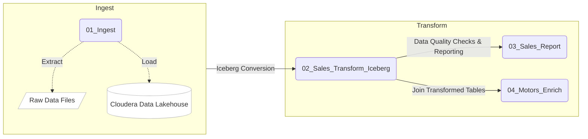

# CDE 1.19 ACE Hands-On-Lab Workshop

## About the Hands On Lab Workshops

The Hands-On Lab (HOL) Workshops are an initiative by Cloudera Solutions Engineering aimed at familiarizing CDP users with each Data Service. The content consists of a series of guides and exercises to quickly implement sample end-to-end use cases in the realm of Machine Learning, Datawarehousing, Data Engineering, Data Streaming and Operational Database.

The HOL is typically a three to four-hour event organized by Cloudera for CDP customers and prospects, where a small technical team from Cloudera Solutions Engineering provides cloud infrastructure for all participants and guides them through the completion of the labs with the help of presentations and open discussions.

The HOL contained in this GitHub repository is dedicated to Cloudera Data Engineering 1.19. CDE is the CDP Data Service for data engineering commonly known for Spark and Airflow use cases in Private and Public Clouds.

The content is primarily designed for developers, cloud administrators and big data software architects. However, little to no code changes are typically required and non-technical stakeholders such as project managers and analysts are encouraged to actively take part.

HOL events are open to all CDP users and customers. If you would like Cloudera to host an event for you and your colleagues please contact your local Cloudera Representative or submit your information [through this portal](https://www.cloudera.com/contact-sales.html). Finally, if you have access to a CDE Virtual Cluster you are welcome to use this guide and go through the same concepts in your own time.

## About the Cloudera Data Engineering (CDE) Service

CDE is the Cloudera Data Engineering Service, a containerized managed service for Cloudera Data Platform designed for Large Scale Batch Pipelines with Spark, Airflow and Iceberg. It allows you to submit batch jobs to auto-scaling virtual clusters. As a Cloud-Native service, CDE enables you to spend more time on your applications, and less time on infrastructure.

CDE allows you to create, manage, and schedule Apache Spark jobs without the overhead of creating and maintaining Spark clusters. With CDE, you define virtual clusters with a range of CPU and memory resources, and the cluster scales up and down as needed to run your Spark workloads, helping to control your cloud costs.

## About the Labs

This Hands On Lab is designed to walk you through the Services's main capabilities. Throughout the exercises you will:

1. Deploy an Ingestion, Transformation and Reporting pipeline with Spark 3.2.
2. Learn about Iceberg's most popular features.
3. Orchestrate pipelines with Airflow.
4. Use the CDE CLI to execute Spark Submits and more from your local machine.
5. Use the CDE Spark Submit Migration Tool to automatically convert a Spark Submit to a CDE Spark Submit.
6. Build a Python App leveraging the CDE API and monitor multiple CDE Virtual Clusters at the same time.

Throughout these labs, you are going to deploy an ELT (Extract, Load, Transform) data pipeline that extracts data stored on AWS S3 (or Azure ADLS) object storage, loads it into the Cloudera Data Lakehouse and transforms it for reporting purposes.



The Sales_Report job will give us an aggregate overview of our sales by model and customer types:

```
GROUP TOTAL SALES BY MODEL
+-------+--------------------+
|  Model|total_sales_by_model|
+-------+--------------------+
|Model C|        136557721.36|
|Model D|        162208438.10|
|Model R|        201420946.00|
+-------+--------------------+

GROUP TOTAL SALES BY GENDER
+------+---------------------+
|Gender|total_sales_by_gender|
+------+---------------------+
|     F|         258522496.93|
|     M|         241664608.53|
+------+---------------------+
````

## Step by Step Instructions

Detailed instructions are provided in the [step_by_step_guides](https://github.com/pdefusco/CDE119_ACE_WORKSHOP/blob/main/step_by_step_guides/) folder.

* [Link to the English Guide](https://github.com/pdefusco/CDE119_ACE_WORKSHOP/blob/main/step_by_step_guides/english).
* [Enlace a la guía en español](https://github.com/pdefusco/CDE119_ACE_WORKSHOP/blob/main/step_by_step_guides/espanol).
* [Link alla guida in italiano](https://github.com/pdefusco/CDE119_ACE_WORKSHOP/blob/main/step_by_step_guides/italiano).

## Hands On Lab Workshops for Prior Versions of CDE

This GitHub repository pertains to CDE version 1.19 which introduced some important changes with respect to prior versions.

If you don't have access to a CDE 1.19 Virtual Cluster we recommend the prior version of the HOL which covers all versions up until 1.18 and is available [at this GitHub repository](https://github.com/pdefusco/CDE_Tour_ACE_HOL).

## Other CDP Hands On Lab Workshops

CDP Data Services include Cloudera Machine Learning (CML), Cloudera Operational Database (COD), Cloudera Data Flow (CDF) and Cloudera Data Warehouse (CDW). HOL Workshops are available for each of these CDP Data Services.

* [CML Workshop](https://github.com/cloudera/CML_AMP_Churn_Prediction): Prototype and deploy a Churn Prediction classifier, apply an explainability model to it and deploy a Flask Application to share insights with your project stakeholders. This project uses SciKit-Lean, PySpark, and Local Interpretable Model-agnostic Explanations (LIME).
* [CDF Workshop](https://github.com/cloudera-labs/edge2ai-workshop): Build a full OT to IT workflow for an IoT Predictive Maintenance use case with: Edge Flow Management with MQTT and Minifi for data collection; Data Flow management was handled by NiFi and Kafka, and Spark Streaming with Cloudera Data Science Workbench (CDSW) model to process data. The lab also includes content focused on Kudu, Impala and Hue.
* [CDW Workshop](https://github.com/pdefusco/cdw-workshop): As a Big Data Engineer and Analyst for an Aeronautics corporation, build a Data Warehouse & Data Lakehouse to gain an advantage over your competition. Interacticely explore data at scale. Create ongoing reports. Finally move to real-time analysis to anticipate engine failures. All using Apache Impala and Iceberg.
