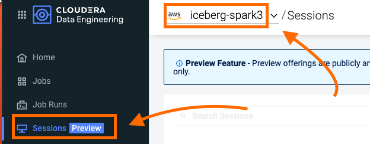
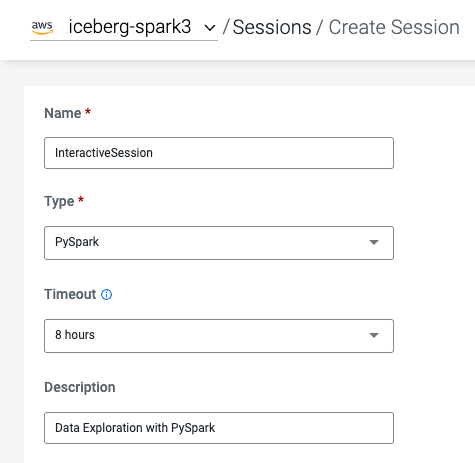
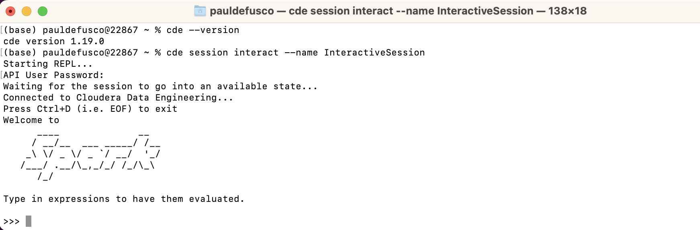
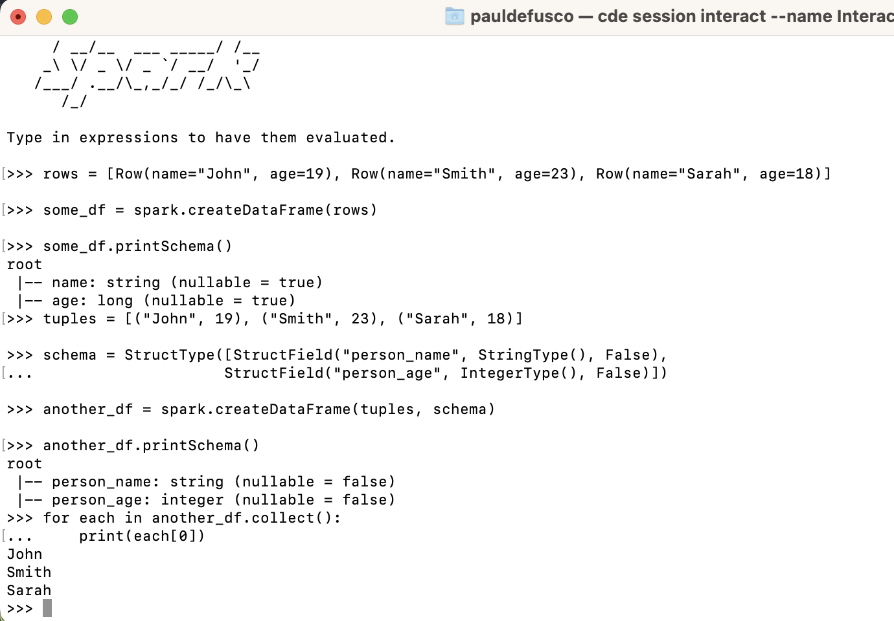
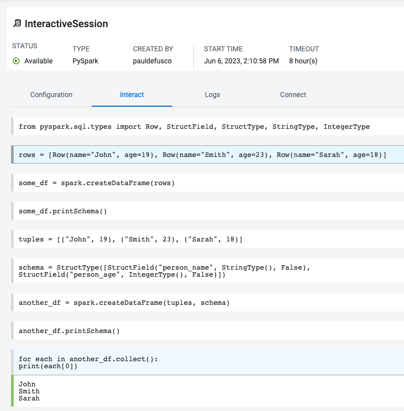
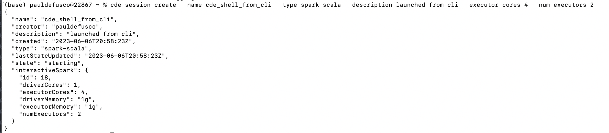
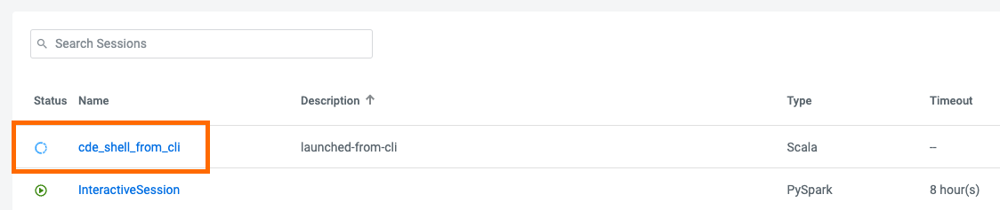

# Step by Step Guide - ENG

## Recommendations Before you Start

Throughout the labs, this guide will instruct you to make minor edits to some of the scripts. Please be prepared to make changes in an editor and re-upload them to the same CDE File Resource after each change. Having all scripts open at all times in an editor such as Atom is highly recommended.

Your Cloudera ACE Workshop Lead will load the required datasets to Cloud Storage ahead of the workshop. If you are reproducing these labs on your own, ensure you have placed all the contents of the data folder in a Cloud Storage path of your choice.

Each user will be assigned a username and cloud storage path. Each script will read your credentials from "parameters.conf" which you will have placed in your CDE File Resource. Before you start the labs, open the "parameters.conf" located in the "resources_files" folder and edit all three fields with values provided by your Cloudera ACE Workshop Lead. If you are reproducing these labs on your own you will also have to ensure that these values reflect the Cloud Storage path where you loaded the data.

## Requirements

In order to execute the Hands On Labs you need:
* A Spark 3 and Iceberg-enabled CDE Virtual Cluster (Azure, AWS and Private Cloud ok).
* Very few code changes are required but familiarity with Python and PySpark is highly recommended.
* Bonus Lab 1 requires a Hive CDW Virtual Warehouse. This lab is optional.

## Project Setup

Clone this GitHub repository to your local machine or the VM where you will be running the script.

```
mkdir ~/Documents/cde_ace_hol
cd ~/Documents/cde_ace_hol
git clone https://github.com/pdefusco/CDE119_ACE_WORKSHOP.git
```

Alternatively, if you don't have `git` installed on your machine, create a folder on your local computer; navigate to [this URL](https://github.com/pdefusco/CDE119_ACE_WORKSHOP.git) and manually download the files.

## Index

* In Part 1 you will develop three Spark Jobs using the CDE UI, the CDE CLI and CDE Interactive Sessions. One of the Jobs will focus on Apache Iceberg.
* In Part 2 you will create an Airflow Pipeline to orchestrate multiple Spark Jobs.
* In Part 3 you will use the CDE Spark Migration tool to convert Spark Jobs into CDE Spark Jobs.
* The Bonus Labs include cover a variety of topics including Airflow Orchestration of CDW Queries and the CDE Airflow Editor.


# Introduction to the CDE Data Service

Cloudera Data Engineering (CDE) is a serverless service for Cloudera Data Platform that allows you to submit batch jobs to auto-scaling virtual clusters. CDE enables you to spend more time on your applications, and less time on infrastructure.

Cloudera Data Engineering allows you to create, manage, and schedule Apache Spark jobs without the overhead of creating and maintaining Spark clusters. With Cloudera Data Engineering, you define virtual clusters with a range of CPU and memory resources, and the cluster scales up and down as needed to run your Spark workloads, helping to control your cloud costs.

The CDE Service can be reached from the CDP Home Page by clicking on the blue "Data Engineering" icon.


The CDE Landing Page allows you to access, create and manage CDE Virtual Clusters. Within each CDE Virtual Cluster you can  create, monitor and troubleshoot Spark and Airflow Jobs.

The Virtual Cluster is pegged to the CDP Environment. Each CDE Virtual Cluster is mapped to at most one CDP Environment while a CDP Environment can map to one or more Virtual Cluster.

These are the most important components in the CDE Service:

##### CDP Environment
A logical subset of your cloud provider account including a specific virtual network. CDP Environments can be in AWS, Azure, RedHat OCP and Cloudera ECS. For more information, see [CDP Environments](https://docs.cloudera.com/management-console/cloud/overview/topics/mc-core-concepts.html). Practically speaking, an environment is equivalent to a Data Lake as each environment is automatically associated with its own SDX services for Security, Governance and Lineage.

##### CDE Service
The long-running Kubernetes cluster and services that manage the virtual clusters. The CDE service must be enabled on an environment before you can create any virtual clusters.

##### Virtual Cluster
An individual auto-scaling cluster with defined CPU and memory ranges. Virtual Clusters in CDE can be created and deleted on demand. Jobs are associated with clusters. Up until CDE 1.18 all Virtual Clusters provided the same capabilities. With Version 1.19 you can choose between two Cluster Tiers:

Core (Tier 1): Batch-based transformation and engineering options include:
* Autoscaling Cluster
* Spot Instances
* SDX/Lakehouse
* Job Lifecycle
* Monitoring
* Workflow Orchestration

All Purpose (Tier 2) - Develop using interactive sessions and deploy both batch and streaming workloads. This option includes all options in Tier 1 with the following:
* Shell Sessions - CLI and Web
* JDBC/SparkSQL (Coming soon)
* IDE (Coming Soon)

Core clusters are recommended as Production environments. All Purpose clusters are instead designed to be used as Development and Testing environments.
For more information on the CDE 1.19.1 and 1.19.2 releases please visit this page in the [documentation](https://docs.cloudera.com/data-engineering/cloud/release-notes/topics/cde-whats-new-1.19.html).

##### Jobs
Application code along with defined configurations and resources. Jobs can be run on demand or scheduled. An individual job execution is called a job run.

##### Resource
A defined collection of files such as a Python file or application JAR, dependencies, and any other reference files required for a job.

##### Job Run
An individual job run.

##### CDE Session

CDE interactive sessions give data engineers flexible end-points to start developing Spark applications from anywhere -- in a web-based terminal, local CLI, favorite IDE, and even via JDBC from third-party tools.

##### Apache Iceberg

Apache Iceberg is a cloud-native, high-performance open table format for organizing petabyte-scale analytic datasets on a file system or object store. Combined with Cloudera Data Platform (CDP), users can build an open data lakehouse architecture for multi-function analytics and to deploy large scale end-to-end pipelines.

Open Data Lakehouse on CDP simplifies advanced analytics on all data with a unified platform for structured and unstructured data and integrated data services to enable any analytics use case from ML, BI to stream analytics and real-time analytics. Apache Iceberg is the secret sauce of the open lakehouse.

Iceberg is compatible with a variety of compute engines including Spark. CDE allows you to deploy Iceberg-enabled Virtual Clusters.

For more information please visit the [documentation](https://iceberg.apache.org/).

##### CDE User Interface

Now that you have covered the basics of CDE, spend a few moments familiarizing yourself with the CDE Landing page.

The Home Page provides a high level overview of all CDE Services and Clusters. At the top, you have shortcuts to creating CDE Jobs and Resources. Scroll down to the CDE Virtual Clusters section and notice that all Virtual Clusters and each associated CDP Environment / CDE Service are shown.


Next, open the Administration page on the left tab. This page also shows CDE Services on the left and associated Virtual Clusters on the right.


Open the CDE Service Details page and notice the following key information and links:

* CDE Version
* Nodes Autoscale Range
* CDP Data Lake and Environment
* Graphana Charts. Click on this link to obtain a dashboard of running Service Kubernetes resources.
* Resource Scheduler. Click on this link to view the Yunikorn Web UI.


Scroll down and open the Configurations tab. Notice that this is where Instance Types and Instance Autoscale ranges are defined.


To learn more about other important service configurations please visit [Enabling a CDE Service](https://docs.cloudera.com/data-engineering/cloud/enable-data-engineering/topics/cde-enable-data-engineering.html) in the CDE Documentation.

Navigate back to the Administration page and open a Virtual Cluster's Cluster Details page.


This view includes other important cluster management information. From here you can:

* Download the CDE CLI binaries. The CLI is recommended to submit jobs and interact with CDE. It is covered in Part 3 of this guide.
* Visit the API Docs to learn the CDE API and build sample requests on the Swagger page.
* Access the Airflow UI to monitor your Airflow Jobs, set up custom connections, variables, and more.  

Open the Configuration tab. Notice that CPU and Memory autoscale ranges, Spark version, and Iceberg options are set here.


To learn more about CDE Architecture please visit [Creating and Managing Virtual Clusters](https://docs.cloudera.com/data-engineering/cloud/manage-clusters/topics/cde-create-cluster.html) and [Recommendations for Scaling CDE Deployments](https://docs.cloudera.com/data-engineering/cloud/deployment-architecture/topics/cde-general-scaling.html)

>**Note**  
>A CDE Service defines compute instance types, instance autoscale ranges and the associated CDP Data Lake. The Data and Users associated with the Service are constrained by SDX and the CDP Environment settings.

>**Note**  
> Within a CDE Service you can deploy one or more CDE Virtual Clusters. The Service Autoscale Range is a count of min/max allowed Compute Instances. The Virtual Cluster Autoscale Range is the min/max CPU and Memory that can be utilized by all CDE Jobs within the cluster. The Virtual Cluster Autoscale Range is naturally bounded by the CPU and Memory available at the Service level.

>**Note**  
> This flexible architecture allows you to isolate your workloads and limit access within different autoscaling compute clusters while predefining cost management guardrails at an aggregate level. For example, you can define Services at an organization level and Virtual Clusters within them as DEV, QA, PROD, etc.

>**Note**  
>CDE takes advantage of YuniKorn resource scheduling and sorting policies, such as gang scheduling and bin packing, to optimize resource utilization and improve cost efficiency. For more information on gang scheduling, see the Cloudera blog post [Spark on Kubernetes – Gang Scheduling with YuniKorn](https://blog.cloudera.com/spark-on-kubernetes-gang-scheduling-with-yunikorn/).

>**Note**  
>CDE Spark Job auto-scaling is controlled by Apache Spark dynamic allocation. Dynamic allocation scales job executors up and down as needed for running jobs. This can provide large performance benefits by allocating as many resources as needed by the running job, and by returning resources when they are not needed so that concurrent jobs can potentially run faster.


## Part 1: Developing Spark Jobs in CDE

#### Summary

In this section you will create four Spark jobs using the CDE UI, the CDE CLI and CDE Interactive Sessions. In the process you learn how to use CDE Resources to store files and reuse Python virtual environments, migrate Spark tables to Iceberg tables, and use some of Iceberg's most awaited features including Time Travel, Incremental Queries, Partition and Schema Evolution.

#### Editing Files and Creating CDE Resources

CDE Resources can be of type "File", "Python", or "Custom Runtime". You will start by creating a resource of type file to store all Spark and Airflow files and dependencies and then a Python Resource to utilize custom Python libraries in a CDE Spark Job run.

To create a File Resource, from the CDE Home Page click on "Create New" in the "Resources" -> "File" section.


Pick your Spark 3 / Iceberg enabled CDE Virtual Cluster and name your Resource after your username or a unique ID.


Upload the following files located in the "cde_ace_hol/cde_spark_jobs" and "cde_ace_hol/resources_files" folders.

When you are done, ensure that the following files are located in your File Resource:

```
01_PySpark_ETL.py
simple_udf.zip
simple_udf_dependency.py
parameters.conf
utils.py
```

To create a Python Resource, navigate back to the CDE Home Page and click on "Create New" in the "Resources" -> "Python" section.


Ensure to select the same CDE Virtual Cluster. Name the Python CDE Resource and leave the pipy mirror field blank.


Upload the "requirements.txt" file provided in the "cde_ace_hol/resources_files" folder.


Notice the CDE Resource is now building the Python Virtual Environment. After a few moments the build will complete and you will be able to validate the libraries used.


To learn more about CDE Resources please visit [Using CDE Resources](https://docs.cloudera.com/data-engineering/cloud/use-resources/topics/cde-python-virtual-env.html) in the CDE Documentation.

#### Creating CDE Spark Jobs in the UI

Next we will create a CDE Job of type Spark using the script "01_PySpark_ETL.py" which you have already uploaded to your CDE File Resource in the prior step.

Navigate back to the CDE Home Page. Click on "Create New" in the "Jobs" -> "Spark" section.


Select your CDE Virtual Cluster and assign "O1_ETL" as the Job Name.


###### 1. Set Application File

The Application File is the code that will run as the Spark Job. This could be a PySpark file or a Jar.

Scroll down; ensure to select "File" from the radio button and click on "Select from Resource" in the "Application File" section. A window will open with the contents loaded in your File Resource. Select script "01_PySpark_ETL.py".


###### 2. Set Spark Configurations

The Configurations section allows you to set Spark Application Configurations such as Driver and Executor settings, Jars, Spark properties, and many more. In other words, virtually most properties available in the [Spark Configurations Documentation](https://spark.apache.org/docs/latest/configuration.html) can be applied here.

In this job we will set the "spark.executorEnv.PYTHONPATH" configuration to "/app/mount/simple_udf.zip" so it can read the UDF from the CDE File Resource.

###### 3. Set Python Environment

Set the Python environment to the CDE Python Resource you created in the previous step.

###### 4. Set Advanced Options

The Python, Egg, Zip Files section allows you to load dependencies onto your job. This can be used for a variety of use cases including mounting Python files to the Executors, using Wheel files, and more.

In the Python, Egg, Zip Files section select the "utils.py" and "simple_udf.zip" file dependencies to load the UDF to the Spark Job. Notice the files have already been uploaded to the File Resource so you just need to select them from there.

Scroll down again to the "Resources" section and notice that your File Resource has been mapped to the Job by default. This allows the PySpark script to load modules in the same Resource such as the ones contained in the "utils.py" file.

###### 5. Set Compute Options

Compute Options allow you to set important Spark Resource Configs.

* The Executors toggle bar allows you to set the "spark.dynamicAllocation.minExecutors" and "spark.dynamicAllocation.maxExecutors" options. These determine how many executors will be deployed by Spark Dynamic Allocation. Spark Dynamic Allocation is overridden to "Enabled" by default in CDE.
* The Initial Executors bar allows you to set the "spark.dynamicAllocation.initialExecutors" property. The option sets the initial number of executors for dynamic allocation. We recommend ensuring this is not set too high, especially to a value that is above the Job's expected number of Executors.
* Driver Cores and Driver Memory allow you to set "spark.driver.cores" and "spark.driver.memory". Increasing Driver Cores and Memory can be useful when your queries compile slowly or in case you call lots of collect() or take(N) actions especially on large RDD's.
* Executor Cores and Executor Memory allow you to set "spark.executor.cores" and "spark.executor.memory". These properties are used heavily in the context of Spark Tuning as they provide you with the ability to influence the degree of parallelism and storage capacity available in each Executor.

Set "Executors" to a minimum of 1 and a maximum of 4. Then set Executor Cores to 4, Driver Memory to 2, and Executor Memory to 4. This allows you to deploy a Spark Application with Executors that are slightly more resourceful than the values set in the default configurations, which often can result in Executors that are too small.

###### 6. Trigger and Monitor the Job

Scroll to the bottom and click on the "Create and Run" blue icon.


You will be automatically taken to the Jobs tab where the Job will now be listed at the top. Open the Job Runs tab on the left pane and validate that the CDE Spark Job is executing.


When complete, a green checkmark will appear on the left side. Click on the Job Run number to explore further.


The Job Run is populated with Metadata, Logs, and the Spark UI. This information is persisted and can be referenced at a later point in time.

The Configuration tab allows you to verify the script and resources used by the CDE Spark Job.


The Logs tab contains rich logging information. For example, you can verify your code output under "Logs" -> "Driver" -> "StdOut".


The Spark UI allows you to visualize resources, optimize performance and troubleshoot your Spark Jobs.


>**Note**  
>Your credentials are stored in parameters.conf

>**Note**  
>The Iceberg Jars did not have to be loaded in the Spark Configurations. Iceberg is enabled at the Virtual Cluster level.

>**Note**  
>Job 04_Sales_Report uses the Quinn Python library. The methods are implemented in utils.py which is loaded via the File Resource.   


#### Creating CDE Spark Jobs in the CLI

So far we have created a Spark Job via the CDE UI. However, CDE use cases involving more than just a few jobs normally benefit in numerous ways from the CDE CLI or CDE API. The CLI allows you to more quickly iterate through different Spark Submits and CDE Resources. The API is an excellent access point to CDE from other tools including 3rd party DevOps and CI/CD solutions.

In this section we will create a CDE Spark Submit and a CDE Spark Job via the CLI. In the process we will explain the difference.

###### 0. Installing the CDE CLI

Step 1: Download the CLI Client:

    * Navigate to the Cloudera Data Engineering Overview page by clicking the Data Engineering tile in the Cloudera Data Platform (CDP) management console.
    * In the CDE web console, select an environment.
    * Click the Cluster Details icon for the virtual cluster you want to access.
    * Click the link under CLI TOOL to download the CLI client.
    * Change the permissions on the downloaded cde file to make it executable:

Step 2: Determine the Virtual Cluster Endpoint URL:

    * Navigate to the Cloudera Data Engineering Overview page.
    * In the Environments column, select the environment containing the virtual cluster you want to access using the CLI.
    * In the Virtual Clusters column on the right, click the Cluster Details icon for the virtual cluster you want to access.
    * Click JOBS API URL to copy the URL to your clipboard.

Step 3: On the host with the CLI client, create or edit the configuration file at ```~/.cde/config.yaml```. You can create multiple profiles in the ```~/.cde/config.yaml``` file and can be used while running commands.

Step 4: In the configuration file, specify the CDP user and virtual cluster endpoint as follows. The CDP user is your workload username:

```
user: <CDP_user>
vcluster-endpoint: <CDE_virtual_cluster_endpoint>
```

Step 5: Save the configuration file. If you have not done so already, make sure that the cde file is executable by running ```chmod +x /path/to/cde```. Finally, run ```cde job list``` from your terminal to verify your configuration. Enter your workload password when prompted.

For further information on the CLI please visit the [CDE Documentation](https://docs.cloudera.com/data-engineering/cloud/cli-access/topics/cde-cli.html)


###### 1. CDE Spark Submit via the CDE CLI.

A CDE Spark Submit is the fastest way to prototype a Spark Job. It allows you to submit Spark Application Code and monitor results with CDE's logging and observability features but it does not allow you to save the Code as a reusable CDE Job Definition. This is beneficial for example in case you want to reschedule the job to run on a recurrent basis or include it in a CDE Airflow Job.

Start with a simple Spark Submit by running the following command in your terminal:

```
cde spark submit cde_spark_jobs/simple-pyspark-sql.py
```

Shortly after running this you will notice confirmation of sibmission in the terminal. As the Spark Application runs the terminal will show logs and job outputs.


The above created a "cli-submit-username-timestamp" entry in the Job Runs page of your CDE Cluster. Open the Job Run and explore the logs. Notice the Job Definition is not reusable.


The first Spark Submit ran a simple PySpark job but notice we didn't specify any Spark Options. Next, create a more advanced Spark Submit by running the following command in your terminal:

```
cde spark submit --py-files cde_spark_jobs/dist/mywheel-0.0.1-py3-none-any.whl cde_spark_jobs/mywheel/__main__.py --executor-cores 2 --executor-memory 2g
```

The above CDE Spark Submit ran with Spark Applicaiton code packaged in a Wheel file. Notice that the CDE Spark Submit included the ```--py-files```, ```--exeutor-cores``` and ```--executor-memory``` flags. These correspond to the same options available for a Spark Submit. For more on building Spark Submits commands, please visit the [Spark Documentation](https://spark.apache.org/docs/latest/submitting-applications.html)


###### 2. CDE Spark Job via the CDE CLI.

Similar to a CDE Spark Submit a CDE Spark Job is Application code to execute a Spark (or Airflow) Job in a CDE Virtual Cluster. However, the CDE Job allows you to easily define, edit and reuse configurations and resources in future runs. Jobs can be run on demand or scheduled. An individual job execution is called a Job Run.

A CDE Job of type Spark always requires a reference CDE Resource in order to mount Application Code and any dependencies. Therefore, start by creating a CDE Resource of type File:

```
cde resource create --name my_user_resource
```

Upload Application Code to the Resource:

```
cde resource upload --name my_user_resource --local-path cde_spark_jobs/cdejobjar_2.12-1.0.jar
```

Now create a CDE Job of type Spark mounting the uploaded Resource files:

```
cde job create \
  --name my-cde-job \
  --type spark \
  --mount-1-resource my_user_resource \
  --application-file cdejobjar_2.12-1.0.jar \
  --conf spark.sql.shuffle.partitions=10 \
  --executor-cores 2 \
  --executor-memory 2g
```

As before, notice Spark Configurations such as ```--executor-cores```, ```--executor-memory```, or ```spark.sql.shuffle.partitions=10``` via the ```--conf``` flag can be applied to the CDE Job.

Finally, run the Job :

```cde job run --name my-cde-job```

Notice the Job Run ID output to the terminal and validate the Job in the Job Runs page of your cluster.

Navigate to the Jobs page in your CDE Virtual Cluster and open the Job. Notice that the Definition can be edited and is reusable.


###### 3. Exploring Data Interactively with CDE Sessions

A CDE Session is an interactive short-lived development environment for running Spark commands to help you iterate upon and build your Spark workloads. You can launch CDE Sessions in two ways: from the CDE UI and from your termianl with the CLI.

##### Using Interactive Sessions in the CDE UI

From the CDE Landing Page open "Sessions" on the left pane and then select the CDE Virtual Cluster where you want to run your CDE Interactive Session.





The session will be in "starting" state for a few moments. When it's ready, launch it and open the Spark Shell by clicking on the "Interact" tab.

Copy and paste the following code snippets in each cell and observe the output (no code changes required).

>**Note**  
>CDE Sessions do not require creating the SparkSession object. The shell has already been launched for you. However, if you need to import any types or functions you do have to import the necessary modules.

Import PySpark:

```
from pyspark.sql.types import Row, StructField, StructType, StringType, IntegerType
```

Create a list of Rows. Infer schema from the first row, create a DataFrame and print the schema:

```
rows = [Row(name="John", age=19), Row(name="Smith", age=23), Row(name="Sarah", age=18)]
some_df = spark.createDataFrame(rows)
some_df.printSchema()
```

Create a list of tuples:

```
tuples = [("John", 19), ("Smith", 23), ("Sarah", 18)]
```

Create a Spark schema with two fields - person_name and person_age

```
schema = StructType([StructField("person_name", StringType(), False),
                    StructField("person_age", IntegerType(), False)])
```

Create a DataFrame by applying the schema to the RDD and print the schema

```
another_df = spark.createDataFrame(tuples, schema)
another_df.printSchema()
```

Iterate through the Spark Dataframe:

```
for each in another_df.collect():
    print(each[0])
```


##### Using Interactive Sessions with the CDE CLI

You can interact with the same CDE Session from your local terminal using the ```cde sessions interact``` command.

Open your terminal and enter ```cde session interact --name InteractiveSession```. You will be prompted for your password and then the SparkShell will launch.

Run the same PySpark code into the shell.





Navigate back to the CDE Session and validate that the code has run from the UI.



You can also create a session directly from the CLI. In your local terminal, exit out of your current Spark Shell with "ctrl+D" and then run the following command:

```cde session create --name cde_shell_from_cli --type spark-scala --description launched-from-cli --executor-cores 4 --num-executors 2```.

Notice that you can pass CDE Compute Options such as number of executors and executor-cores when using the command.






###### 4. Creating a CDE Spark Job with Apache Iceberg


To learn more about Iceberg in CDE please visit [Using Apache Iceberg in Cloudera Data Engineering](https://docs.cloudera.com/data-engineering/cloud/manage-jobs/topics/cde-using-iceberg.html).

To learn more about CDE Jobs please visit [Creating and Managing CDE Jobs](https://docs.cloudera.com/data-engineering/cloud/manage-jobs/topics/cde-create-job.html) in the CDE Documentation.


## Part 2: Orchestrating Pipelines with Airflow and the Cloudera Airflow Editor

#### Summary

CDE Provides a Native Airflow Service that allows you to orchestrate complex CDE pipelines. Although primarily designed to orchestrate CDE Spark Jobs, CDE Airflow allows you to run queries in CDW and integrate with 3rd party Orchestration and DevOps tools.

This tutorial is divided in two sections. First you will build three Airflow jobs to schedule, orchestrate and monitor the execution of Spark Jobs and more. Then you will build an Airflow DAG with the Cloudera Airflow Editor, a No-Code tool that allows you to create Airflow DAGs in a simplified manner.

#### Airflow Concepts

In Airflow, a DAG (Directed Acyclic Graph) is defined in a Python script that represents the DAGs structure (tasks and their dependencies) as code.

For example, for a simple DAG consisting of three tasks: A, B, and C. The DAG can specify that A has to run successfully before B can run, but C can run anytime. Also that task A times out after 5 minutes, and B can be restarted up to 5 times in case it fails. The DAG might also specify that the workflow runs every night at 10pm, but should not start until a certain date.

For more information about Airflow DAGs, see Apache Airflow documentation [here](https://airflow.apache.org/docs/apache-airflow/stable/concepts/dags.html). For an example DAG in CDE, see CDE Airflow DAG documentation [here](https://docs.cloudera.com/data-engineering/cloud/orchestrate-workflows/topics/cde-airflow-editor.html).

The Airflow UI makes it easy to monitor and troubleshoot your data pipelines. For a complete overview of the Airflow UI, see  Apache Airflow UI documentation [here](https://airflow.apache.org/docs/apache-airflow/stable/ui.html).

##### Executing Airflow Basic DAG

Open "05-Airflow-Basic-DAG.py", familiarize yourself with the code, and notice the following:

* Airflow allows you to break up complex Spark Pipelines in different steps, isolating issues and optionally providing retry options.
* The CDEJobRunOperator, BashOperator and PythonOperator are imported at lines 44-46. These allow you to execute a CDE Spark Job, Bash, and Python Code respectively all within the same workflow.
* Each code block at lines 74, 80, 86, 92 and 102 instantiates an Operator. Each of them is stored as a variable named Step 1 through 5.
* Step 2 and 3 are CDEJobRunOperator instances and are used to execute CDE Spark Jobs. At lines 77 and 83 the CDE Spark Job names have to be declared as they appear in the CDE Jobs UI. In this case, the fields are referencing two variables at lines 52 and 53.
* Finally, task dependencies are specified at line 109. Steps 1 - 5 are executed in sequence, one when the other completes. If any of them fails, the remaining CDE Jobs will not be triggered.

Create two CDE Spark Jobs using scripts "05-A-ETL.py" and "05-B-Reports.py" but do not run them.

Then, open "05-Airflow-Basic-DAG.py" and enter the names of the two CDE Spark Jobs as they appear in the CDE Jobs UI at lines 52 and 53.

In addition, notice that credentials stored in parameters.conf are not available to CDE Airflow jobs. Therefore, update the "username" variable at line 48 in "05-Airflow-Basic-DAG.py".

The "username" variable is read at line 64 to create a dag_name variable which in turn will be used at line 67 to assign a unique DAG name when instantiating the DAG object.

Finally, modify lines 60 and 61 to assign a start and end date that takes place in the future.

>**⚠ Warning**  
>CDE requires a unique DAG name for each CDE Airflow Job or will otherwise return an error upon job creation.

>**⚠ Warning**   
> If you don't edit the start and end date, the CDE Airflow Job might fail. The Start Date parameter must reflect a date in the past while the End Date must be in the future. If you are getting two identical Airflow Job runs you have set both dates in the past.  

Upload the updated script to your CDE Files Resource. Then navigate back to the CDE Home Page and create a new CDE Job of type Airflow.


As before, select your Virtual Cluster and Job name. Then create and execute.


Navigate to the Job Runs tab and notice that the Airflow DAG is running. While in progress, navigate back to the CDE Home Page, scroll down to the Virtual Clusters section and open the Virtual Cluster Details. Then, open the Airflow UI.


Familiarize yourself with the Airflow UI. Then, open the Dag Runs page and validate the CDE Airflow Job's execution.


To learn more about CDE Airflow please visit [Orchestrating Workflows and Pipelines](https://docs.cloudera.com/data-engineering/cloud/orchestrate-workflows/topics/cde-airflow-editor.html) in the CDE Documentation.

##### Using the No-Code CDE Airflow Editor to Build Airflow DAGs in the UI

You can use the CDE Airflow Editor to build DAGs without writing code. This is a great option if your DAG consists of a long sequence of CDE Spark or CDW Hive jobs.

From the CDE Jobs UI, create a new CDE Job of type Airflow as shown below. Ensure to select the "Editor" option. Then click create.


From the Editor Canvas drag and drop the Shell Script action. This is equivalent to instantiating the BashOperator. Click on the icon on the canvas and an option window will appear on the right side. Enter the "dag start" in the Bash Command section.


From the Canvas, drop two CDE Job Actions. Configure them with Job Name "sql_job". You already created this CDE Spark Job in part 2.


Next, drag and drop a Python action. In the code section, add *print("DAG Terminated")* as shown below.


Finally, complete the DAG by connecting each action.


For each of the two CDE Jobs, open the action by clicking on the icon on the canvas. Select "Depends on Past" and then "all_success" in the "Trigger Rule" section.


Execute the DAG and observe it from the CDE Job Runs UI.


## Part 3: Using the Spark Migration Tool to Convert Spark Submits to CDE Spark Submits

#### Summary

The CDE CLI provides a similar although not identical way of running "spark-submits" in CDE. However, adapting many spark-submit command to CDE might become an obstacle. The CDE Engineering team created a Spark Migration tool to facilitate the conversion of a spark-submit to a cde spark-submit.

#### Step By Step Instructions

>**⚠ Warning**  
>The Spark Submit Migration tool requires having the CDE CLI installed on your machine. Please ensure you have completed the installation steps in Part 3.

>**⚠ Warning**  
>This tutorial utilizes Docker to streamline the installation process of the Spark Submit Migration tool. If you don't have Docker installed on your machine you will have to go through [this tutorial by Vish Rajagopalan](https://github.com/SuperEllipse/cde-spark-submit-migration) instead.

Navigate to the CDP Management Console and download your user credentials file. The credentials file includes a CDP Access Key ID and a CDP Private Key.


Next, navigate to the CDE Virtual Cluster Details and copy the JOBS_API_URL.


Launch the example Docker container.

```
docker run -it pauldefusco/cde_spark_submit_migration_tool:latest
```

You are now inside the running container. Next, activate the Spark Submit Migration tool by running the following shell command.

```
cde-env.sh activate -p vc-1
```

Navigate to the .cde folder and place the CDP Access Key ID and Private Key you downloaded earlier in the respective fields in the credentials file.

Next, open the config.yaml file located in the same folder. Replace the cdp console value at line 3 with the CDP Console URL (e.g. `https://console.us-west-1.cdp.cloudera.com/`).
Then, enter your JOBS_API_URL in the "vcluster-endpoint" field at line 8.

Finally, run the following spark-submit. This is a sample submit taken from a legacy CDH cluster.

```
spark-submit \
--master yarn \
--deploy-mode cluster \
--num-executors 2 \
--executor-cores 1 \
--executor-memory 2G \
--driver-memory 1G \
--driver-cores 1 \
--queue default \
06-pyspark-sql.py
```

Shortly you should get output in your terminal including a Job Run ID confirming successful job submission to CDE. In the screenshot example below the Job Run ID is 9.


Navigate to your CDE Virtual Cluster Job Runs page and validate the job is running or has run successfully.


>**⚠ Warning**  
>If you are unable to run the spark-submit you may have to remove the tls setting from config.yaml. In other words, completely erase line 4.


## Bonus Labs

So far you explored the core aspects of CDE Spark, Airflow and Iceberg. The following labs give you an opportunity to explore CDE in more detail.

Each Bonus Lab can be run independently of another. In other words, you can run all or just a select few, and in any order that you prefer.

#### Bonus Lab 1: CDE Airflow Orchestration (In-Depth)

Part 2 of the lab introduced you to a basic Airflow DAG in CDE. However, Airflow's capabilities include a wide variety of operators, the ability to store temporary context values, connecting to 3rd party systems and overall the ability to implement more advanced orchestration use cases.

Using "07-Airflow-Logic-DAG.py" you will create a new CDE Airflow Job with other popular Operators such as the SimpleHttpOperator Operator to send/receive API requests.

First you must set up a Connection to the API endpoint you will reference in the DAG code. Navigate back to the CDE Administration tab, open your Virtual Cluster's "Cluster Details" and then click on the "Airflow" icon to reach the Airflow UI.


Open Airflow Connections under the Admin dropdown as shown below.


Airflow Connections allow you to predefine connection configurations so that they can be referenced within a DAG for various purposes. In our case, we will create a new connection to access the "Random Joke API" and in particular the "Programming" endpoint.


Fill out the following fields as shown below and save.

```
Connection Id: random_joke_connection
Connection Type: HTTP
Host: https://official-joke-api.appspot.com/
```


Now open "07-Airflow-Logic-DAG.py" and familiarize yourself with the code. Some of the most notable aspects of this DAG include:

* Review line 127. Task Execution no longer follows a linear sequence. Step 3 only executes when both Step 1 and 2 have completed successfully.
* At lines 75-77, the DummyOperator Operator is used as a placeholder and starting place for Task Execution.
* At lines 106-115, the SimpleHttpOperator Operator is used to send a request to an API endpoint. This provides an optional integration point between CDE Airflow and 3rd Party systems or other Airflow services as requests and responses can be processed by the DAG.
* At line 109 the connection id value is the same as the one used in the Airflow Connection you just created.
* At line 110 the endpoint value determines the API endpoint your requests will hit. This is appended to the base URL you set in the Airflow Connection.
* At line 112 the response is captured and parsed by the "handle_response" method specified between lines 98-104.
* At line 114 we use the "do_xcom_push" option to write the response as a DAG context variable. Now the response is temporarily stored for the duration of the Airflow Job and can be reused by other operators.
* At lines 120-124 the Python Operator executes the "_print_random_joke" method declared at lines 117-118 and outputs the response of the API call.

As in the previous example, first create (but don't run) three CDE Spark Jobs using "07_A_pyspark_LEFT.py", "07_B_pyspark_RIGHT.py" and  "07_C_pyspark_JOIN.py".

Then, open "07-Airflow-Logic-DAG.py" in your editor and update your username at line 50. Make sure that the job names at lines 54 - 56 reflect the three CDE Spark Job names as you entered them in the CDE Job UI.

Finally, reupload the script to your CDE Files Resource. Create a new CDE Job of type Airflow and select the script from your CDE Resource.

>**Note**
>The SimpleHttpOperator Operator can be used to interact with 3rd party systems and exchange data to and from a CDE Airflow Job run. For example you could trigger the execution of jobs outside CDP or execute CDE Airflow DAG logic based on inputs from 3rd party systems.

>**Note**  
>You can use CDE Airflow to orchestrate SQL queries in CDW, the Cloudera Data Warehouse Data Service, with the Cloudera-supported  CDWOperator. If you want to learn more, please go to [Bonus Lab 1: Using CDE Airflow with CDW](https://github.com/pdefusco/CDE_Tour_ACE_HOL/blob/main/step_by_step_guides/english.md#bonus-lab-1-using-cde-airflow-with-cdw).

>**Note**  
>Additionally, other operators including Python, HTTP, and Bash are available in CDE. If you want to learn more about Airflow in CDE, please reference [Using CDE Airflow](https://github.com/pdefusco/Using_CDE_Airflow).


### Bonus Lab 2: Using CDE Airflow with CDW

You can use the CDWRunOperator to run CDW queries from a CDE Airflow DAG. This operator has been created and is fully supported by Cloudera.

##### CDW Setup Steps

Before we can use the operator in a DAG you need to establish a connection between CDE Airflow to CDW. To complete these steps, you must have access to a CDW virtual warehouse.

CDE currently supports CDW operations for ETL workloads in Apache Hive virtual warehouses. To determine the CDW hostname to use for the connection:

Navigate to the Cloudera Data Warehouse Overview page by clicking the Data Warehouse tile in the Cloudera Data Platform (CDP) management console.


In the Virtual Warehouses column, find the warehouse you want to connect to.


Click the three-dot menu for the selected warehouse, and then click Copy JDBC URL.


Paste the URL into a text editor, and make note of the hostname. For example, starting with the following url the hostname would be:

```
Original URL: jdbc:hive2://hs2-aws-2-hive.env-k5ip0r.dw.ylcu-atmi.cloudera.site/default;transportMode=http;httpPath=cliservice;ssl=true;retries=3;

Hostname: hs2-aws-2-hive.env-k5ip0r.dw.ylcu-atmi.cloudera.site
```

##### CDE Setup Steps

Navigate to the Cloudera Data Engineering Overview page by clicking the Data Engineering tile in the Cloudera Data Platform (CDP) management console.

In the CDE Services column, select the service containing the virtual cluster you are using, and then in the Virtual Clusters column, click  Cluster Details for the virtual cluster. Click AIRFLOW UI.


From the Airflow UI, click the Connection link from the Admin tab.


Click the plus sign to add a new record, and then fill in the fields:

* Conn Id: Create a unique connection identifier, such as "cdw_connection".
* Conn Type: Select Hive Client Wrapper.
* Host: Enter the hostname from the JDBC connection URL. Do not enter the full JDBC URL.
* Schema: default
* Login: Enter your workload username and password.

6. Click Save.


##### Editing the DAG Python file

Now you are ready to use the CDWOperator in your Airflow DAG. Open the "bonus-01_Airflow_CDW.py" script and familiarize yourself with the code.

The Operator class is imported at line 47.

```
from cloudera.cdp.airflow.operators.cdw_operator import CDWOperator
```

An instance of the CDWOperator class is created at lines 78-86.

```
cdw_query = """
show databases;
"""

dw_step3 = CDWOperator(
    task_id='dataset-etl-cdw',
    dag=example_dag,
    cli_conn_id='cdw_connection',
    hql=cdw_query,
    schema='default',
    use_proxy_user=False,
    query_isolation=True
)
```

Notice that the SQL syntax run in the CDW Virtual Warehouse is declared as a separate variable and then passed to the Operator instance as an argument. The Connection is also passed as an argument at line

Finally, notice that task dependencies include both the spark and dw steps:

```
spark_step >> dw_step
```

Next, create a new Airflow CDE Job named "CDW Dag". Upload the new DAG file to the same or a new CDE resource as part of the creation process.


Navigate to the CDE Job Runs Page and open the run's Airflow UI. Then open the Tree View and validate that the job has succeeded.


### Bonus Lab 3: Using the CDE CLI to Streamline CDE Production Use Cases (In-Depth)

#### Summary

The majority of CDE Production use cases rely on the CDE API and CLI. With them, you can easily interact with CDE from a local IDE and build integrations with external 3rd party systems. For example, you can implement multi-CDE cluster workflows with GitLabCI or Python.  

In this part of the workshop you will gain familiarity with the CDE CLI by rerunning the same jobs and interacting with the service remotely.

You can use the CDE CLI or API to execute Spark and Airflow jobs remotely rather than via the CDE UI as shown up to this point. In general, the CDE CLI is recommended over the UI when running spark submits from a local machine. The API is instead recommended when integrating CDE Spark Jobs or Airflow Jobs (or both) with 3rd party orchestration systems. For example you can use GitLab CI to build CDE Pipelines across multiple Virtual Clusters. For a detailed example, please reference [GitLab2CDE](https://github.com/pdefusco/Gitlab2CDE).

We assume you have already installed the CLI following the instructions in Part 1. If you haven't done so, please install the CDE CLI now.

First, create a Python virtual environment and install the requirements.


#### Using the CDE CLI

###### Run Spark Job:

This command will run the script as a simple Spark Submit. This is slightly different from creating a CDE Job of type Spark as the Job definition will not become reusable.

>**⚠ Warning**  
> The CLI commands below are meant to be copy/pasted in your terminal as-is and run from the "cde_tour_ace_hol" directory. However, you may have to update the script path in each command if you're running these from a different folder.

```
cde spark submit --conf "spark.pyspark.python=python3" cde_cli_jobs/01_pyspark-sql.py
```

###### Check Job Status:

This command will allow you to obtain information related to the above spark job. Make sure to replace the id flag with the id provided when you executed the last script e.g. 199.

```
cde run describe --id 199
```

###### Review the Output:

This command shows the logs for the above job. Make sure to replace the id flag with the id provided when you executed the last script.  

```
cde run logs --type "driver/stdout" --id 199
```

###### Create a CDE Resource:

This command creates a CDE Resource of type File:

```
cde resource create --name "my_CDE_Resource"
```

###### Upload file(s) to resource:

This command uploads the "01_pyspark-sql.py" script into the CDE Resource.

```
cde resource upload --local-path "cde_cli_jobs/01_pyspark-sql.py" --name "my_CDE_Resource"
```

###### Validate CDE Resource:

This command obtains information related to the CDE Resource.

```
cde resource describe --name "my_CDE_Resource"
```

###### Schedule CDE Spark Job with the File Uploaded to the CDE Resource

This command creates a CDE Spark Job using the file uploaded to the CDE Resource.

```
cde job create --name "PySparkJob_from_CLI" --type spark --conf "spark.pyspark.python=python3" --application-file "/app/mount/01_pyspark-sql.py" --cron-expression "0 */1 * * *" --schedule-enabled "true" --schedule-start "2022-11-28" --schedule-end "2023-08-18" --mount-1-resource "my_CDE_Resource"
```

###### Validate Job:

This command obtains information about CDE Jobs whose name contains the string "PySparkJob".

```
cde job list --filter 'name[like]%PySparkJob%'
```

###### Learning to use the CDE CLI

The CDE CLI offers many more commands. To become familiarized with it you can use the "help" command and learn as you go. Here are some examples:

```
cde --help
cde job --help
cde run --help
cde resource --help
```

To learn more about the CDE CLI please visit [Using the Cloudera Data Engineering command line interface](https://docs.cloudera.com/data-engineering/cloud/cli-access/topics/cde-cli.html) in the CDE Documentation.


### Bonus Lab 4: Using Python with the CDE API

Cloudera Data Engineering (CDE) provides a robust API for integration with your existing continuous integration/continuous delivery platforms. In this example we will use Python to create and deploy Spark Jobs in CDE from your local machine. The same code can execute on other platforms and 3rd party tools.

##### Introduction to the CDE API

The Cloudera Data Engineering service API is documented in Swagger. You can view the API documentation and try out individual API calls by accessing the API DOC link in any virtual cluster:

In the Data Engineering web console, select an environment.
Click the Cluster Details icon in any of the listed virtual clusters.
Click the link under API DOC.

##### Basic API Workflow

Obtain CDE Token and Set Environment Variable:

```
export CDE_TOKEN=$(curl -u <workload_user> $(echo '<grafana_charts>' | cut -d'/' -f1-3 | awk '{print $1"/gateway/authtkn/knoxtoken/api/v1/token"}') | jq -r '.access_token')
```

Create a sample CDE Resource

```
curl -H "Authorization: Bearer $ACCESS_TOKEN" -X POST \
  "$JOBS_API_URL/resources" -H "Content-Type: application/json" \
  -d "{ \"name\": \"cml2cde_api_resource\"}"
```

Validate CDE Resource Creation

```
curl -H "Authorization: Bearer $ACCESS_TOKEN" -X GET "$JOBS_API_URL/resources/cml2cde_api_resource"
```

Upload Spark Job Script

```
curl -H "Authorization: Bearer $ACCESS_TOKEN" -X PUT \
  "$JOBS_API_URL/resources/cml2cde_api_resource/Data_Extraction_Sub_150k.py" \
  -F "file=@/home/cdsw/cml2cde_tutorial_code/Data_Extraction_Sub_150k.py"
```

Create CDE Spark Job

```
curl -H "Authorization: Bearer $ACCESS_TOKEN" -X POST "$JOBS_API_URL/jobs" \
          -H "accept: application/json" \
          -H "Content-Type: application/json" \
          -d "{ \"name\": \"cml2cde_api_job\", \"type\": \"spark\", \"retentionPolicy\": \"keep_indefinitely\", \"mounts
```

Run CDE Spark Job

```
curl -H "Authorization: Bearer $ACCESS_TOKEN" -X POST "$JOBS_API_URL/jobs/cml2cde_api_job/run"
```

##### Using Python

You can use the Python Requests library to wrap the above methods. For example you can build a function to download the CDE Token via:

```
import requests

def set_cde_token():
    rep = os.environ["JOBS_API_URL"].split("/")[2].split(".")[0]
    os.environ["GET_TOKEN_URL"] = os.environ["JOBS_API_URL"].replace(rep, "service").replace("dex/api/v1", "gateway/authtkn/knoxtoken/api/v1/token")
    token_json = !curl -u $WORKLOAD_USER:$WORKLOAD_PASSWORD $GET_TOKEN_URL
    os.environ["ACCESS_TOKEN"] = json.loads(token_json[5])["access_token"]
    return json.loads(token_json[5])["access_token"]
```

Once you set the JOBS_API_URL correctly you can run the following code to download the CDE Token:

```
JOBS_API_URL = "https://ewefwfw.cde-6fhtj4hthr.my-cluster.ylcu-atmi.cloudera.site/dex/api/v1"

tok = set_cde_token()
```

Although this can work in an interactive setting, we recommend using CDE Sessions as they allow you to directly use the PySpark and Spark Scala shells. In general, the API is a great choice for building applications. For example, you could use Python to issue a CDE API Request in order to monitor CDE Resources:

```
url = os.environ["JOBS_API_URL"] + "/resources"
myobj = {"name": "cml2cde_python"}
headers = {"Authorization": f'Bearer {tok}',
          "Content-Type": "application/json"}

x = requests.get(url, headers=headers)
x.json()["resources"][-3:-1]
```

As an exmaple we built [CDE Alerter](https://github.com/pdefusco/CDE_Alerter) and the cde_python module. CDE Alerter is a Python App to continuously monitor the status of CDE Jobs across multiple CDE Virtual Clusters. It allows you to implement a set of rules to notify a set of recipients in case of a particular event. It uses cde_python, a custom Python wrapper for the CDE API, to issue requests to the CDE Virtual Cluster.

In order to run this App in your local machine little to none code changes are required. You will need Python 3.6 or above, a Gmail account with 2-step authentication and an App password. Steps to set up a Gmail account correctly are provided below. We recommend creating a new one and not using your personal Gmail account if you have one.

## Instructions

#### Step 0: Project setup

Clone this GitHub repository to your local machine or the VM where you will be running the script.

```
mkdir ~/Documents/CDE_Alerter
cd ~/Documents/CDE_Alerter
git clone https://github.com/pdefusco/CDE_Alerter.git
```

Alternatively, if you don't have GitHub create a folder on your local computer; navigate to [this URL](https://github.com/pdefusco/CDE_Alerter.git) and download the files.

#### Step 1: Create a Python Virtual Environment and Install Requirements

Although a Python Virtual Environment is optional, it is highly recommended. To create one and install requirements execute the following commands:

```
#Create
python3 -m venv venv

#Activate
source venv/bin/activate

#Install single package
pip install pandas #Optionally use pip3 install

#Install requirements
pip install -r requirements.txt #Optionally use pip3 install
```


#### Step 2: Test CDE Connection

To test if your VM can reach the CDE Virtual Cluster, open your terminal and run the following command:

```
python3 connection_tester.py jobs_api_url cdpusername cdppassword
```

The output in the terminal should confirm that a test resource has been created successfully.


#### Step 3: Run the script

Before you can run the script you will need:
* The CDE JOBS API URL for the intended CDE Virtual Cluster you want to monitor.
* The Gmail APP password (not just the account login password). If you need help setting this up for the first time:
  1. Recommended: [Create a New Gmail Account](https://support.google.com/mail/answer/56256?hl=en)
  2. [Enable 2-step Authentication and Create an App Password](https://www.youtube.com/watch?v=hXiPshHn9Pw)
* The CDP User and Password you will authenticate into the CDE Virtual Cluster with.

To run the script, run the following python command in the directory where you cloned your project.

```
python3 alerter.py https://z4xgdztf.cde-6fr6l74r.go01-dem.ylcu-atmi.cloudera.site/dex/api/v1 cdpusername cdppwd mysecregapppwdhere 1800 me@myco.com mycolleague@myco.com
```

The Gmail App password should be entered as the fourth argument (for example replacing "mysecregapppwdhere" above).

The script will automatically detect whether more than 1800 seconds (30 minutes) have expired between the start and end time of any of your CDE Jobs.

If any CDE Jobs meet the criteria, the script will automatically send a notification to the provided emails. You can enter two email recipients by adding them as the last two arguments at script execution.

As an example, if we lower the time window from 1800 seconds to 18 seconds the script will detect some jobs and output the following to the terminal.


If no CDE Jobs meet the criteria, nothing is done.


#### Step 4: Schedule the Script as a Cron Job

The script can run as often as you would like. For example, you could schedule a cron job to execute the script every minute with the following command:

```
* * * * * /usr/bin/python ~/path/to/proj/cde_alerter/alerter.py
```


### Conclusion

Congratulations for making it to the end of this tutorial! We hope you enjoyed using CDE first hand. We recommend visiting the [Next Steps Section](https://github.com/pdefusco/CDE_Tour_ACE_HOL#next-steps) to continue your journey with CDE.


