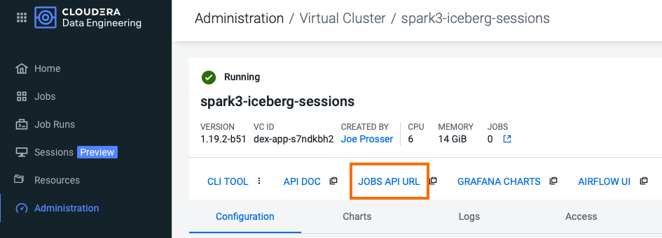

# Introduction

This page provides instructions for setting up the necessary data assets. Follow the steps below as a checklist to ensure you are good to go.

## Table of Contents

* [1. Requirements]()
* [2. Recommendations Before you Start]()
* [3. Project Download]()
* [4. CDP User & Credentials]()
* [5. Data Upload to Cloud Storage]
* [6. parameters.conf Configuration]()
* [7. Jobs API URL]
* [8. CDE CLI Setup]()
  * [8A. Configuring the CLI with the Provided Docker Container]()
  * [8B. Installing the CLI in your Local Machine]()
* [Index]()

## 1. Requirements

In order to execute the Labs you need:

* A Spark 3 and Iceberg-enabled CDE Virtual Cluster (Azure, AWS and Private Cloud ok). The CDE Service must be on version 1.19.3.

* Very few code changes are required but familiarity with Python and PySpark is highly recommended.

* Bonus Lab 2 requires a Hive CDW Virtual Warehouse. This lab is optional.

* A working installation of the CDE CLI. For this you have two options: pulling the provided Docker image or installing the CLI on your local machine. More details are provided below in step 7.

## 2. Recommendations Before you Start

This guide will instruct you to make minor edits to some of the scripts as you go along with the labs. Please be prepared to make changes in an editor and re-upload them to the same CDE File Resource after each change. Having all scripts open at all times in an editor such as Atom or Sublime Text is highly recommended.

## 3. Project Download

Clone this Git repository to your local machine.

```
mkdir ~/Documents/cde_ace_hol
cd ~/Documents/cde_ace_hol
git clone https://github.com/pdefusco/CDE119_ACE_WORKSHOP.git
```

Alternatively, if you don't have `git` installed on your machine, create a folder on your local computer; navigate to [this URL](https://github.com/pdefusco/CDE119_ACE_WORKSHOP.git) and manually download the files.

## 4. CDP User & Credentials

If you are participating in a Cloudera Event your Workshop Lead will provide you with the above credentials.

If you are reproducing the labs in your CDE Environment without the help of a Cloudera Lead you will have to upload the data to an arbitrary Cloud path and obtain your Workload User from your CDP Admin.

## 5. Data Upload to Cloud Storage

Upload the data folder in a Cloud Storage location of your choice.

If you are attending a Public HOL event with infrastructure provided by Cloudera the data will already have been uplaoded by your Workshop Lead.

If you are reproducing these labs in your own CDE deployment ensure you have placed all the contents of the data folder in a Cloud Storage location of your choice.

## 6. parameters.conf Configuration

Each script will read your credentials from "parameters.conf". Instructions for uploading this in your CDE File Resource are provided in part 2.

Before you start the labs, open "parameters.conf" located in the "resources_files" folder and edit all three fields with values provided by your Cloudera ACE Workshop Lead.

If you are reproducing these labs on your own you will have to ensure that these values reflect the Cloud Storage path where you loaded the data.

## 7. Jobs API URL

The Jobs API URL is the entry point to the cluster for the API and CLI. It will become necessary in the CDE CLI Setup and other parts of the labs.

Take note of your cluster's JOBS API URL by navigating to the Administration tab and by clicking on the Cluster Details icon for your Virtual Cluster.




## 8. CDE CLI Setup

Throughout the labs you will be using the CDE CLI. To set up the CLI you have two options: using the provided Docker container or manually installing it in your local machine.

*We highly recommend using the provided Docker container* as the configuration is much simpler.

#### 8A. Configuring the CLI with the Provided Docker Container

In order to use the provided Docker container first pull with the following command:

```docker pull pauldefusco/cde_cli_workshop_1_19:latest```

Next run the container. The following command starts and logs you into the running container:

```docker run -it pauldefusco/cde_cli_workshop_1_19:latest```

To configure the CLI open the "config.yaml" file and add your credentials:

```vi ~/.cde/config.yaml ```

* user: this will be provided to you by your Cloudera Workshop Lead. If you are working in your company's CDP Environment you can obtain your CDP Workload User from the CDP Management Console or by asking your CDP Administrator.

* vcluster-endpoint: the JOBS API URL provided in the Cluster Details page.

Test the CLI by running the following command. If your cluster is new no job runs may be found, but the output will help you ensure that you can connect to the cluster.

```cde run list```

#### 8B. Installing the CLI in your Local Machine

To manually install the CLI in your local machine follow the steps below:

Step 1: Download the CLI Client:

    * Navigate to the Cloudera Data Engineering Overview page by clicking the Data Engineering tile in the Cloudera Data Platform (CDP) management console.
    * In the CDE web console, select an environment.
    * Click the Cluster Details icon for the virtual cluster you want to access.
    * Click the link under CLI TOOL to download the CLI client.
    * Change the permissions on the downloaded cde file to make it executable:

Step 2: On the host with the CLI client, create or edit the configuration file at ```~/.cde/config.yaml```. You can create multiple profiles in the ```~/.cde/config.yaml``` file and can be used while running commands.

Step 3: In the configuration file, specify the CDP user and virtual cluster endpoint as follows. The CDP user is your workload username:

```
user: <CDP_user>
vcluster-endpoint: <JOBS API URL>
```

Step 4: Save the configuration file. If you have not done so already, make sure that the cde file is executable by running ```chmod +x /path/to/cde```. Test the CLI by running the following command. If your cluster is new no job runs may be found, but the output will help you ensure that you can connect to the cluster.

```cde run list```

For further information on the CLI please visit the [CDE Documentation](https://docs.cloudera.com/data-engineering/cloud/cli-access/topics/cde-cli.html)

## Index

* [Part 1](https://github.com/pdefusco/CDE119_ACE_WORKSHOP/blob/main/step_by_step_guides/english/part01_cde_architecture.md#cde-architecture) provides an introduction to the Architecture of the CDE Service. You will learn about the main components of CDE including the Environment, the Virtual Cluster, and more.
* In [Part 2](https://github.com/pdefusco/CDE119_ACE_WORKSHOP/blob/main/step_by_step_guides/english/part02_spark.md#part-2-developing-spark-jobs-in-cde) you will develop and deploy four Spark Jobs using the CDE UI, the CDE CLI and CDE Interactive Sessions. One of the Jobs will focus on Apache Iceberg.
* In [Part 3](https://github.com/pdefusco/CDE119_ACE_WORKSHOP/blob/main/step_by_step_guides/english/part03_airflow.md#part-3-orchestrating-pipelines-with-airflow) you will create an Airflow Pipeline to orchestrate multiple Spark Jobs.
* In [Part 4](https://github.com/pdefusco/CDE119_ACE_WORKSHOP/blob/main/step_by_step_guides/english/part04_spark_migration_tool.md#part-4-using-the-cde-spark-migration-tool-to-convert-spark-submits-to-cde-spark-submits) you will use the CDE Spark Migration tool to convert Spark Jobs into CDE Spark Jobs.
* In [Part 5](https://github.com/pdefusco/CDE119_ACE_WORKSHOP/blob/main/step_by_step_guides/english/part05_bonus_labs.md#part-5-bonus-labs) you will be able to explore a variety of topics in more detail including the CDE CLI, Airflow, and the CDE API.
* [Part 6](https://github.com/pdefusco/CDE119_ACE_WORKSHOP/blob/main/step_by_step_guides/english/part06_next_steps.md#conclusions-and-next-steps) provides a summary and a few related projects. If you are using or evaluating CDE today, please make sure to visit this page to learn about related projects.
