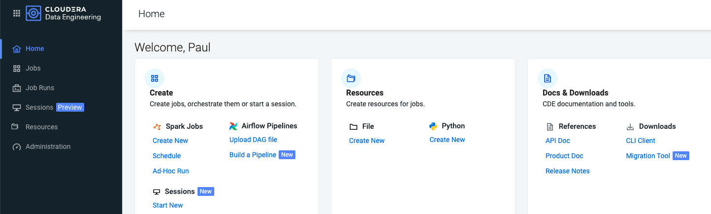
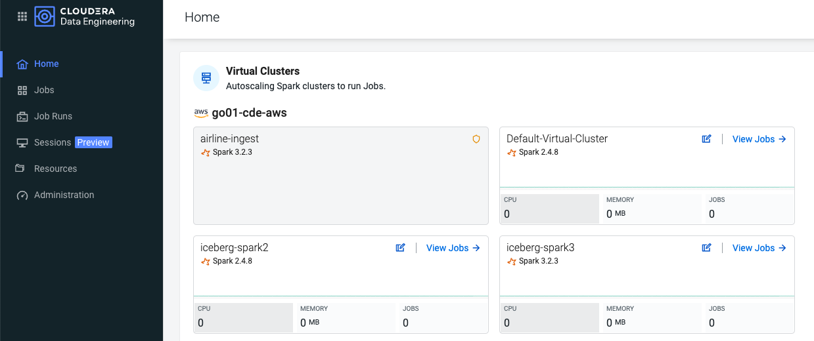
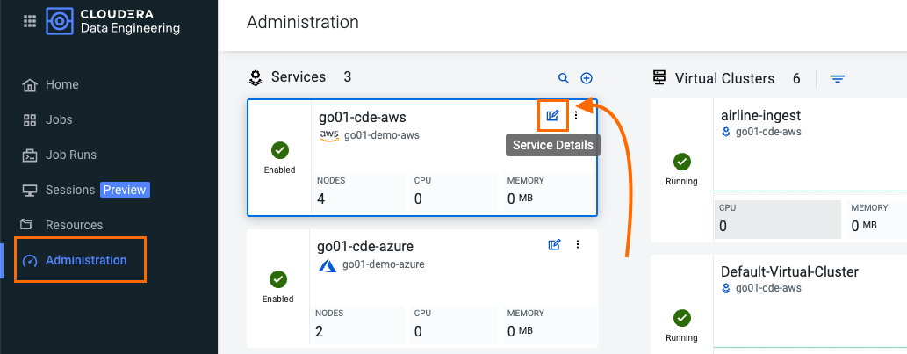
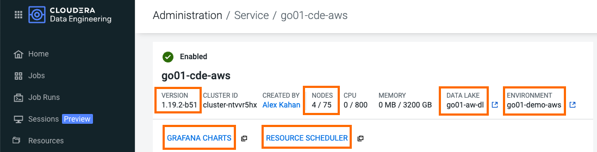
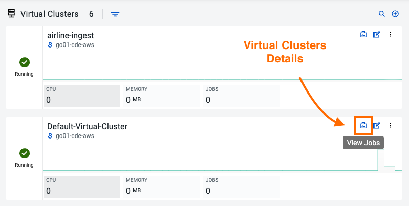
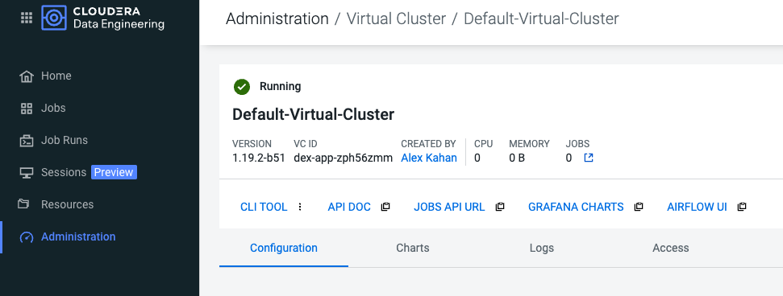
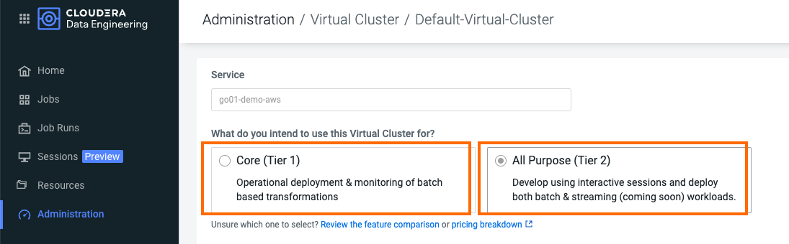
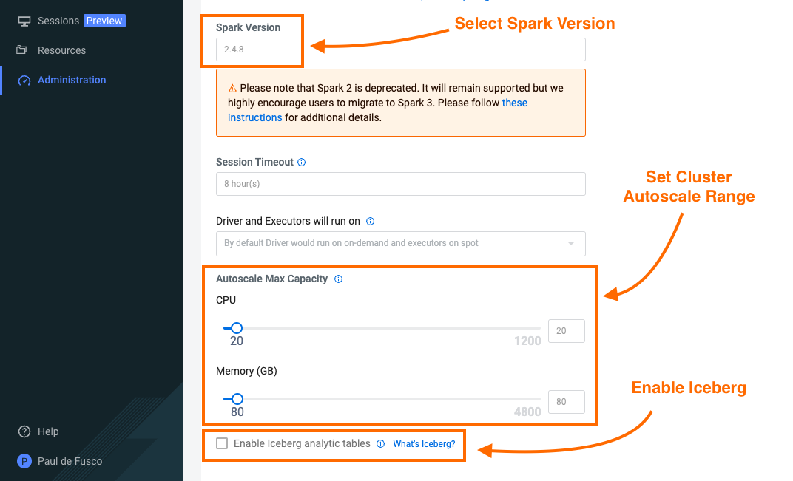

# Part 1: CDE Architecture

## Objective

In this section you will learn about CDE's flexible architecture and its main components.

## Table of Contents

* [Introduction to the CDE Service](https://github.com/pdefusco/CDE119_ACE_WORKSHOP/blob/main/step_by_step_guides/english/part01_cde_architecture.md#introduction-to-the-cde-service)
  * [CDP Environment](https://github.com/pdefusco/CDE119_ACE_WORKSHOP/blob/main/step_by_step_guides/english/part01_cde_architecture.md#cdp-environment)
  * [CDP Service](https://github.com/pdefusco/CDE119_ACE_WORKSHOP/blob/main/step_by_step_guides/english/part01_cde_architecture.md#cde-service)
  * [Virtual Cluster](https://github.com/pdefusco/CDE119_ACE_WORKSHOP/blob/main/step_by_step_guides/english/part01_cde_architecture.md#virtual-cluster)
  * [CDE Jobs](https://github.com/pdefusco/CDE119_ACE_WORKSHOP/blob/main/step_by_step_guides/english/part01_cde_architecture.md#jobs)
  * [CDE Resource](https://github.com/pdefusco/CDE119_ACE_WORKSHOP/blob/main/step_by_step_guides/english/part01_cde_architecture.md#resource)
  * [Job Run](https://github.com/pdefusco/CDE119_ACE_WORKSHOP/blob/main/step_by_step_guides/english/part01_cde_architecture.md#job-run)
  * [CDE Sessions](https://github.com/pdefusco/CDE119_ACE_WORKSHOP/blob/main/step_by_step_guides/english/part01_cde_architecture.md#cde-session)
  * [Apache Iceberg](https://github.com/pdefusco/CDE119_ACE_WORKSHOP/blob/main/step_by_step_guides/english/part01_cde_architecture.md#apache-iceberg)
  * [CDE User Interface](https://github.com/pdefusco/CDE119_ACE_WORKSHOP/blob/main/step_by_step_guides/english/part01_cde_architecture.md#cde-user-interface)
* [Summary](https://github.com/pdefusco/CDE119_ACE_WORKSHOP/blob/main/step_by_step_guides/english/part01_cde_architecture.md#summary)

## Introduction to the CDE Service

Cloudera Data Engineering (CDE) is a service for Cloudera Data Platform that allows you to submit batch jobs to auto-scaling virtual clusters. CDE enables you to spend more time on your applications, and less time on infrastructure.

Cloudera Data Engineering allows you to create, manage, and schedule Apache Spark jobs without the overhead of creating and maintaining Spark clusters. With Cloudera Data Engineering, you define virtual clusters with a range of CPU and memory resources, and the cluster scales up and down as needed to run your Spark workloads, helping to control your cloud costs.

The CDE Service can be reached from the CDP Home Page by clicking on the blue "Data Engineering" icon.

The CDE Landing Page allows you to access, create and manage CDE Virtual Clusters. Within each CDE Virtual Cluster you can  create, monitor and troubleshoot Spark and Airflow Jobs.

The Virtual Cluster is pegged to the CDP Environment. Each CDE Virtual Cluster is mapped to at most one CDP Environment while a CDP Environment can map to one or more Virtual Cluster.

These are the most important components in the CDE Service:

##### CDP Environment
A logical subset of your cloud provider account including a specific virtual network. CDP Environments can be in AWS, Azure, RedHat OCP and Cloudera ECS. For more information, see [CDP Environments](https://docs.cloudera.com/management-console/cloud/overview/topics/mc-core-concepts.html). Practically speaking, an environment is equivalent to a Data Lake as each environment is automatically associated with its own SDX services for Security, Governance and Lineage.

##### CDE Service
The long-running Kubernetes cluster and services that manage the virtual clusters. The CDE service must be enabled on an environment before you can create any virtual clusters.

##### Virtual Cluster
An individual auto-scaling cluster with predefined CPU and memory ranges. Virtual Clusters in CDE can be created and deleted on demand. Jobs are associated with clusters. Up until CDE version 1.18 only one type of Virtual Clusters was available. Since Version 1.19 you can choose between two Cluster Tiers:

*Core (Tier 1)*: Batch-based transformation and engineering options include:
* Autoscaling Cluster
* Spot Instances
* SDX/Lakehouse
* Job Lifecycle
* Monitoring
* Workflow Orchestration

*All Purpose (Tier 2)*: Develop using interactive sessions and deploy both batch and streaming workloads. This option includes all options in Tier 1 with the addition of the  following:
* Shell Sessions - CLI and Web
* JDBC/SparkSQL (Coming in October 2023 with CDE 1.20)
* IDE (Coming in October 2023 with CDE 1.20)

Core clusters are recommended as Production environments. All Purpose clusters are instead designed to be used as Development and Testing environments.
For more information on the CDE 1.19.1 and 1.19.2 releases please visit this page in the [documentation](https://docs.cloudera.com/data-engineering/cloud/release-notes/topics/cde-whats-new-1.19.html).

##### Jobs
Application code along with defined configurations and resources. Jobs can be run on demand or scheduled. An individual job execution is called a job run.

##### Resource
A defined collection of files such as a Python file or application JAR, dependencies, and any other reference files required for a job.

##### Job Run
An individual job run.

##### CDE Session

CDE interactive sessions give data engineers flexible end-points to start developing Spark applications from anywhere -- in a web-based terminal, local CLI, favorite IDE, and even via JDBC from third-party tools.

##### Apache Iceberg

Apache Iceberg is a cloud-native, high-performance open table format for organizing petabyte-scale analytic datasets on a file system or object store. Combined with Cloudera Data Platform (CDP), users can build an open data lakehouse architecture for multi-function analytics and to deploy large scale end-to-end pipelines.

Open Data Lakehouse on CDP simplifies advanced analytics on all data with a unified platform for structured and unstructured data and integrated data services to enable any analytics use case from ML, BI to stream analytics and real-time analytics. Apache Iceberg is the secret sauce of the open lakehouse.

Iceberg is compatible with a variety of compute engines including Spark. CDE allows you to deploy Iceberg-enabled Virtual Clusters.

For more information please visit the [documentation](https://iceberg.apache.org/).

##### CDE User Interface

Now that you have covered the basics of CDE, spend a few moments familiarizing yourself with the CDE Landing page.

The Home Page provides a high level overview of all CDE Services and Clusters. It was redesigned in version 1.19 to also include shortcuts for different actions such as creating CDE Jobs and Resources or visiting the documentation.

At the top, you have shortcuts to creating CDE Jobs and Resources.

Scroll down to the CDE Virtual Clusters section and notice that all Virtual Clusters and each associated CDP Environment / CDE Service are shown.

Next, open the Administration page on the left tab. This page also shows CDE Services on the left and associated Virtual Clusters on the right.

Open the CDE Service Details page and notice the following key information and links:

* CDE Version
* Nodes Autoscale Range
* CDP Data Lake and Environment
* Graphana Charts. Click on this link to obtain a dashboard of running Service Kubernetes resources.
* Resource Scheduler. Click on this link to view the Yunikorn Web UI.

Scroll down and open the Configurations tab. Notice that this is where Instance Types and Instance Autoscale ranges are defined.

To learn more about other important service configurations please visit [Enabling a CDE Service](https://docs.cloudera.com/data-engineering/cloud/enable-data-engineering/topics/cde-enable-data-engineering.html) in the CDE Documentation.

Navigate back to the Administration page and open a Virtual Cluster's Cluster Details page.

This view includes other important cluster management information. From here you can:

* Download the CDE CLI binaries. The CLI is recommended to submit jobs and interact with CDE. It is covered in Part 3 of this guide.
* Visit the API Docs to learn the CDE API and build sample requests on the Swagger page.
* Access the Airflow UI to monitor your Airflow Jobs, set up custom connections, variables, and more.  

Open the Configuration tab. Notice that you can select between Core and All Purpose Tier Clusters.
In addition, this view provides options to set CPU and Memory autoscale ranges, Spark version, and Iceberg options are set here.
CDE supports Spark 2.4.8, 3.2.3 and 3.3.0.

To learn more about CDE Architecture please visit [Creating and Managing Virtual Clusters](https://docs.cloudera.com/data-engineering/cloud/manage-clusters/topics/cde-create-cluster.html) and [Recommendations for Scaling CDE Deployments](https://docs.cloudera.com/data-engineering/cloud/deployment-architecture/topics/cde-general-scaling.html)

## Summary

A CDE Service defines compute instance types, instance autoscale ranges and the associated CDP Data Lake. The Data and Users associated with the Service are subjected by SDX and the CDP Environment settings. You can leverage SDX Atlas and Ranger to visualize table and job metadata and secure user and data access with fine-grained policies.

Within a CDE Service you can deploy one or more CDE Virtual Clusters. The Service Autoscale Range is a count of min/max allowed Compute Instances. The Virtual Cluster Autoscale Range is the min/max CPU and Memory that can be utilized by all CDE Jobs within the cluster. The Virtual Cluster Autoscale Range is naturally bounded by the CPU and Memory available at the Service level.

CDE supports Spark versions 2.4.8, 3.2.3 and 3.3.0. CDE Virtual Clusters are deployed with one Spark Version per Virtual Cluster.

This flexible architecture allows you to isolate your workloads and limit access within different autoscaling compute clusters while predefining cost management guardrails at an aggregate level. For example, you can define Services at an organization level and Virtual Clusters within them as DEV, QA, PROD, etc.

CDE takes advantage of YuniKorn resource scheduling and sorting policies, such as gang scheduling and bin packing, to optimize resource utilization and improve cost efficiency. For more information on gang scheduling, see the Cloudera blog post [Spark on Kubernetes – Gang Scheduling with YuniKorn](https://blog.cloudera.com/spark-on-kubernetes-gang-scheduling-with-yunikorn/).

CDE Spark Job auto-scaling is controlled by Apache Spark dynamic allocation. Dynamic allocation scales job executors up and down as needed for running jobs. This can provide large performance benefits by allocating as many resources as needed by the running job, and by returning resources when they are not needed so that concurrent jobs can potentially run faster.

[In the next section](https://github.com/pdefusco/CDE119_ACE_WORKSHOP/blob/main/step_by_step_guides/english/part02_spark.md#part-2-developing-spark-jobs-in-cde) you will develop and deploy your first Spark Jobs in CDE to start building an ETL and Reporting Pipeline at scale.
