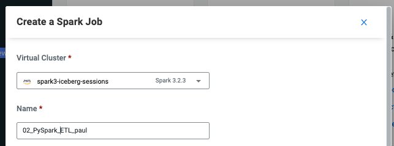

# Part 3: Developing and Deploying Spark Jobs in CDE

## Table of Contents

* [Use Case: Create a Spark Pipeline]()
* [Spark Concepts]()
  * [Spark Architecture]()
  * [Spark Application]()
  * [Spark Worker Nodes]()
  * [JVM]()
  * [Spark Driver]()
  * [Spark Executors]()
  * [Spark Cores/Slots/Threads]()
  * [Spark Partitioning]()
  * [Lifecycle of a Spark Application]()
  * [Spark DAG]()
  * [Spark Job]()
  * [Spark Stages]()
  * [Spark Tasks]()
  * [Caching in Spark]()
  * [Shuffling in Spark]()
  * [Transformations]()
  * [Actions]()
  * [Narrow vs Wide Tranformations]()
  * [Application Execution Flow]()
  * [Dataframes vs Datasets vs RDDs]()
* [Lab 1: Using CDE Resources](https://github.com/pdefusco/CDE119_ACE_WORKSHOP/blob/main/step_by_step_guides/english/part03_spark.md#table-of-contents)
* [Lab 2: Creating CDE Spark Jobs in the UI](https://github.com/pdefusco/CDE119_ACE_WORKSHOP/blob/main/step_by_step_guides/english/part03_spark.md#creating-cde-spark-jobs-in-the-ui)
  * [1. Set Job Name, Virtual Cluster and Application File](https://github.com/pdefusco/CDE119_ACE_WORKSHOP/blob/main/step_by_step_guides/english/part03_spark.md#1-set-job-name-virtual-cluster-and-application-file)
  * [2. Set Spark Configurations](https://github.com/pdefusco/CDE119_ACE_WORKSHOP/blob/main/step_by_step_guides/english/part03_spark.md#2-set-spark-configurations)
  * [3. Set Python Environment](https://github.com/pdefusco/CDE119_ACE_WORKSHOP/blob/main/step_by_step_guides/english/part03_spark.md#3-set-python-environment)
  * [4. Set Advanced Options](https://github.com/pdefusco/CDE119_ACE_WORKSHOP/blob/main/step_by_step_guides/english/part03_spark.md#4-set-advanced-options)
  * [5. Set Compute Options](https://github.com/pdefusco/CDE119_ACE_WORKSHOP/blob/main/step_by_step_guides/english/part03_spark.md#5-set-compute-options)
  * [6. Trigger and Monitor the Job](https://github.com/pdefusco/CDE119_ACE_WORKSHOP/blob/main/step_by_step_guides/english/part03_spark.md#6-trigger-and-monitor-the-job)
* [Lab 3: Creating Spark Jobs with the CDE CLI](https://github.com/pdefusco/CDE119_ACE_WORKSHOP/blob/main/step_by_step_guides/english/part03_spark.md#creating-spark-jobs-with-the-cde-cli)
  * [1. CDE Spark Submit via the CDE CLI](https://github.com/pdefusco/CDE119_ACE_WORKSHOP/blob/main/step_by_step_guides/english/part03_spark.md#1-cde-spark-submit-via-the-cde-cli)
  * [2. CDE Spark Job via the CDE CLI](https://github.com/pdefusco/CDE119_ACE_WORKSHOP/blob/main/step_by_step_guides/english/part03_spark.md#2-cde-spark-job-via-the-cde-cli)
* [Summary](https://github.com/pdefusco/CDE119_ACE_WORKSHOP/blob/main/step_by_step_guides/english/part03_spark.md#summary)

## Use Case: Create a Spark Pipeline

In part 2 you started using Spark in CDE via interactive sessions. However, Spark is often primarily used to process large quantities of data in batch. In the following labs you will create a Spark pipeline composed of two Spark Jobs. The first job will Extract, Load and Transform data located in Cloud Storage. The data will be saved in intermediary tables and then loaded and joind by the second job in order to create a report.

In the process you will learn to build CDE Spark Jobs with PySpark and Scala. You will work with complex file dependencies and Spark configurations and leverage CDE Resources (Files and Python Environment) to more effectively organize and reuse them as part of CDE Job Definitions. In the process you will become familiar with the CDE UI and its built-in observability capabilities. Finally, you will leverage the CDE CLI in order to construct Jobs more efficiently.

## Spark Concepts

#### Spark Architecture

A cluster, or group of machines, pools the resources of many machines together allowing us to use all the cumulative resources as if they were one. Now a group of machines sitting somewhere alone is not powerful, you need a framework to coordinate work across them. Spark is a tailor-made engine exactly for this, managing and coordinating the execution of tasks on data across a cluster of computers.

The cluster of machines that Spark will leverage to execute tasks will be managed by a cluster manager like Spark’s Standalone cluster manager, YARN - Yet Another Resource Negotiator, Kubernetes. We then submit Spark Applications to these cluster managers which will grant resources to our application so that we can complete our work.

#### Spark Application

Spark Applications consist of a driver process and a set of executor processes. In the illustration we see above, our driver is on the left and four executors on the right.

#### Spark Worker Nodes

The worker nodes contain the executors which are responsible for actually carrying out the work that the driver assigns them. The Cluster Manager controls physical machines and allocates resources to the Spark Application. There can be multiple Spark Applications running on a cluster at the same time.

#### JVM

The JVM manages system memory and provides a portable execution environment for Java-based applications

Technical definition: The JVM is the specification for a software program that executes code and provides the runtime environment for that code.

Everyday definition: The JVM is how we run our Java programs. We configure the JVM's settings and then rely on it to manage program resources during execution.

The Java Virtual Machine (JVM) is a program whose purpose is to execute other programs.

The JVM has two primary functions: To allow Java programs to run on any device or operating system (known as the "Write once, run anywhere" principle) and to manage and optimize program memory.

#### Spark Driver

The driver process runs your main() functions; it sits on the node in the cluster and is responsible for 3 main things:

1) Maintaining information about the spark application. Its a heart of a spark application and maintains all the I information during the lifetime of the application. Responding to user’s program or input. Analyzing, distributing and scheduling work across the executors.

2) When a Spark program is triggered (e.g. a cell in this notebook performing Spark transformations and actions) the Driver converts the user program into tasks and after that it schedules the tasks on the executors.

3) Spark Application — -> Driver — -> List of Tasks — -> Scheduler — -> Executors

#### Spark Executors

The executors are responsible for carrying out the work that the driver assigns them.

Executors are worker nodes’ processes in charge of running individual tasks in a given Spark job. They are launched at the beginning of a Spark application and typically run for the entire lifetime of an application. Once they have run the task they send the results to the driver. They also provide in-memory storage for RDDs that are cached by user programs through Block Manager.

When executors are started they register themselves with the driver and from so on they communicate directly. The workers are in charge of communicating the cluster manager the availability of their resources.

Execute code assigned to it by the driver.

Reporting the state of the computation on that executor back to driver.

#### Spark Cores/Slots/Threads

Spark parallelizes at two levels. One is the splitting the work among executors. The other is the slot. Each executor has a number of slots. Each slot can be assigned a Task.

The JVM is naturally multithreaded, but a single JVM, such as our Driver, has a finite upper limit. By creating Tasks, the Driver can assign units of work to Slots on each Executor for parallel execution. Additionally, the Driver must also decide how to partition the data so that it can be distributed for parallel processing (see below). Consequently, the Driver is assigning a Partition of data to each task - in this way each Task knows which piece of data it is to process. Once started, each Task will fetch from the original data source (e.g. An Azure Storage Account) the Partition of data assigned to it. You can set the number of task slots to a value two or three times (i.e. to a multiple of) the number of CPU cores. Although these task slots are often referred to as CPU cores in Spark, they’re implemented as threads that work on a physical core's thread and don’t need to correspond to the number of physical CPU cores on the machine (since different CPU manufacturer's can architect multi-threaded chips differently).

In other words:

All processors of today have multiple cores (e.g. 1 CPU = 8 Cores) Most processors of today are multi-threaded (e.g. 1 Core = 2 Threads, 8 cores = 16 Threads) A Spark Task runs on a Slot. 1 Thread is capable of doing 1 Task at a time. To make use of all our threads on the CPU, we cleverly assign the number of Slots to correspond to a multiple of the number of Cores (which translates to multiple Threads). By doing this, after the Driver breaks down a given command into Tasks and Partitions, which are tailor-made to fit our particular Cluster Configuration (say 4 nodes - 1 driver and 3 executors, 8 cores per node, 2 threads per core). By using our Clusters at maximum efficiency like this (utilizing all available threads), we can get our massive command executed as fast as possible (given our Cluster in this case, 382 Threads --> 48 Tasks, 48 Partitions - i.e. 1 Partition per Task) If we don't do then even with a 100 executor cluster, the entire burden would go to 1 executor, and the other 99 will be sitting idle - i.e. slow execution. if we foolishly assign 49 Tasks and 49 Partitions, the first pass would execute 48 Tasks in parallel across the executors cores (say in 10 minutes), then that 1 remaining Task in the next pass will execute on 1 core for another 10 minutes, while the rest of our 47 cores are sitting idle - meaning the whole job will take double the time at 20 minutes. This is obviously an inefficient use of our available resources, and could rather be fixed by setting the number of tasks/partitions to a multiple of the number of cores we have (in this setup - 48, 96 etc).

#### Spark Partitioning

In order to allow every executor to perform work in parallel, Spark breaks up the data into chunks, called partitions. A partition is a collection of rows that sit on one physical machine in our cluster. A DataFrame’s partitions represent how the data is physically distributed across your cluster of machines during execution.

A partition can be processed by a single Executor core/thread. For example: If you have 4 data partitions and you have 4 executor cores/threads, you can process everything in parallel, in a single pass. If you have many partitions, but only one executor, Spark will still only have a parallelism of one because there is only one computation resource.

#### Lifecycle of a Spark Application

When you create the SparkContext, each worker starts an executor. This is a separate process (JVM), and it loads your jar too. The executors connect back to your driver program. Now the driver can send them commands, like flatMap, map and reduceByKey in your example. When the driver quits, the executors shut down.

RDDs are sort of like big arrays that are split into partitions, and each executor can hold some of these partitions.

A task is a command sent from the driver to an executor by serializing your Function object. The executor deserializes the command (this is possible because it has loaded your jar), and executes it on a partition.

#### Spark DAG

Directed Acyclic Graph ( DAG ) in Apache Spark is a set of Vertices and Edges, where vertices represent the RDDs and the edges represent the Operation to be applied on RDDs.

DAGScheduler is the scheduling layer of Apache Spark that implements stage-oriented scheduling. It transforms a logical execution plan to a physical execution plan (using stages).

After an action has been called, SparkContext hands over a logical plan to DAGScheduler that it in turn translates to a set of stages that are submitted as a set of tasks for execution.

The fundamental concepts of DAGScheduler are jobs and stages that it tracks through internal registries and counters.

#### Spark Job

A Job is a sequence of stages, triggered by an action such as count(), collect(), read() or write().

Each parallelized action is referred to as a Job. The results of each Job (parallelized/distributed action) is returned to the Driver from the Executor. Depending on the work required, multiple Jobs will be required.

#### Spark Stages

Each job that gets divided into smaller sets of tasks is a stage.

A Stage is a sequence of Tasks that can all be run together - i.e. in parallel - without a shuffle. For example: using ".read" to read a file from disk, then runnning ".filter" can be done without a shuffle, so it can fit in a single stage. The number of Tasks in a Stage also depends upon the number of Partitions your datasets have.

#### Spark Tasks

A task is a unit of work that is sent to the executor. Each stage has some tasks, one task per partition. The same task is done over different partitions of the RDD. In the example of Stages above, each Step is a Task.

#### Caching in Spark

In applications that reuse the same datasets over and over, one of the most useful optimizations is caching. Caching will place a DataFrame or table into temporary storage across the executors in your cluster and make subsequent reads faster.

#### Shuffling in Spark

A Shuffle refers to an operation where data is re-partitioned across a Cluster - i.e. when data needs to move between executors.

join and any operation that ends with ByKey will trigger a Shuffle. It is a costly operation because a lot of data can be sent via the network.

For example, to group by color, it will serve us best if...

All the reds are in one partitions All the blues are in a second partition All the greens are in a third From there we can easily sum/count/average all of the reds, blues, and greens.

#### Transformations

In Spark, the core data structures are immutable meaning they cannot be changed once created. In order to "change" a DataFrame you will have to instruct Spark how you would like to modify the DataFrame you have into the one that you want. These instructions are called transformations. Let’s perform a simple transformation to find all even numbers in our currentDataFrame. Examples – Select, Filter, GroupBy, Join, Union, Partition etc

#### Actions

Transformations allow us to build up our logical transformation plan. To trigger the computation, we run an action. An action instructs Spark to compute a result from a series of transformations. The simplest action is count which gives us the total number of records in the DataFrame.

#### Narrow Transformations Vs Wide Transformations

There are two types of transformations: Narrow and Wide. For narrow transformations, the data required to compute the records in a single partition reside in at most one partition of the parent dataset.

Examples include:

filter(..) drop(..) coalesce() For wide transformations, the data required to compute the records in a single partition may reside in many partitions of the parent dataset.

Examples include:

distinct() groupBy(..).sum() repartition(n) Remember, spark partitions are collections of rows that sit on physical machines in the cluster. Narrow transformations mean that work can be computed and reported back to the executor without changing the way data is partitioned over the system. Wide transformations require that data be redistributed over the system. This is called a shuffle.

Shuffles are triggered when data needs to move between executors.

#### Dataframes vs Datasets vs RDDs

Initially, in 2011 in they came up with the concept of RDDs, then in 2013 with Dataframes and later in 2015 with the concept of Datasets. None of them has been depreciated, we can still use all of them.

#### Spark RDD's

RDDs or Resilient Distributed Datasets is the fundamental data structure of the Spark. It is the collection of objects which is capable of storing the data partitioned across the multiple nodes of the cluster and also allows them to do processing in parallel.

It is fault-tolerant if you perform multiple transformations on the RDD and then due to any reason any node fails. The RDD, in that case, is capable of recovering automatically.

#### Spark Dataframes

It was introduced first in Spark version 1.3 to overcome the limitations of the Spark RDD. Spark Dataframes are the distributed collection of the data points, but here, the data is organized into the named columns. They allow developers to debug the code during the runtime which was not allowed with the RDDs.

Dataframes can read and write the data into various formats like CSV, JSON, AVRO, HDFS, and HIVE tables. It is already optimized to process large datasets for most of the pre-processing tasks so that we do not need to write complex functions on our own.

It uses a catalyst optimizer for optimization purposes.

#### Spark Datasets

Spark Datasets is an extension of Dataframes API with the benefits of both RDDs and the Datasets. It is fast as well as provides a type-safe interface. Type safety means that the compiler will validate the data types of all the columns in the dataset while compilation only and will throw an error if there is any mismatch in the data types.

Users of RDD will find it somewhat similar to code but it is faster than RDDs. It can efficiently process both structured and unstructured data.

We cannot create Spark Datasets in Python yet. The dataset API is available only in Scala and Java only

## Lab 1: Using CDE Resources

CDE Resources can be of type "File", "Python", or "Custom Runtime". You will start by creating a resource of type file to store all Spark and Airflow files and dependencies and then a Python Resource to utilize custom Python libraries in a CDE Spark Job run.

To create a File Resource, from the CDE Home Page click on "Create New" in the "Resources" -> "File" section.


Pick your Spark 3 / Iceberg enabled CDE Virtual Cluster and name your *Resource after your username or a unique ID.*


>**⚠ Warning**  
>Each Workshop user should create a separate File Resource with a unique name.  

Upload the following files located in the "cde_ace_hol/cde_spark_jobs" and "cde_ace_hol/resources_files" folders.

When you have finished ensure that the following files are located in your File Resource:

```
02_PySpark_ETL.py
simple_udf.zip
simple_udf_dependency.py
parameters.conf
utils.py
```

To create a Python Resource, navigate back to the CDE Home Page and click on "Create New" in the "Resources" -> "Python" section.


Ensure to select the same CDE Virtual Cluster. Name the Python CDE Resource and leave the pipy mirror field blank.


Upload the "requirements.txt" file provided in the "cde_ace_hol/resources_files" folder.


Notice the CDE Resource is now building the Python Virtual Environment. After a few moments the build will complete and you will be able to validate the libraries used.


To learn more about CDE Resources please visit [Using CDE Resources](https://docs.cloudera.com/data-engineering/cloud/use-resources/topics/cde-python-virtual-env.html) in the CDE Documentation.

## Lab 2: Creating CDE Spark Jobs in the UI

Next we will run and deploy a Spark script as a CDE Job of type Spark using the "02_PySpark_ETL.py" script. Navigate back to the CDE Home Page. Click on "Create New" in the "Jobs" -> "Spark" section.


#### 1. Set Job Name, Virtual Cluster and Application File

Select your CDE Virtual Cluster and assign "01_ETL" as the Job Name. Append your name to distinguish your job's name from others'.



The Application File is the code that will run as the Spark Job. This could be a PySpark file or a Jar.

Because you already uploaded the script to the CDE File Resource in the prior step this can be easily selected in the Job Configuration build: ensure to select "File" from the radio button and click on "Select from Resource" in the "Application File" section. A window will open with the contents loaded in your File Resource. Select script "02_PySpark_ETL.py".


#### 2. Set Spark Configurations

The Configurations section allows you to set Spark Application Configurations such as Driver and Executor settings, Jars, Spark properties, and many more. In other words, virtually most properties available in the [Spark Configurations Documentation](https://spark.apache.org/docs/latest/configuration.html) can be applied here.

In this job we will set the "spark.executorEnv.PYTHONPATH" configuration to "/app/mount/simple_udf.zip" so it can read the UDF from the File Resource.


#### 3. Set Python Environment

Set the Python environment to the Python Resource you created in the previous step.


#### 4. Set Advanced Options

The "Python, Egg, Zip Files" section allows you to load dependencies onto your job. This can be used for a variety of use cases including mounting Python files to the Executors, using Wheel files, and more.

In the Python, Egg, Zip Files section select the "utils.py" and "simple_udf.zip" file dependencies to load the UDF to the Spark Job. Notice the files have already been uploaded to the File Resource so you just need to select them from there.


Scroll down again to the "Resources" section and notice that your File Resource has been mapped to the Job by default. This allows the PySpark script to load modules in the same Resource such as the ones contained in the "utils.py" file.


#### 5. Set Compute Options

Compute Options allow you to set important Spark Resource Configurations.

* The Executors toggle bar allows you to set the "spark.dynamicAllocation.minExecutors" and "spark.dynamicAllocation.maxExecutors" options. These determine how many executors will be deployed by Spark Dynamic Allocation. Spark Dynamic Allocation is overridden to "Enabled" by default in CDE.

* The Initial Executors bar allows you to set the "spark.dynamicAllocation.initialExecutors" property. The option sets the initial number of executors for dynamic allocation. We recommend ensuring this is not set too high, especially to a value that is above the Job's expected number of Executors.

* Driver Cores and Driver Memory allow you to set "spark.driver.cores" and "spark.driver.memory". Increasing Driver Cores and Memory can be useful when your queries compile slowly or in case you call lots of collect() or take(N) actions especially on large RDD's.

* Executor Cores and Executor Memory allow you to set "spark.executor.cores" and "spark.executor.memory". These properties are used heavily in the context of Spark Tuning as they provide you with the ability to influence the degree of parallelism and storage capacity available in each Executor.

Set "Executors" to a minimum of 1 and a maximum of 4. Then set Executor Cores to 2, Driver Memory to 2, and Executor Memory to 2. This allows you to deploy a Spark Application with Executors that are slightly more resourceful than the values set in the default configurations, which often can result in Executors that are too small.


#### 6. Trigger and Monitor the Job

Scroll to the bottom and click on the "Create and Run" blue icon.


You will be automatically taken to the Jobs tab where the Job will now be listed at the top. Open the Job Runs tab on the left pane and validate that the CDE Spark Job is executing.


When complete, a green checkmark will appear on the left side. Click on the Job Run number to explore further.


The Job Run is populated with Metadata, Logs, and the Spark UI. This information is persisted and can be referenced at a later point in time.

The Configuration tab allows you to verify the script and resources used by the CDE Spark Job. From here you can edit the Configuration to change files, dependencies, run schedule, and more. For example the developer can reuse an existing job (or optionally create a clone) and make changes to its dependencies, schedule, etc. from the UI.

This also serves as an important CDE Observability feature. CDE maintains a historical trail of all runs and the respective job configurations associated with them. In other words, in traditional clusters when a Spark Job fails the developer had to manually investigate logs or, in a best case scenario, maintain DevOps processes to back up logs and runs. In CDE all of this is done automatically.   


The Logs tab contains rich logging information. For example, you can verify code output under "Logs" -> "Driver" -> "StdOut".


The Spark UI allows you to visualize resource usage, optimize performance and troubleshoot your Spark Jobs.


## Lab 3: Creating Spark Jobs with the CDE CLI

So far we have created a Spark Job via the CDE UI. However, CDE use cases involving more than just a few jobs normally benefit in numerous ways from the CDE CLI or CDE API. The CLI allows you to more quickly iterate through different Spark Submits and CDE Resources. The API is an excellent access point to CDE from other tools including 3rd party DevOps and CI/CD solutions.

In this section we will create a CDE Spark Submit and a CDE Spark Job via the CLI. In the process we will explain the difference.

#### 1. CDE Spark Submit via the CDE CLI.

A CDE Spark Submit is the fastest way to prototype a Spark Job. It allows you to submit Spark Application Code and monitor results with CDE's logging and observability features but it does not allow you to save the Code as a reusable CDE Job Definition. This is beneficial for example in case you want to reschedule the job to run on a recurrent basis or include it in a CDE Airflow Job.

Start with a simple Spark Submit by running the following command in your terminal:

```
cde spark submit cde_spark_jobs/02_PySpark_Reports.py
```

Shortly after running this you will notice confirmation of submission in the terminal. As the Spark Application runs the terminal will show logs and job outputs.


The above created a "cli-submit-username-timestamp" entry in the Job Runs page of your CDE Cluster. Open the Job Run and explore the logs. Notice the Job Definition is not reusable.


The first Spark Submit ran a simple PySpark job but notice we didn't specify any Spark Options. Next, create a more advanced Spark Submit by running the following command in your terminal:

```
cde spark submit --py-files cde_spark_jobs/dist/mywheel-0.0.1-py3-none-any.whl cde_spark_jobs/mywheel/__main__.py --executor-cores 2 --executor-memory 2g
```

The above CDE Spark Submit ran with Spark Application code packaged in a Wheel file. Notice that the CDE Spark Submit included the ```--py-files```, ```--exeutor-cores``` and ```--executor-memory``` flags. These correspond to the same options available for a Spark Submit. For more on building Spark Submits commands, please visit the [Spark Documentation](https://spark.apache.org/docs/latest/submitting-applications.html)


#### 2. CDE Spark Job via the CDE CLI.

Similar to a CDE Spark Submit a CDE Spark Job is Application code to execute a Spark (or Airflow) Job in a CDE Virtual Cluster. However, the CDE Job allows you to easily define, edit and reuse configurations and resources in future runs. Jobs can be run on demand or scheduled. An individual job execution is called a Job Run.

A CDE Job of type Spark always requires a reference CDE Resource in order to mount Application Code and any dependencies. Therefore, start by creating a CDE Resource of type File:

```
cde resource create --name my_user_resource
```

Upload Application Code to the Resource:

```
cde resource upload --name my_user_resource --local-path cde_spark_jobs/cdejobjar_2.12-1.0.jar
```


Now create a CDE Job of type Spark mounting the uploaded Resource files:

```
cde job create \
  --name my-cde-job \
  --type spark \
  --mount-1-resource my_user_resource \
  --application-file cdejobjar_2.12-1.0.jar \
  --conf spark.sql.shuffle.partitions=10 \
  --executor-cores 2 \
  --executor-memory 2g
```

As before, notice Spark Configurations such as ```--executor-cores```, ```--executor-memory```, or ```spark.sql.shuffle.partitions=10``` via the ```--conf``` flag can be applied to the CDE Job.

Finally, run the Job :

```
cde job run --name my-cde-job
```

Notice the Job Run ID output to the terminal and validate the Job in the Job Runs page of your cluster.


Navigate to the Jobs page in your CDE Virtual Cluster and open the Job. Notice that the Definition can be edited and is reusable.


To learn more about CDE Jobs please visit [Creating and Managing CDE Jobs](https://docs.cloudera.com/data-engineering/cloud/manage-jobs/topics/cde-create-job.html) in the CDE Documentation.

## Summary

CDE provides multiple options for running Spark Application code at scale.

The easiest way to create and deploy a Spark Job is by leveraging the UI. Each section in the UI corresponds to a piece of a spark-submit. However, if you are planning to use CDE on a daily basis we recommend learning the CLI as it provides a richer set of options and the ability to iterate through multiple job runs faster.

Both the CLI and the UI allow you to create and deploy a CDE Job of type Spark. The CLI also allows you to run a spark-submit. The CDE Job wraps the Spark Application code with a reusable entity. The CDE Job is associated with an editable configuration and a detailed run history including logs, dependencies, user, and even a long-lived Spark UI. The simple spark-submit doesn't provide any of the above and is rather recommended when prototyping Spark Applications without the need to worry about the future. The spark-submit can also be converted into a CDE Spark Job via the UI or CLI.

Another advantage of CDE Jobs is that they can be associated with CDE Resources. Resources can be of type File or Python. File Resources allow you to store file dependencies at the cluster level and mount them at runtime. Similarly, Python Resources make it possible to apply custom Python Environments to a given job or job run. By decoupling Spark Applications from their dependencies, CDE allows users to iterate faster while achieving high job observability.

Finally, CDE Sessions allow you to connect to CDE remotely by entering an interactive Spark Shell. Users can choose between Scala and PySpark. Sessions are recommended for interactive data exploration and quick tests in general.

If allowed access to the Virtual Cluster, CDP Users can run CDE Jobs. The Workload User is inherited from the CDP Environment while the Workload Password is set automatically. Data is secured by default via SDX and can be easily accessed from Cloud Storage or other sources.  

Apache Iceberg is a new open table format designed for managing, organizing, and tracking all the files that make up a table. The table format helps break down complex datasets stored in popular file formats like Apache Parquet, Optimized row columnar, and AVRO, among others. Apache Iceberg architecture keeps track of all the files using tree structures. The table format consists of a clear path to the metadata file that stores all individual data files. Iceberg was introduced by Netflix to solve several data consistency and performance issues in Apache Hive.

CDE Virtual Clusters are automatically enabled with Iceberg at Cluster deployment time. CDE Users need only apply the SparkSession configurations shown above to launch an Iceberg-compatible Spark Job. No extra jars are needed.

[In the next section](https://github.com/pdefusco/CDE119_ACE_WORKSHOP/blob/main/step_by_step_guides/english/part03_airflow.md#part-3-orchestrating-pipelines-with-airflow) you will learn the basics of Airflow Orchestration in CDE in order to deploy a pipeline of dependent CDE Jobs.
