# Parte 2: Desarrollo e Implementación de Jobs de Spark en CDE

## Objetivo

En esta sección, crearás cuatro Jobs de Spark utilizando la interfaz de usuario de CDE, la CLI de CDE y Sesiones Interactivas de CDE. En el proceso, aprenderás cómo usar Recursos de CDE para almacenar archivos y reutilizar entornos virtuales de Python, migrar tablas de Spark a tablas de Iceberg y utilizar algunas de las características más esperadas de Iceberg, como Viaje en el Tiempo, Consultas Incrementales, Particiones y Evolución de Esquemas.

### Edición de Archivos y Creación de Recursos de CDE

Los Recursos de CDE pueden ser de tipo "Archivo", "Python" o "Tiempo de Ejecución Personalizado". Comenzarás creando un recurso de tipo archivo para almacenar todos los archivos de Spark y Airflow y sus dependencias, y luego un Recurso de Python para utilizar bibliotecas Python personalizadas en una ejecución de Job de Spark de CDE.

Para crear un Recurso de Archivo, desde la Página de Inicio de CDE, haz clic en "Crear Nuevo" en la sección "Recursos" -> "Archivo"."


Selecciona tu Clúster Virtual de CDE habilitado para Spark 3 / Iceberg y nombra tu *Recource con tu nombre de usuario o un ID único.*


>**⚠ Advertencia**  
>Cada usuario del taller debe crear un Recurso de Archivo separado con un nombre único.

Carga los siguientes archivos ubicados en las carpetas "cde_ace_hol/cde_spark_jobs" y "cde_ace_hol/resources_files".

Cuando hayas terminado, asegúrate de que los siguientes archivos se encuentren en tu Recurso de Archivo:

```
02_PySpark_ETL.py
simple_udf.zip
simple_udf_dependency.py
parameters.conf
utils.py
```

Para crear un Resource de Python, regresa a la Página de Inicio de CDE y haz clic en "Crear Nuevo" en la sección "Recursos" -> "Python".


Asegúrate de seleccionar el mismo Clúster Virtual de CDE. Nombra el Recurso de CDE de Python y deja el campo de espejo de pipy en blanco.

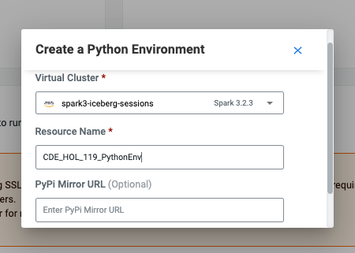

Carga el archivo "requirements.txt" proporcionado en la carpeta "cde_ace_hol/resources_files".


Observa que el Recurso de CDE está construyendo el Ambiente Virtual de Python. Después de unos momentos, la compilación se completará y podrás validar las bibliotecas utilizadas.

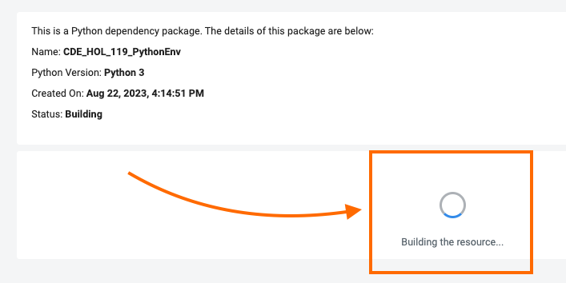

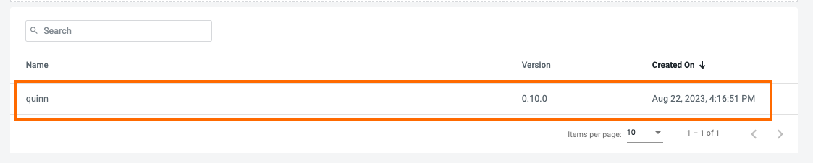

Para obtener más información sobre los Resources de CDE, visita [Using CDE Resources](https://docs.cloudera.com/data-engineering/cloud/use-resources/topics/cde-python-virtual-env.html) en la documentación de CDE.

### Creación de Jobs de Spark en la Interfaz de Usuario de CDE

A continuación, ejecutaremos e implementaremos un script de Spark como un Job de CDE de tipo Spark utilizando el script "02_PySpark_ETL.py". Regresa a la Página de Inicio de CDE. Haz clic en "Create New" en la sección "Jobs" -> "Spark".

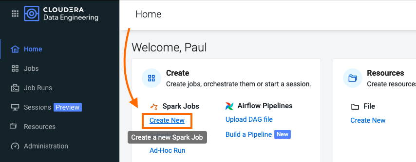

#### 1. Establecer Nombre del Job, Clúster Virtual y Archivo de Aplicación

Selecciona tu Clúster Virtual de CDE y asigna "O1_ETL" como Nombre del Job. Agrega tu nombre para distinguir el nombre de tu Job de los demás.

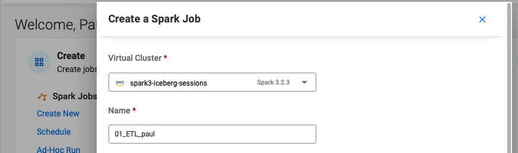

El Archivo de Aplicación es el código que se ejecutará como el Job de Spark. Puede ser un archivo de PySpark o un archivo Jar.

Dado que ya cargaste el script en el Recurso de Archivo de CDE en el paso anterior, esto se puede seleccionar fácilmente en la construcción de la Configuración del Job: asegúrate de seleccionar "Archivo" en el botón de opción y haz clic en "Seleccionar desde Recurso" en la sección "Archivo de Aplicación". Se abrirá una ventana con el contenido cargado en tu Recurso de Archivo. Selecciona el script "02_PySpark_ETL.py".

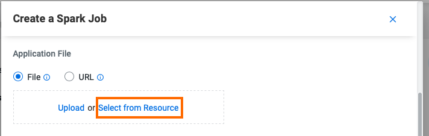

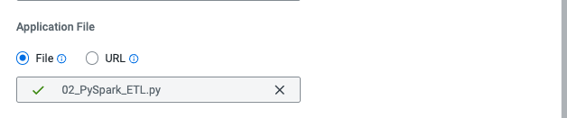

#### 2. Set Spark Configurations

La sección de Configuraciones te permite establecer Configuraciones de Aplicación de Spark, como la configuración del Controlador y los Ejecutores, Jars, propiedades de Spark y muchas más. En otras palabras, prácticamente la mayoría de las propiedades disponibles en la [Spark Configurations Documentation](https://spark.apache.org/docs/latest/configuration.html) se pueden aplicar aquí.

En este Job, estableceremos la configuración `spark.executorEnv.PYTHONPATH` en `/app/mount/simple_udf.zip` para que pueda leer la UDF desde el Recurso de Archivo de CDE.

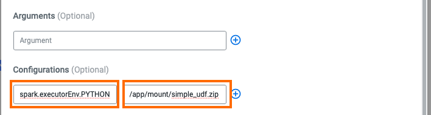

#### 3. Establecer Ambiente de Python

Establece el entorno de Python en el Recurso de Python de CDE que creaste en el paso anterior.

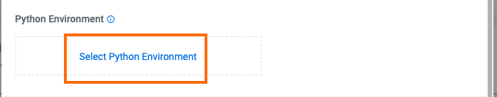

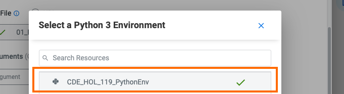

#### 4. Set Advanced Options

La sección "Python, Egg y Zip Files" te permite cargar dependencias en tu job. Esto se puede usar para una variedad de casos de uso, incluido montar archivos Python en los Ejecutores, usar archivos Wheel y más.

En la sección "Python, Egg y Zip Files" selecciona las dependencias de archivos "utils.py" y "simple_udf.zip" para cargar la UDF en el Job de Spark. Observa que los archivos ya se han cargado en el Recurso de Archivo, por lo que solo necesitas seleccionarlos desde allí.


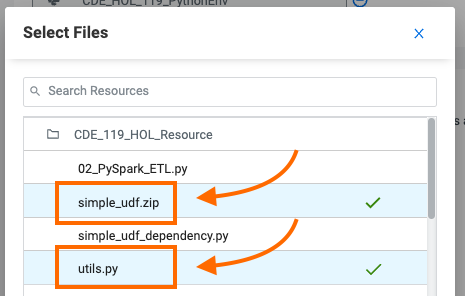

Desplázate nuevamente hacia abajo hasta la sección "Recursos" y observa que tu Recurso de Archivo se ha asignado al Job de manera predeterminada. Esto permite que el script de PySpark cargue módulos en el mismo Recurso, como los que están contenidos en el archivo "utils.py".

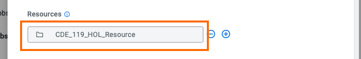

#### 5. Configurar Opciones de Cómputo

Las Opciones de Cómputo te permiten establecer configuraciones importantes de recursos de Spark.

* La barra de alternancia de Ejecutores te permite establecer las opciones "spark.dynamicAllocation.minExecutors" y "spark.dynamicAllocation.maxExecutors". Estas determinan cuántos ejecutores serán desplegados por la Asignación Dinámica de Spark. La Asignación Dinámica de Spark se establece en "Habilitado" de forma predeterminada en CDE.
* La barra de Initial Executors te permite establecer la propiedad "spark.dynamicAllocation.initialExecutors". Esta opción establece el número inicial de Executors para la asignación dinámica. Recomendamos asegurarte de que esto no esté configurado demasiado alto, especialmente en un valor que esté por encima del número esperado de Executors del Jobs.
* Driver Cores and Driver Memory te permiten establecer "spark.driver.cores" y "spark.driver.memory". Aumentar los Cores del Controlador y la Memoria puede ser útil cuando tus consultas se compilan lentamente o en caso de que realices muchas acciones collect() o take(N), especialmente en RDD grandes.
* Executor Cores and Executor Memory te permiten establecer "spark.executor.cores" y "spark.executor.memory". Estas propiedades se utilizan mucho en el contexto de la Afinación de Spark, ya que te brindan la capacidad de influir en el grado de paralelismo y la capacidad de almacenamiento disponibles en cada Executor.

Establece "Executors" en un mínimo de 1 y un máximo de 4. Luego, establece los Cores del Executor en 2, la Memoria del Controlador en 2 y la Memoria del Executor en 2. Esto te permite implementar una Aplicación de Spark con Executors que sean un poco más recursosos que los valores establecidos en las configuraciones predeterminadas, lo que a menudo puede resultar en Executors que son demasiado pequeños.

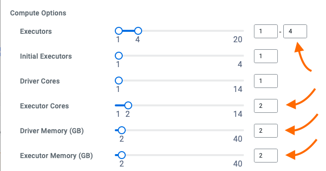

#### 6. Desencadenar y Monitorear el Job

Desplázate hacia abajo y haz clic en el ícono azul "Create and Run".

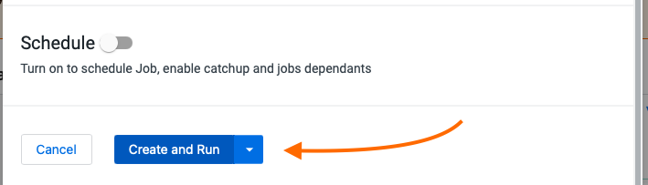

Serás llevado automáticamente a la pestaña de Jobs, donde el Job ahora se listará en la parte superior. Abre la pestaña de Ejecuciones de Jobs en el panel izquierdo y valida que el Job de Spark de CDE se esté ejecutando.

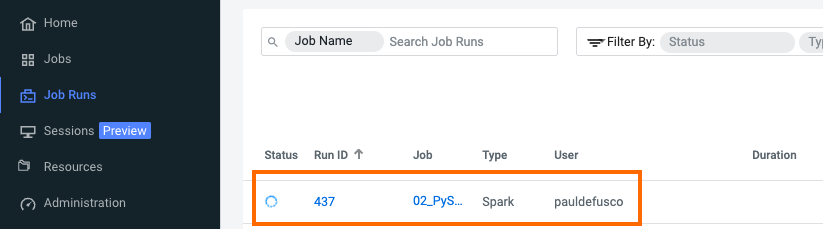

Cuando esté completo, aparecerá una marca de verificación verde en el lado izquierdo. Haz clic en el número de Ejecución del Job para explorar más a fondo.

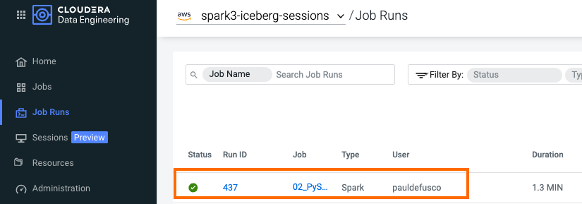

La Job RUn se llena con Metadatos, Registros y la Interfaz de Usuario de Spark. Esta información se mantiene y puede consultarse en un momento posterior.

La pestaña de Configuración te permite verificar el script y los recursos utilizados por el Job de Spark de CDE. Desde aquí, puedes editar la Configuración para cambiar archivos, dependencias, horarios de ejecución y más. Por ejemplo, el desarrollador puede reutilizar un Job existente (o crear un clon opcionalmente) y hacer cambios en sus dependencias, horario, etc., desde la interfaz de usuario.

Esto también sirve como una característica de Observabilidad importante de CDE. CDE mantiene un historial completo de todas las ejecuciones y las configuraciones de Job respectivas asociadas con ellas. En otras palabras, en clústeres tradicionales, cuando un Job de Spark fallaba, el desarrollador tenía que investigar los registros manualmente o, en el mejor de los casos, mantener procesos de DevOps para respaldar los registros y las ejecuciones. En CDE, todo esto se hace automáticamente.  


La pestaña de Registros contiene información detallada de registro. Por ejemplo, puedes verificar la salida del código en "Logs" -> "Driver" -> "StdOut".

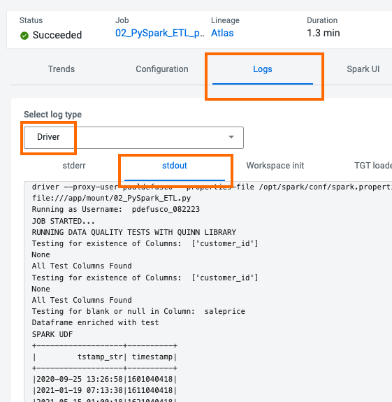

La Interfaz de Usuario de Spark te permite visualizar recursos, optimizar el rendimiento y solucionar problemas en tus Jobs de Spark.


### Creación de Jobs de Spark de CDE con la CLI

Hasta ahora hemos creado un Job de Spark a través de la Interfaz de Usuario de CDE. Sin embargo, los casos de uso de CDE que involucran más que solo unos pocos Jobs generalmente se benefician de numerosas formas con la CLI de CDE o la API de CDE. La CLI te permite iterar más rápidamente a través de diferentes envíos de Spark y Recursos de CDE. La API es un excelente punto de acceso a CDE desde otras herramientas, incluidas soluciones de DevOps y CI/CD de terceros.

En esta sección crearemos un Spark-Submit de CDE y un Job de Spark de CDE a través de la CLI. En el proceso, explicaremos la diferencia.

#### 0. Instalación de la CLI de CDE

Paso 1: Descarga el Cliente de la CLI:
```
    * Navega a la página de Resumen de Cloudera Data Engineering haciendo clic en el mosaico de Data Engineering en la consola de gestión de Cloudera Data Platform (CDP).
    * En la consola web de CDE, selecciona un entorno.
    * Haz clic en el icono de Detalles del Clúster para el clúster virtual al que deseas acceder.
    * Haz clic en el enlace bajo HERRAMIENTA DE LA CLI para descargar el cliente de la CLI.
    * Cambia los permisos del archivo cde descargado para que sea ejecutable:
```

Paso 2: Determina la URL del Punto de Acceso del Clúster Virtual:
```
    * Navega a la página de Resumen de Cloudera Data Engineering.
    * En la columna de Entornos, selecciona el entorno que contiene el clúster virtual al que deseas acceder mediante la CLI.
    * En la columna de Clústeres Virtuales a la derecha, haz clic en el icono de Detalles del Clúster para el clúster virtual al que deseas acceder.
    * Haz clic en URL DE LA JOBS API para copiar la URL en tu portapapeles."
```

Paso 3: En el host con el cliente de la CLI, crea o edita el archivo de configuración en ```~/.cde/config.yaml```. Puedes crear varios perfiles en el archivo ```~/.cde/config.yaml``` y se pueden utilizar al ejecutar comandos.

Paso 4: En el archivo de configuración, especifica el usuario de CDP y el punto de acceso del clúster virtual de la siguiente manera. El usuario de CDP es tu Workload User:

```
user: <CDP_user>
vcluster-endpoint: <CDE_virtual_cluster_endpoint>
```

Paso 5: Guarda el archivo de configuración. Si aún no lo has hecho, asegúrate de que el archivo cde sea ejecutable ejecutando ```chmod +x /path/to/cde```. Finalmente, ejecuta ```cde job list``` desde tu terminal para verificar tu configuración. Ingresa tu contraseña de carga de Job cuando se te solicite.

Para obtener más información sobre la CLI, visita la [Documentación de CDE](https://docs.cloudera.com/data-engineering/cloud/cli-access/topics/cde-cli.html)


#### 1. Spark-Submit de CDE a través de la CLI de CDE.

Un Spark-Submit de CDE es la forma más rápida de prototipar un Job de Spark. Te permite enviar Código de Aplicación de Spark y monitorear los resultados con las funciones de registro y observabilidad de CDE, pero no te permite guardar el Código como una Definición de Job de CDE reutilizable. Esto sería beneficioso, por ejemplo, si deseas reprogramar el job para que se ejecute de manera recurrente o incluirlo en un Job de CDE Airflow.

Comienza con un Spark-Submit simple ejecutando el siguiente comando en tu terminal:"

```
cde spark submit cde_spark_jobs/simple-pyspark-sql.py
```

Poco después de ejecutar esto, noterás la confirmación de la presentación en la terminal. A medida que se ejecuta la Aplicación de Spark, la terminal mostrará registros y salidas del Job.

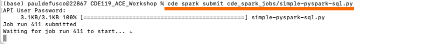

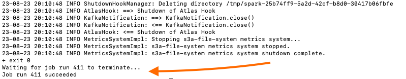

Lo anterior creó una entrada "cli-submit-nombredeusuario-marcatiempo" en la página de Job Runs de tu Clúster CDE. Abre la Ejecución del Job y explora los registros. Observa que la Definición del Job no es reutilizable.

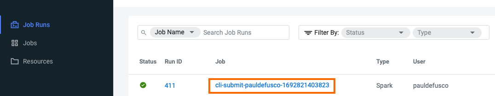

El primer Spark-Submit ejecutó un job PySpark simple, pero observa que no especificamos ninguna Opción de Spark. A continuación, crea un Spark-Submit más avanzado ejecutando el siguiente comando en tu terminal:

```
cde spark submit --py-files cde_spark_jobs/dist/mywheel-0.0.1-py3-none-any.whl cde_spark_jobs/mywheel/__main__.py --executor-cores 2 --executor-memory 2g
```

El Spark-Submit de CDE anterior se ejecutó con el código de la Aplicación de Spark empaquetado en un archivo Wheel. Observa que el Spark-Submit de CDE incluyó las banderas  ```--executor-memory```. Estas corresponden a las mismas opciones disponibles para un Spark-Submit. Para obtener más información sobre cómo construir comandos Spark-Submit, visita la [Documentación de Spark](https://spark.apache.org/docs/latest/submitting-applications.html)


#### 2. Job de Spark de CDE a través de la CLI de CDE.

Similar a un Spark-Submit de CDE, un Job de Spark de CDE es un código de Aplicación para ejecutar un Job de Spark (o Airflow) en un Clúster Virtual de CDE. Sin embargo, el Job de CDE te permite definir, editar y reutilizar configuraciones y recursos fácilmente en ejecuciones futuras. Los Jobs se pueden ejecutar a pedido o programarse. Una ejecución individual de Job se llama Ejecución de Job.

Un Job de CDE de tipo Spark siempre requiere una referencia a un Recurso de CDE para montar el Código de Aplicación y cualquier dependencia. Por lo tanto, comienza creando un Recurso de CDE de tipo Archivo:

```
cde resource create --name my_user_resource
```

Sube el Código de Aplicación al Recurso:

```
cde resource upload --name my_user_resource --local-path cde_spark_jobs/cdejobjar_2.12-1.0.jar
```

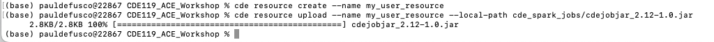

Ahora crea un Job de CDE de tipo Spark montando los archivos de Resources subidos:

```
cde job create \
  --name my-cde-job \
  --type spark \
  --mount-1-resource my_user_resource \
  --application-file cdejobjar_2.12-1.0.jar \
  --conf spark.sql.shuffle.partitions=10 \
  --executor-cores 2 \
  --executor-memory 2g
```

Como antes, observa que las Configuraciones de Spark como ```--executor-cores```, ```--executor-memory```, o ```spark.sql.shuffle.partitions=10``` se pueden aplicar al Job de CDE mediante la bandera ```--conf```.

Finalmente, ejecuta el Job:

```cde job run --name my-cde-job```

Observa la ID de Ejecución del Job que se muestra en la terminal y valida el Job en la página de Ejecuciones de Jobs de tu clúster.

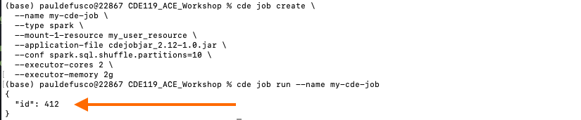

Navega a la página de Jobs en tu Clúster Virtual de CDE y abre el Job. Observa que la Definición se puede editar y es reutilizable.

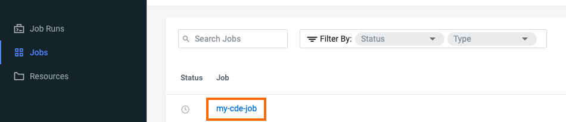

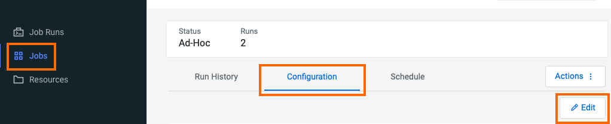

### Explorando Datos de Forma Interactiva con Sesiones CDE

Una Sesión CDE es un entorno interactivo de desarrollo de corta duración para ejecutar comandos de Spark que te ayudan a iterar y construir tus cargas de Job de Spark. Puedes iniciar Sesiones CDE de dos formas: desde la IU de CDE y desde tu terminal con la CLI.

##### Usando Sesiones Interactivas en la IU de CDE

Desde la Página de Inicio de CDE, abre "Sesiones" en el panel izquierdo y luego selecciona el Clúster Virtual de CDE donde deseas ejecutar tu Sesión Interactiva de CDE.

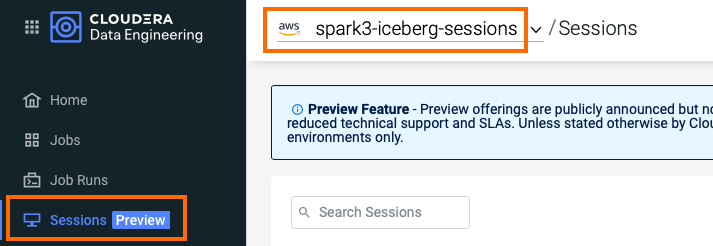

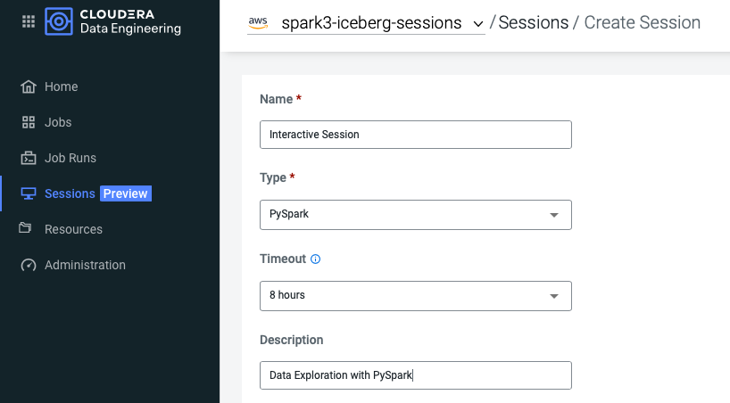

La sesión estará en estado "iniciando" durante algunos momentos. Cuando esté lista, lánzala y abre el Spark Shell haciendo clic en la pestaña "Interactuar".

Copia y pega los siguientes fragmentos de código en cada celda y observa la salida (no se requieren cambios en el código).

>**note**  
>Las Sesiones CDE no requieren la creación del objeto SparkSession. La shell ya ha sido lanzada para ti. Sin embargo, si necesitas importar algún tipo o función, debes importar los módulos necesarios.

importa el paquete PySpark:

```
from pyspark.sql.types import Row, StructField, StructType, StringType, IntegerType
```

Crea una lista de Filas. Inferir el esquema a partir de la primera fila, crear un DataFrame e imprimir el esquema:

```
rows = [Row(name="John", age=19), Row(name="Smith", age=23), Row(name="Sarah", age=18)]
some_df = spark.createDataFrame(rows)
some_df.printSchema()
```

Crea una lista de tuplas:

```
tuples = [("John", 19), ("Smith", 23), ("Sarah", 18)]
```

Crea un esquema de Spark con dos campos: person_name y person_age

```
schema = StructType([StructField("person_name", StringType(), False),
                    StructField("person_age", IntegerType(), False)])
```

Crea un DataFrame aplicando el esquema al RDD e imprime el esquema:

```
another_df = spark.createDataFrame(tuples, schema)
another_df.printSchema()
```

Itera a través del DataFrame de Spark:

```
for each in another_df.collect():
    print(each[0])
```


##### Usar Sesiones Interactivas con el CDE CLI

Puedes interactuar con la misma Sesión de CDE desde tu terminal local usando el comando ```cde sessions interact```.

Abre tu terminal e ingresa ```cde session interact --name InteractiveSession```. Se te solicitará tu contraseña y luego se lanzará el SparkShell.

Ejecuta el mismo código de PySpark en la terminal.


Vuelve a la Sesión de CDE y verifica que el código se haya ejecutado desde la interfaz de usuario.


También puedes crear una sesión directamente desde la CLI. En tu terminal local, sal del Spark Shell actual con "ctrl+D" y luego ejecuta el siguiente comando:

```cde session create --name cde_shell_from_cli --type spark-scala --description launched-from-cli --executor-cores 4 --num-executors 2```.

Observa que puedes pasar Opciones de Cálculo de CDE, como el número de ejecutores y los núcleos de ejecutor, cuando utilizas el comando.


### Creación de un Job de Spark CDE con Apache Iceberg

En esta última sección de la Parte 2, terminarás desplegando un Job de CDE de tipo Spark en la interfaz de usuario de CDE utilizando el script PySpark "02_PySpark_Iceberg.py".

El script incluye mucho código relacionado con Iceberg. Ábrelo en tu editor de elección y familiarízate con el código. En particular, observa:

* Líneas 62-69: La SparkSession debe lanzarse con el Catálogo de Iceberg. Sin embargo, no es necesario hacer referencia a Jars. Estos ya están disponibles, ya que Iceberg está habilitado a nivel de Virtual Cluster de CDE. El Catálogo de Iceberg reemplaza al Metastore de Hive para el seguimiento de los metadatos de las tablas.     

```
spark = SparkSession \
    .builder \
    .appName("ICEBERG LOAD") \
    .config("spark.sql.catalog.spark_catalog", "org.apache.iceberg.spark.SparkSessionCatalog")\
    .config("spark.sql.catalog.spark_catalog.type", "hive")\
    .config("spark.sql.extensions", "org.apache.iceberg.spark.extensions.IcebergSparkSessionExtensions")\
    .config("spark.yarn.access.hadoopFileSystems", data_lake_name)\
    .getOrCreate()
```

* Líneas 82 - 98: Puedes migrar una tabla de Spark al formato Iceberg con las sentencias SQL "ALTER TABLE" y "CALL", como se muestra a continuación.

```
spark.sql("ALTER TABLE CDE_WORKSHOP.CAR_SALES_{} UNSET TBLPROPERTIES ('TRANSLATED_TO_EXTERNAL')".format(username))

spark.sql("CALL spark_catalog.system.migrate('CDE_WORKSHOP.CAR_SALES_{}')".format(username))

```

* Líneas 125-126: Iceberg te permite consultar los metadatos de la tabla, incluido el historial de cambios y las instantáneas de la tabla.

```
spark.read.format("iceberg").load("spark_catalog.CDE_WORKSHOP.CAR_SALES_{}.history".format(username)).show(20, False)

spark.read.format("iceberg").load("spark_catalog.CDE_WORKSHOP.CAR_SALES_{}.snapshots".format(username)).show(20, False)
```

* Líneas 146 y 150: Puedes crear/actualizar/anexar tablas Iceberg desde un DataFrame de Spark mediante el comando "writeTo" de la API de DataFrame de Iceberg.
En la línea 146, añadimos el DataFrame a la tabla preexistente.
En la línea 150, creamos una nueva tabla Iceberg a partir del DataFrame de Spark.

```
temp_df.writeTo("spark_catalog.CDE_WORKSHOP.CAR_SALES_{}".format(username)).append()

temp_df.writeTo("spark_catalog.CDE_WORKSHOP.CAR_SALES_SAMPLE_{}".format(username)).create()
```

* Línea 171: Puedes consultar tablas en un momento específico o una instantánea en particular. En este caso, utilizamos la marca de tiempo. Esta información está disponible en las tablas de historial e instantáneas que consultamos en las líneas 125 y 126. Las tablas de metadatos se actualizan en tiempo real a medida que se modifican las tablas.

```
df = spark.read.option("as-of-timestamp", int(timestamp*1000)).format("iceberg").load("spark_catalog.CDE_WORKSHOP.CAR_SALES_{}".format(username))
```

* Líneas 193-197: Puedes consultar una tabla Iceberg seleccionando solo los datos que han cambiado entre dos momentos en el tiempo o dos instantáneas. Esto se conoce como una "Lectura Incremental de Iceberg".

```
spark.read\
    .format("iceberg")\
    .option("start-snapshot-id", first_snapshot)\
    .option("end-snapshot-id", last_snapshot)\
    .load("spark_catalog.CDE_WORKSHOP.CAR_SALES_{}".format(username)).show()
```

* Líneas 234-251: Aunque Spark proporciona capacidades de particionado, una vez que se elige una estrategia de particionado, la única forma de cambiarla es mediante el reparticionado, es decir, recalculando todas las particiones de la tabla o el dataframe.

Iceberg introduce la Evolución de Particiones, es decir, la capacidad de cambiar el esquema de particionado en nuevos datos sin modificarlo en el conjunto de datos inicial. Gracias a esto, las tablas y los dataframes no se recalculan. Esto se logra mediante una forma mejorada de rastrear los metadatos de la tabla en la Capa de Metadatos de Iceberg.

En este ejemplo, los datos presentes en la tabla CAR_SALES están inicialmente particionados por Mes. A medida que fluyen más datos a nuestra tabla, decidimos que el particionado por Día proporciona a Spark mejores oportunidades para el paralelismo en Jobs. Por lo tanto, simplemente cambiamos el esquema de particionado a Día. Los datos antiguos siguen estando particionados por Mes, mientras que los nuevos datos agregados a la tabla desde este punto en adelante se particionarán por Día.

```
spark.sql("ALTER TABLE spark_catalog.CDE_WORKSHOP.CAR_SALES_{} REPLACE PARTITION FIELD month WITH day".format(username))
```

* Línea 260: de manera similar a la evolución de particiones, Spark no te permite cambiar el esquema de una tabla sin recrearla. Iceberg te permite de manera más flexible AGREGAR y ELIMINAR columnas de una tabla a través de la instrucción ALTER TABLE.

```
spark.sql("ALTER TABLE spark_catalog.CDE_WORKSHOP.CAR_SALES_{} DROP COLUMN VIN".format(username))
```

* Línea 275: La instrucción MERGE INTO te permite comparar datos entre tablas y realizar actualizaciones flexibles basadas en lógica compleja de manera más sencilla. En comparación, las inserciones y actualizaciones de tablas en Spark son rígidas, ya que la instrucción MERGE INTO no está permitida en Spark SQL.

```
ICEBERG_MERGE_INTO = "MERGE INTO spark_catalog.CDE_WORKSHOP.CAR_SALES_{0} t USING (SELECT CUSTOMER_ID, MODEL, SALEPRICE, DAY, MONTH, YEAR FROM CAR_SALES_TEMP_{0}) s ON t.customer_id = s.customer_id WHEN MATCHED THEN UPDATE SET * WHEN NOT MATCHED THEN INSERT *".format(username)

spark.sql(ICEBERG_MERGE_INTO)
```

Una vez que hayas terminado de revisar el código, ejecuta el script como un Job de Spark CDE desde la interfaz de usuario de CDE. Supervisa las salidas y los resultados desde la página de Ejecuciones de Jobs de CDE.

Para obtener más información sobre Iceberg en CDE, visita [Using Apache Iceberg in Cloudera Data Engineering](https://docs.cloudera.com/data-engineering/cloud/manage-jobs/topics/cde-using-iceberg.html).

Para obtener más información sobre los Jobs de CDE, visita [Creating and Managing CDE Jobs](https://docs.cloudera.com/data-engineering/cloud/manage-jobs/topics/cde-create-job.html) en la documentación de CDE.

## Resumen

CDE ofrece múltiples opciones para ejecutar código de aplicaciones Spark a gran escala.

La forma más sencilla de crear y desplegar un Job Spark es aprovechar la interfaz de usuario (UI). Cada sección en la UI corresponde a una parte de un spark-submit. Sin embargo, si planeas utilizar CDE de manera habitual, te recomendamos aprender la CLI, ya que proporciona un conjunto más amplio de opciones y la capacidad de iterar a través de múltiples ejecuciones de Jobs de manera más rápida.

Tanto la CLI como la UI te permiten crear y desplegar un Job CDE de tipo Spark. La CLI también te permite ejecutar un spark-submit. El Job CDE envuelve el código de la aplicación Spark con una entidad reutilizable. El Job CDE está asociado con una configuración editable y un historial detallado de ejecuciones que incluye registros, dependencias, usuario e incluso una interfaz de usuario Spark de larga duración. El simple spark-submit no proporciona ninguna de estas funcionalidades y se recomienda más bien cuando se están creando prototipos de aplicaciones Spark sin la necesidad de preocuparse por el futuro. El spark-submit también se puede convertir en un Job CDE de Spark a través de la UI o la CLI.

Otra ventaja de los Jobs CDE es que pueden estar asociados con Recursos CDE. Los recursos pueden ser de tipo Archivo o Python. Los Recursos de Archivo te permiten almacenar las dependencias de archivos a nivel de clúster y montarlas en tiempo de ejecución. De manera similar, los Recursos de Python permiten aplicar Entornos Python personalizados a un Job o ejecución de Job determinados. Al desvincular las Aplicaciones Spark de sus dependencias, CDE permite a los usuarios iterar más rápido y lograr una alta observabilidad del Job.

Finalmente, las Sesiones CDE te permiten conectarte a CDE de forma remota ingresando a un Spark Shell interactivo. Los usuarios pueden elegir entre Scala y PySpark. Las sesiones se recomiendan para la exploración interactiva de datos y pruebas rápidas en general.

Si se les permite el acceso al Clúster Virtual, los Usuarios de CDP pueden ejecutar Jobs CDE. El Usuario de Carga de Job se hereda del Entorno CDP, mientras que la Contraseña de Carga de Job se establece automáticamente. Los datos están asegurados por defecto a través de SDX y se pueden acceder fácilmente desde el Almacenamiento en la Nube u otras fuentes.

Apache Iceberg es un nuevo formato de tabla abierto diseñado para gestionar, organizar y rastrear todos los archivos que conforman una tabla. El formato de tabla ayuda a descomponer conjuntos de datos complejos almacenados en formatos de archivo populares como Apache Parquet, Optimized row columnar (columnas y filas optimizadas) y AVRO, entre otros. La arquitectura de Apache Iceberg realiza un seguimiento de todos los archivos utilizando estructuras de árbol. El formato de tabla consta de una ruta clara hacia el archivo de metadatos que almacena todos los archivos de datos individuales. Iceberg fue introducido por Netflix para resolver varios problemas de consistencia y rendimiento de datos en Apache Hive.

Los Clústeres Virtuales de CDE están habilitados automáticamente con Iceberg en el momento del despliegue del Clúster. Los Usuarios de CDE solo necesitan aplicar las configuraciones de SparkSession mostradas anteriormente para lanzar un Job de Spark compatible con Iceberg. No se necesitan JARs adicionales.

[En la próxima sección](https://github.com/pdefusco/CDE119_ACE_WORKSHOP/blob/main/step_by_step_guides/english/part03_airflow.md#part-3-orchestrating-pipelines-with-airflow) aprenderás los conceptos básicos de la Orquestación con Airflow en CDE para desplegar una tubería (pipeline) de Jobs CDE dependientes.
