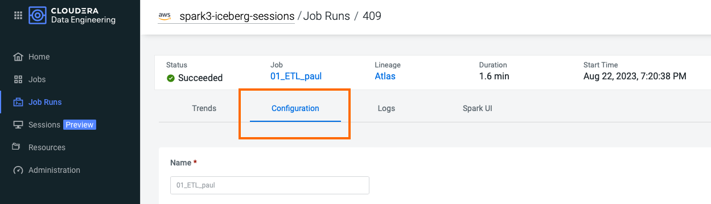
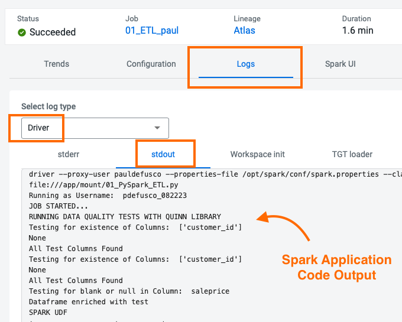
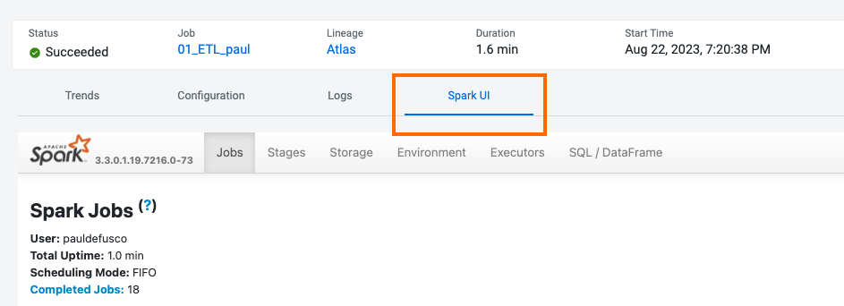

# Parte 2: Sviluppo e Dispiegamento di Job Spark in CDE

## Obbiettivo

In questa sezione creerai quattro job Spark utilizzando l'interfaccia utente di CDE, la CDE CLI e le sessioni interattive di CDE. Nel processo imparerai come utilizzare le Risorse CDE per archiviare file e riutilizzare ambienti virtuali Python, migrare tabelle Spark in tabelle Iceberg e utilizzare alcune delle funzionalità più attese di Iceberg, incluse Time Travel, Query Incrementali, Partition e l'evoluzione dello Schema.

### Modifica dei File e Creazione delle Risorse CDE

Le Risorse CDE possono essere di tipo "File", "Python" o "Runtime personalizzato". Inizierai creando una risorsa di tipo file per archiviare tutti i file e le dipendenze di Spark e Airflow, e successivamente una risorsa Python per utilizzare librerie Python personalizzate in un'esecuzione di job Spark CDE.

Per creare una Risorsa File, dalla Home Page di CDE fai clic su "Crea nuovo" nella sezione "Risorse" -> "File".


Scegli il tuo CDE Virtual Cluster abilitato a Spark 3 / Iceberg e *dai un nome alla tua Resource in base al tuo nome utente o a un ID univoco.*


>**⚠ Avviso**  
>Ogni utente del workshop dovrebbe creare una Risorsa File separata con un nome univoco.

Carica i seguenti file presenti nelle cartelle "cde_ace_hol/cde_spark_jobs" e "cde_ace_hol/resources_files".

Una volta finito, assicurati che i seguenti file si trovino nella tua Resource:

```
02_PySpark_ETL.py
simple_udf.zip
simple_udf_dependency.py
parameters.conf
utils.py
```

Per creare una Resource di tipo Python, torna alla Home Page di CDE e fai clic su "Create New" nella sezione "Resource" -> "Python".


Assicurati di selezionare lo stesso CDE Virtual Cluster. Assegna un nome alla Resource Python e lascia vuoto il campo dello specchio pipy.


Carica il file "requirements.txt" fornito nella cartella "cde_ace_hol/resources_files".


Osserva che la Resource sta ora creando l'Ambiente Virtuale Python. Dopo qualche istante, la creazione sarà completata e potrai convalidare le libraries utilizzate.


Per saperne di più sulle Risorse CDE, visita [Using CDE Resources](https://docs.cloudera.com/data-engineering/cloud/use-resources/topics/cde-python-virtual-env.html) nella documentazione.

### Creazione di Job Spark in CDE UI

Successivamente eseguiremo e distribuire uno script Spark come Job CDE di tipo Spark utilizzando lo script "02_PySpark_ETL.py". Torna alla Home Page di CDE. Fai clic su "Create New" nella sezione "Jobs" -> "Spark".


#### 1. Imposta il Nome del Job, il Virtual Cluster e il File dell'Applicazione

Seleziona il tuo CDE Virtual Cluster e assegna "O1_ETL" come Nome del Job. Aggiungi il tuo nome per distinguere il nome del tuo job dagli altri.


Il File dell'Applicazione è il codice che verrà eseguito come Job Spark. Questo potrebbe essere un file PySpark o una Jar.

Poiché hai già caricato lo script nella Resource di tipo File nel passaggio precedente, puoi selezionarlo facilmente nella costruzione della Configurazione del Job: assicurati di selezionare "File" dal pulsante radio e fai clic su "Seleziona dalla Risorsa" nella sezione "File dell'Applicazione". Si aprirà una finestra con i contenuti caricati nella tua Risorsa File. Seleziona lo script "02_PySpark_ETL.py".


#### 2. Imposta le Configurazioni di Spark

La sezione Configurazioni ti consente di impostare le Configurazioni dell'Applicazione Spark, come le impostazioni del Driver e degli Executor, Jars, proprietà di Spark e molte altre. In altre parole, praticamente tutte le proprietà disponibili nella [Documentazione delle Configurazioni di Spark](https://spark.apache.org/docs/latest/configuration.html) possono essere applicate qui.

In questo job imposteremo la configurazione `spark.executorEnv.PYTHONPATH` su `/app/mount/simple_udf.zip` in modo che possa leggere l'UDF dalla Resource di tipo File.


#### 3. Imposta l'Ambiente Python

Imposta l'ambiente Python sulla Resource di tipo Python che hai creato nel passaggio precedente.


#### 4. Imposta le Opzioni Avanzate

La sezione "File Python, Egg, Zip" ti consente di caricare le dipendenze nel tuo job. Questo può essere utilizzato per una varietà di casi d'uso, tra cui montare file Python negli Executor, utilizzare file Wheel e altro.

Nella sezione "File Python, Egg, Zip" seleziona le dipendenze dei file "utils.py" e "simple_udf.zip" per caricare l'UDF nel Job Spark. note che i file sono già stati caricati nella Resource di tipo File, quindi devi solo selezionarli da lì.


Scorri nuovamente verso il basso fino alla sezione "Resources" e noterai che la tua Risorsa File è stata mappata al Job per impostazione predefinita. Questo consente allo script PySpark di caricare moduli nella stessa Resource, come quelli contenuti nel file "utils.py".


#### 5. Imposta le Compute Options

Le Compute Options ti consentono di impostare importanti configurazioni delle risorse di Spark.

* La barra di attivazione degli Executors ti permette di impostare le opzioni "spark.dynamicAllocation.minExecutors" e "spark.dynamicAllocation.maxExecutors". Queste determinano quanti executor verranno distribuiti da Spark Dynamic Allocation. La Spark Dynamic Allocation è impostata su "Abilitata" per impostazione predefinita in CDE.

* La barra degli Executors Iniziali ti permette di impostare la proprietà "spark.dynamicAllocation.initialExecutors". L'opzione imposta il numero iniziale di executor per l'allocazione dinamica. Ti consigliamo di assicurarti che questo valore non sia troppo alto, specialmente a un valore superiore al numero previsto di executor del Job.

* Le Core del Driver e la Memoria del Driver ti permettono di impostare "spark.driver.cores" e "spark.driver.memory". Aumentare i Core del Driver e la Memoria può essere utile quando le query compilano lentamente o nel caso in cui vengano eseguite molte azioni collect() o take(N), specialmente su RDD di grandi dimensioni.

* I Core degli Executor e la Memoria degli Executor ti permettono di impostare "spark.executor.cores" e "spark.executor.memory". Queste proprietà sono ampiamente utilizzate nel contesto dell'ottimizzazione di Spark in quanto ti consentono di influenzare il grado di parallelismo e la capacità di archiviazione disponibili in ciascun Executor.

Imposta "Executor" su un minimo di 1 e un massimo di 4. Successivamente, imposta le Core degli Executor su 2, la Memoria del Driver su 2 e la Memoria degli Executor su 2. Questo ti consente di distribuire un'applicazione Spark con Executor leggermente più potenti rispetto ai valori impostati nelle configurazioni predefinite, il che spesso può portare a Executor troppo piccoli.


#### 6. Trigger and Monitor the Job

Scorri fino in fondo e fai clic sull'icona blu "Create and Run".


Verrai automaticamente portato alla scheda dei Job, dove il Job verrà ora elencato nella parte superiore. Apri la scheda "Esecuzioni dei Job" nel riquadro di sinistra e verifica che il CDE Spark Job sia in esecuzione.


Quando il processo è completo, comparirà un segno di spunta verde sul lato sinistro. Fai clic sul numero dell'esecuzione del Job per esplorare ulteriormente.


La Job Run è popolata con metadati, log e l'interfaccia utente di Spark. Queste informazioni vengono conservate e possono essere consultate in un momento successivo.

La scheda "Configurazioni" ti consente di verificare lo script e le risorse utilizzate dal CDE Spark Job. Da qui puoi modificare la configurazione per cambiare file, dipendenze, pianificazione delle esecuzioni e altro ancora. Ad esempio, il programmatore può riutilizzare un job esistente (o eventualmente crearne uno clonato) e apportare modifiche alle sue dipendenze, pianificazione, ecc. dall'interfaccia utente.

Questo serve anche come importante funzione di osservabilità di CDE. CDE mantiene un percorso storico di tutte le esecuzioni e delle relative configurazioni di job associate. In altre parole, nei cluster tradizionali, quando un job Spark falliva, il programmatore doveva investigare manualmente i log o, nel migliore dei casi, mantenere processi DevOps per eseguire il backup dei log e delle esecuzioni. In CDE tutto ciò avviene automaticamente.  



La scheda "Log" contiene informazioni di logging dettagliate. Ad esempio, è possibile verificare l'output del codice sotto "Log" -> "Driver" -> "StdOut".



L'interfaccia utente di Spark consente di visualizzare le risorse, ottimizzare le prestazioni e risolvere i problemi dei tuoi job Spark.




### Creazione di Job Spark tramite la CLI di CDE

Finora abbiamo creato un Job Spark tramite l'interfaccia utente di CDE. Tuttavia, i casi d'uso di CDE che coinvolgono più di qualche job traggono spesso numerosi vantaggi dall'utilizzo della CLI o dell'API di CDE. La CLI consente di iterare più rapidamente attraverso diversi Spark Submits e CDE Resources. L'API è un ottimo punto di accesso a CDE da altre strumenti, inclusi strumenti DevOps e soluzioni di CI/CD di terze parti.

In questa sezione creeremo una Spark Submit CDE e un Job Spark CDE tramite la CLI. Nel processo spiegheremo la differenza.

#### 0. Installazione della CLI di CDE

Passaggio 1: Scarica il Client CLI:
```
    * Vai alla pagina panoramica di Cloudera Data Engineering facendo clic sulla voce Data Engineering nella console di gestione della piattaforma Cloudera Data Platform (CDP).
    * Nella console web di CDE, seleziona un ambiente.
    * Fai clic sull'icona Dettagli del Cluster per il virtual cluster a cui desideri accedere.
    * Fai clic sul collegamento sotto CLI TOOL per scaricare il client CLI.
    * Modifica le autorizzazioni del file cde scaricato per renderlo eseguibile:
```

Passaggio 2: Determina l'URL dell'Endpoint del Virtual Cluster:
```
    * Vai alla pagina panoramica di Cloudera Data Engineering.
    * Nella colonna Ambiente, seleziona l'ambiente contenente il virtual cluster a cui desideri accedere tramite la CLI.
    * Nella colonna Virtual Clusters a destra, fai clic sull'icona Dettagli del Cluster per il virtual cluster a cui desideri accedere.
    * Fai clic su JOBS API URL per copiare l'URL negli appunti.
```

Passaggio 3: Sull'host con il client CLI, crea o modifica il file di configurazione in ```~/.cde/config.yaml```. Puoi creare più profili nel file ```~/.cde/config.yaml``` e utilizzarli durante l'esecuzione dei comandi.

Passaggio 4: Nel file di configurazione, specifica il Workload User CDP e l'endpoint del Virtual Cluster come segue. Il Worklaod User CDP è il tuo user:

```
user: <CDP_user>
vcluster-endpoint: <CDE_virtual_cluster_endpoint>
```

Passaggio 5: Salva il file di configurazione. Se non l'hai già fatto, assicurati che il file cde sia eseguibile eseguendo il comando ```chmod +x /path/to/cde```. Infine, esegui il comando ```cde job list``` dal tuo terminale per verificare la configurazione. Inserisci la tua password di job quando richiesto.

Per ulteriori informazioni sulla CLI, visita la [documentazione](https://docs.cloudera.com/data-engineering/cloud/cli-access/topics/cde-cli.html)


#### 1. CDE Spark Submit tramite la CLI di CDE.

Una CDE Spark Submit è il modo più rapido per creare un prototipo di un Job Spark. Ti consente di inviare il codice dell'applicazione Spark e monitorare i risultati con le funzionalità di registrazione e osservabilità di CDE, ma non ti permette di salvare il codice come una definizione di Job CDE riutilizzabile. Questo è vantaggioso, ad esempio, nel caso in cui desideri pianificare nuovamente l'esecuzione del job in modo ricorrente o includerlo in un Job CDE Airflow.

Inizia con una semplice Spark Submit eseguendo il seguente comando nel tuo terminale:

```
cde spark submit cde_spark_jobs/simple-pyspark-sql.py
```

Poco dopo aver eseguito questo comando, noterai la conferma dell'invio nel terminale. Mentre l'applicazione Spark viene eseguita, il terminale mostrerà registri e output del job.


L'operazione sopra ha creato una voce "cli-submit-username-timestamp" nella pagina delle Esecuzioni di Job del tuo Cluster CDE. Apri l'Esecuzione del Job e esplora i log. note che la Definizione del Job non è riutilizzabile.


Il primo Spark Submit ha eseguito un semplice job PySpark, ma notere che non abbiamo specificato alcuna Opzione Spark. Successivamente, crea una Spark Submit più avanzata eseguendo il seguente comando nel tuo terminale:

```
cde spark submit --py-files cde_spark_jobs/dist/mywheel-0.0.1-py3-none-any.whl cde_spark_jobs/mywheel/__main__.py --executor-cores 2 --executor-memory 2g
```

Il Spark Submit CDE sopra è stato eseguito con il codice dell'applicazione Spark confezionato in un file Wheel. note che la Spark Submit CDE include le opzioni ```--py-files```, ```--exeutor-cores``` e ```--executor-memory```. Queste corrispondono alle stesse opzioni disponibili per una Spark Submit. Per ulteriori informazioni sulla creazione di comandi per Spark Submit, visita la [Documentazione di Spark]((https://spark.apache.org/docs/latest/submitting-applications.html)).


#### 2. Job Spark tramite la CLI di CDE.

Analogamente a una CDE Spark Submit, un Job CDE Spark rappresenta il codice di un'applicazione per eseguire un Job Spark (o Airflow) in un Virtual Cluster CDE. Tuttavia, il Job CDE consente di definire, modificare e riutilizzare facilmente configurazioni e risorse in esecuzioni future. I job possono essere eseguiti su richiesta o pianificati. L'esecuzione individuale di un job è chiamata Job Run.

Un Job CDE di tipo Spark richiede sempre un riferimento a una Risorsa CDE per montare il Codice dell'Applicazione e tutte le dipendenze. Pertanto, inizia creando una Resource di tipo File:

```
cde resource create --name my_user_resource
```

Carica il Codice dell'Applicazione nella Risorsa:

```
cde resource upload --name my_user_resource --local-path cde_spark_jobs/cdejobjar_2.12-1.0.jar
```


Ora crea un Job CDE di tipo Spark montando i file della Risorsa caricata:

```
cde job create \
  --name my-cde-job \
  --type spark \
  --mount-1-resource my_user_resource \
  --application-file cdejobjar_2.12-1.0.jar \
  --conf spark.sql.shuffle.partitions=10 \
  --executor-cores 2 \
  --executor-memory 2g
```

Come prima, osserva che le configurazioni di Spark come ```--executor-cores```, ```--executor-memory```, o ```spark.sql.shuffle.partitions=10``` possono essere applicate al Job CDE tramite il flag ```--conf```.

Infine, esegui il Job:

```cde job run --name my-cde-job```

Osserva l'ID dell'esecuzione del Job visualizzato nel terminale e verifica il Job nella pagina delle esecuzioni dei Job del tuo cluster.


Vai alla pagina dei Job nel tuo CDE Virtual Cluster e apri il Job. note che la Definizione può essere modificata ed è riutilizzabile.


### Esplorazione interattiva dei dati con le sessioni CDE

Una sessione CDE è un ambiente di sviluppo interattivo a breve durata per eseguire comandi Spark che ti aiutano a iterare e costruire i tuoi pipeline Spark. Puoi avviare le sessioni CDE in due modi: dall'interfaccia utente di CDE e dal tuo terminale con la CLI.

##### Utilizzo di sessioni interattive nell'interfaccia utente di CDE

Dalla pagina principale di CDE, apri "Sessioni" nel riquadro di sinistra e quindi seleziona il CDE Virtual Cluster in cui desideri eseguire la tua sessione interattiva CDE.


La sessione sarà nello stato "Starting" per qualche istante. Quando sarà pronta, avviala e apri la Spark Shell cliccando sulla scheda "Interact".

Copia e incolla i seguenti frammenti di codice in ogni cella e osserva l'output (non sono richieste modifiche al codice).

>**note**  
>Le sessioni CDE non richiedono la creazione dell'oggetto SparkSession. La shell è già stata avviata per te. Tuttavia, se è necessario importare alcuni tipi o funzioni, è necessario importare i moduli necessari.

Importa il module PySpark:

```
from pyspark.sql.types import Row, StructField, StructType, StringType, IntegerType
```

Crea una lista di oggetti Row. Deduci lo schema dalla prima Row, crea un DataFrame e stampa lo schema:

```
rows = [Row(name="John", age=19), Row(name="Smith", age=23), Row(name="Sarah", age=18)]
some_df = spark.createDataFrame(rows)
some_df.printSchema()
```

Crea una lista di oggetti Tuple:

```
tuples = [("John", 19), ("Smith", 23), ("Sarah", 18)]
```

Crea uno schema Spark con due campi: person_name e person_age

```
schema = StructType([StructField("person_name", StringType(), False),
                    StructField("person_age", IntegerType(), False)])
```

Crea un DataFrame applicando lo schema all'RDD e stampa lo schema

```
another_df = spark.createDataFrame(tuples, schema)
another_df.printSchema()
```

Itera attraverso il DataFrame Spark:

```
for each in another_df.collect():
    print(each[0])
```


##### Utilizzo di Sessioni Interattive con il CDE CLI

Puoi interagire con la stessa Sessione CDE dal tuo terminale locale utilizzando il comando ```cde sessions interact```.

Apri il tuo terminale e inserisci ```cde session interact --name InteractiveSession```. Ti verrà richiesta la password e successivamente verrà avviata la SparkShell.

Esegui lo stesso codice PySpark nella shell.


Torna alla Sessione CDE e verifica che il codice sia stato eseguito dall'interfaccia utente.


Puoi anche creare una sessione direttamente dal CLI. Nel tuo terminale locale, esci dalla tua attuale Spark Shell con "ctrl+D" e quindi esegui il seguente comando:

```cde session create --name cde_shell_from_cli --type spark-scala --description launched-from-cli --executor-cores 4 --num-executors 2```.

note che puoi passare le Compute Options come il numero di executor e le executor-cores quando utilizzi il comando.


### Creazione di un Spark Job con Apache Iceberg

In questa sezione finale della Parte 2, completerai creando un job CDE di tipo Spark nell'interfaccia utente di CDE utilizzando lo script PySpark "03_PySpark_Iceberg.py".

Lo script include molto codice legato ad Iceberg. Aprilo nell'editor di tua scelta e familiarizza con il codice. In particolare, note:

* Righe 62-69: La SparkSession deve essere avviata con il Catalogo Iceberg. Tuttavia, non è necessario fare riferimento a Jars. Questi sono già disponibili poiché Iceberg è abilitato a livello di CDE Virtual Cluster. Il Catalogo Iceberg sostituisce l'Hive Metastore per il tracciamento dei metadati delle tabelle.   

```
spark = SparkSession \
    .builder \
    .appName("ICEBERG LOAD") \
    .config("spark.sql.catalog.spark_catalog", "org.apache.iceberg.spark.SparkSessionCatalog")\
    .config("spark.sql.catalog.spark_catalog.type", "hive")\
    .config("spark.sql.extensions", "org.apache.iceberg.spark.extensions.IcebergSparkSessionExtensions")\
    .config("spark.yarn.access.hadoopFileSystems", data_lake_name)\
    .getOrCreate()
```

* Righe 82 - 98: È possibile migrare una Tabella Spark nel formato Iceberg utilizzando le istruzioni SQL "ALTER TABLE" e "CALL" come mostrato di seguito.

```
spark.sql("ALTER TABLE CDE_WORKSHOP.CAR_SALES_{} UNSET TBLPROPERTIES ('TRANSLATED_TO_EXTERNAL')".format(username))

spark.sql("CALL spark_catalog.system.migrate('CDE_WORKSHOP.CAR_SALES_{}')".format(username))

```

* Righe 125-126: Iceberg consente di interrogare i metadati delle tabelle, inclusa la cronologia delle modifiche e gli snapshot delle tabelle.

```
spark.read.format("iceberg").load("spark_catalog.CDE_WORKSHOP.CAR_SALES_{}.history".format(username)).show(20, False)

spark.read.format("iceberg").load("spark_catalog.CDE_WORKSHOP.CAR_SALES_{}.snapshots".format(username)).show(20, False)
```

* Righe 146 e 150: È possibile creare/aggiornare/aggiungere tabelle Iceberg da un Dataframe Spark tramite il comando Iceberg Dataframe API "writeTo".
Alla riga 146 aggiungiamo il Dataframe alla tabella preesistente.
Alla riga 150 creiamo una nuova tabella Iceberg dal Dataframe Spark.

```
temp_df.writeTo("spark_catalog.CDE_WORKSHOP.CAR_SALES_{}".format(username)).append()

temp_df.writeTo("spark_catalog.CDE_WORKSHOP.CAR_SALES_SAMPLE_{}".format(username)).create()
```

* Riga 171: È possibile interrogare le tabelle in base a un timestamp o uno snapshot particolare. In questo caso utilizziamo il timestamp. Questa informazione è disponibile nella tabella della cronologia e degli snapshot che abbiamo interrogato alle righe 125-126. Le tabelle dei metadati vengono aggiornate in tempo reale man mano che le tabelle vengono modificate.

```
df = spark.read.option("as-of-timestamp", int(timestamp*1000)).format("iceberg").load("spark_catalog.CDE_WORKSHOP.CAR_SALES_{}".format(username))
```

* Righe 193-197: È possibile interrogare una tabella Iceberg selezionando solo i dati che sono cambiati tra due punti nel tempo o due snapshot. Questo è noto come "Iceberg Incremental Read".

```
spark.read\
    .format("iceberg")\
    .option("start-snapshot-id", first_snapshot)\
    .option("end-snapshot-id", last_snapshot)\
    .load("spark_catalog.CDE_WORKSHOP.CAR_SALES_{}".format(username)).show()
```

* Righe 234-251: Sebbene Spark fornisca capacità di partizionamento, una volta scelta una strategia di partizionamento, l'unico modo per cambiarla è ripartizionare o, in altre parole, ricomputare tutte le partizioni della tabella/dataframe.

Iceberg introduce Partition Evolution, ossia la capacità di cambiare lo schema di partizionamento su nuovi dati senza modificarlo sul dataset iniziale. Grazie a questo, le tabelle/dataframe non vengono ricomputati. Questo è reso possibile dal miglioramento di Iceberg nel tracciamento dei metadati delle tabelle nel Layer dei Metadati di Iceberg.

In questo esempio, i dati presenti nella tabella CAR_SALES sono inizialmente partizionati per Month (mese). Man mano che più dati fluiscono nella nostra tabella, abbiamo deciso che il partizionamento per Day (giorno) offre a Spark migliori opportunità di parallelismo dei job.
Quindi semplicemente cambiamo lo schema di partizionamento in Day. I vecchi dati saranno ancora partizionati per Month, mentre i nuovi dati aggiunti alla tabella da questo punto in poi saranno partizionati per Day.  

```
spark.sql("ALTER TABLE spark_catalog.CDE_WORKSHOP.CAR_SALES_{} REPLACE PARTITION FIELD month WITH day".format(username))
```

* Riga 260: simile all'evoluzione delle partizioni, Spark non ti consente di cambiare lo schema di una tabella senza ricrearla. Iceberg ti consente di aggiungere e rimuovere colonne dalla tabella in modo più flessibile tramite l'istruzione ALTER TABLE.

```
spark.sql("ALTER TABLE spark_catalog.CDE_WORKSHOP.CAR_SALES_{} DROP COLUMN VIN".format(username))
```

* Riga 275: L'istruzione MERGE INTO ti consente di confrontare più facilmente i dati tra le tabelle e procedere con aggiornamenti flessibili basati su logiche intricate. In confronto, gli inserimenti e gli aggiornamenti delle tabelle Spark sono rigidi poiché l'istruzione MERGE INTO non è consentita in Spark SQL.

```
ICEBERG_MERGE_INTO = "MERGE INTO spark_catalog.CDE_WORKSHOP.CAR_SALES_{0} t USING (SELECT CUSTOMER_ID, MODEL, SALEPRICE, DAY, MONTH, YEAR FROM CAR_SALES_TEMP_{0}) s ON t.customer_id = s.customer_id WHEN MATCHED THEN UPDATE SET * WHEN NOT MATCHED THEN INSERT *".format(username)

spark.sql(ICEBERG_MERGE_INTO)
```

Una volta che hai finito di esaminare il codice, esegui lo script come un Job Spark CDE dalla UI di CDE. Monitora gli output e i risultati dalla pagina delle esecuzioni dei Job CDE.

Per saperne di più su Iceberg in CDE, visita [Using Apache Iceberg in Cloudera Data Engineering](https://docs.cloudera.com/data-engineering/cloud/manage-jobs/topics/cde-using-iceberg.html).

Per saperne di più sui Job CDE, visita [Creating and Managing CDE Jobs](https://docs.cloudera.com/data-engineering/cloud/manage-jobs/topics/cde-create-job.html).

## Riepilogo

CDE offre diverse opzioni per eseguire codice di applicazione Spark su larga scala.

Il modo più semplice per creare e distribuire un Job Spark è sfruttare l'interfaccia utente (UI). Ogni sezione nella UI corrisponde a una parte di uno spark-submit. Tuttavia, se prevedi di utilizzare CDE quotidianamente, ti consigliamo di imparare la CLI in quanto fornisce un set più ricco di opzioni e la possibilità di iterare attraverso molteplici esecuzioni di job più velocemente.

Sia la CLI che la UI ti consentono di creare e distribuire un Job CDE di tipo Spark. La CLI ti consente anche di eseguire uno spark-submit. Il Job CDE avvolge il codice dell'applicazione Spark con un'entità riutilizzabile. Il Job CDE è associato a una configurazione modificabile e a una cronologia dettagliata delle esecuzioni, compresi i log, le dipendenze, l'utente e persino un'interfaccia utente Spark a lunga durata. Lo spark-submit semplice non fornisce nulla di tutto ciò ed è piuttosto consigliato quando si prototipano Applicazioni Spark senza la necessità di preoccuparsi del futuro. Lo spark-submit può anche essere convertito in un Job CDE di tipo Spark tramite la UI o la CLI.

Un altro vantaggio dei Job CDE è che possono essere associati a Risorse CDE. Le risorse possono essere di tipo File o Python. Le Risorse File ti consentono di archiviare le dipendenze dei file a livello di cluster e montarle durante l'esecuzione. In modo simile, le Risorse Python consentono di applicare ambienti Python personalizzati a un dato job o esecuzione di job. Scollegando le Applicazioni Spark dalle loro dipendenze, CDE consente agli utenti di iterare più velocemente raggiungendo al contempo un'elevata osservabilità dei job.

Infine, le Sessioni CDE ti consentono di connetterti a CDE in remoto inserendo una Spark Shell interattiva. Gli utenti possono scegliere tra Scala e PySpark. Le sessioni sono consigliate per l'esplorazione interattiva dei dati e per i test rapidi in generale.

Se è consentito l'accesso al Virtual Cluster, gli utenti CDP possono eseguire Job CDE. Il Workload User viene ereditato dall'Ambiente CDP mentre la Workload Password viene impostata automaticamente. I dati sono protetti per impostazione predefinita tramite SDX e possono essere facilmente accessibili da Cloud Storage o altre fonti.

Apache Iceberg è un nuovo formato di tabella aperto progettato per gestire, organizzare e tracciare tutti i file che compongono una tabella. Il formato della tabella aiuta a scomporre insiemi di dati complessi archiviati in formati di file popolari come Apache Parquet, Optimized Row Columnar e AVRO, tra gli altri. L'architettura di Apache Iceberg tiene traccia di tutti i file utilizzando strutture ad albero. Il formato della tabella consiste in un percorso chiaro al file di metadati che archivia tutti i file di dati individuali. Iceberg è stato introdotto da Netflix per risolvere diversi problemi di coerenza e prestazioni dei dati in Apache Hive.

I Virtual Cluster CDE sono automaticamente abilitati con Iceberg al momento del deployment del cluster. Gli utenti CDE devono solo applicare le configurazioni SparkSession mostrate sopra per avviare un Job Spark compatibile con Iceberg. Non sono necessari jar aggiuntivi.

[Nella prossima sezione](https://github.com/pdefusco/CDE119_ACE_WORKSHOP/blob/main/step_by_step_guides/english/part03_airflow.md#part-3-orchestrating-pipelines-with-airflow) imparerai i concetti di orchestrazione con Airflow in CDE al fine di distribuire una pipeline di Job CDE dipendenti.
