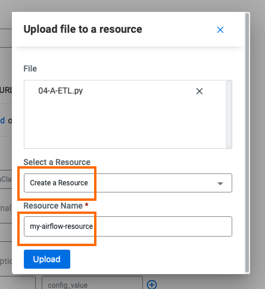
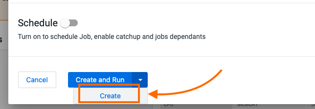
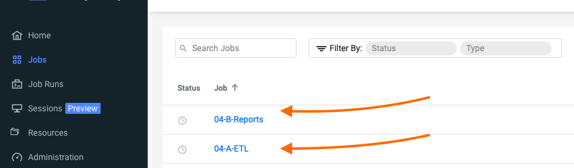
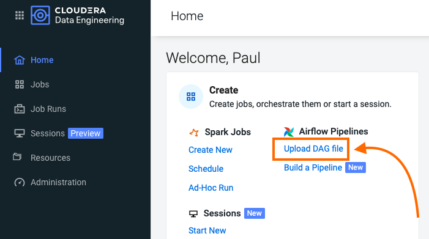
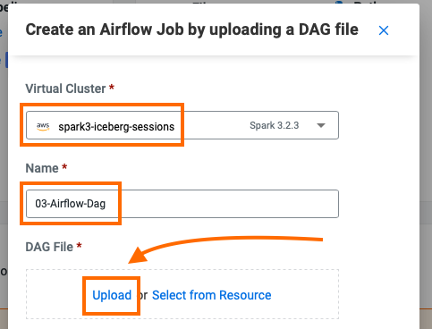
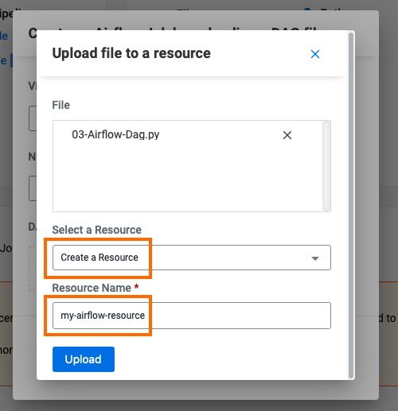
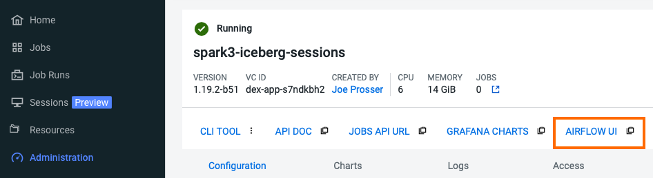
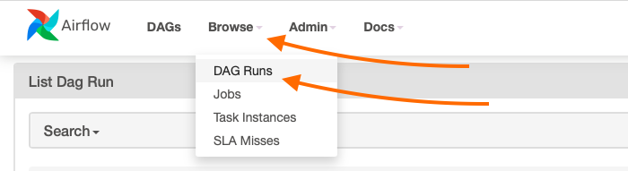
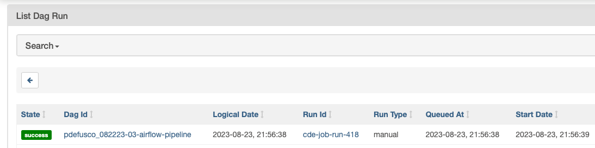
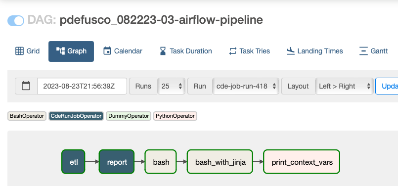

# Parte 3: Orchestrazione di Pipeline di Ingegneria Dati con Airflow

## Obbiettivo

CDE fornisce un servizio Airflow nativo che consente di orchestrare pipeline complesse in CDE. Sebbene progettato principalmente per orchestrare Job Spark CDE, CDE Airflow consente di eseguire query in CDW e di integrarsi con strumenti di orchestrazione e DevOps di terze parti.

Questo tutorial è diviso in due sezioni. Inizialmente, costruirai tre job Airflow per pianificare, orchestrare e monitorare l'esecuzione dei Job Spark e altro ancora. Successivamente, costruirai un DAG (Directed Acyclic Graph) Airflow con l'Editor Airflow di Cloudera, uno strumento "No-Code" che consente di creare DAG Airflow in modo semplificato.

### Concetti Airflow

In Airflow, un DAG (Directed Acyclic Graph) è definito in uno script Python che rappresenta la struttura del DAG (attività e le loro dipendenze) come codice.

Ad esempio, per un DAG semplice composto da tre attività: A, B e C. Il DAG può specificare che A deve essere eseguito con successo prima che B possa essere eseguito, ma C può essere eseguito in qualsiasi momento. Inoltre, l'attività A ha un timeout di 5 minuti e l'attività B può essere riavviata fino a 5 volte in caso di errore. Il DAG potrebbe anche specificare che il workflow viene eseguito ogni notte alle 22:00, ma non deve iniziare fino a una certa data.

Per ulteriori informazioni sui DAG (Directed Acyclic Graph) di Airflow, consulta la documentazione di Apache Airflow [qui](https://airflow.apache.org/docs/apache-airflow/stable/concepts/dags.html). Per un esempio di DAG in CDE, consulta la documentazione sul DAG di CDE Airflow [qui](https://docs.cloudera.com/data-engineering/cloud/orchestrate-workflows/topics/cde-airflow-editor.html).

#### L'interfaccia Utente di Airflow

L'interfaccia utente di Airflow semplifica il monitoraggio e la risoluzione dei problemi delle tue pipeline di dati. Per una panoramica completa dell'interfaccia utente di Airflow, consulta la documentazione di [Apache Airflow](https://airflow.apache.org/docs/apache-airflow/stable/ui.html).

#### Cosa è un Job di CDE in Airflow?

I job di CDE possono essere di due tipi: Spark e Airflow. I job di CDE di tipo Airflow sono generalmente utilizzati per orchestrare job di CDE di tipo Spark e altre azioni di Data Engineering.

I job di CDE di tipo Airflow consistono principalmente in un DAG (Directed Acyclic Graph) di Airflow contenuto in un file Python. Maggiori dettagli sui DAG sono riportati di seguito.

Ci sono tre modi per creare un job di CDE di tipo Airflow:

* Utilizzando l'interfaccia web di CDE. Per ulteriori informazioni, consulta [Running Jobs in Cloudera Data Engineering](https://docs.cloudera.com/data-engineering/cloud/manage-jobs/topics/cde-run-job.html).
* Utilizzando lo strumento a riga di comando (CLI) di CDE. Per ulteriori informazioni, consulta [Cloudera Data Engineering command line interface](https://docs.cloudera.com/data-engineering/cloud/cli-access/topics/cde-cli.html).
* Utilizzando gli endpoint dell'API REST di CDE. Per ulteriori informazioni, consulta [CDE API Jobs](https://docs.cloudera.com/data-engineering/cloud/jobs-rest-api-reference/index.html)

Inoltre, è possibile automatizzare le migrazioni da Oozie su CDP Public Cloud Data Hub, CDP Private Cloud Base, CDH e HDP a job di tipo Spark e Airflow di CDE con l'API [oozie2cde API](https://github.com/pdefusco/Oozie2CDE_Migration).


## Dispiegamento di una Pipeline di Orchestrazione con Airflow

#### Analisi Codice del DAG Airflow

Apri "03-Airflow-Dag.py" nella cartella "cde_airflow_jobs", familiarizza con il codice e note quanto segue:

* Airflow ti consente di suddividere pipeline di Spark complesse in diversi passaggi, isolando problemi e fornendo eventualmente opzioni di ripetizione. Gli operatori CDEJobRunOperator, BashOperator e PythonOperator vengono importati alle linee 44-46. Questi ti consentono di eseguire un CDE Spark Job, Bash e codice Python, tutti all'interno dello stesso flusso di lavoro.

```
from cloudera.cdp.airflow.operators.cde_operator import CDEJobRunOperator
from airflow.operators.bash import BashOperator
from airflow.operators.python_operator import PythonOperator
from airflow.operators.dummy_operator import DummyOperator
from airflow.operators.http_operator import SimpleHttpOperator
```

* Ogni blocco di codice alle linee 74, 80, 86, 92 e 102 istanzia un operatore. Ciascuno di essi viene memorizzato come variabile denominata Step 1 - Step 5.

```
step1 = CDEJobRunOperator(
  task_id='etl',
  dag=intro_dag,
  job_name=cde_job_name_03_A #job_name needs to match the name assigned to the Spark CDE Job in the CDE UI
)

step2 = CDEJobRunOperator(
    task_id='report',
    dag=intro_dag,
    job_name=cde_job_name_03_B #job_name needs to match the name assigned to the Spark CDE Job in the CDE UI
)

step3 = BashOperator(
        task_id='bash',
        dag=intro_dag,
        bash_command='echo "Hello Airflow" '
        )

step4 = BashOperator(
    task_id='bash_with_jinja',
    dag=intro_dag,
    bash_command='echo "yesterday={{ yesterday_ds }} | today={{ ds }}| tomorrow={{ tomorrow_ds }}"',
)

#Custom Python Method
def _print_context(**context):
    print(context)

step5 = PythonOperator(
    task_id="print_context_vars",
    python_callable=_print_context,
    dag=intro_dag
)
```

* Il passaggio 2 e 3 sono istanze di CDEJobRunOperator e vengono utilizzati per eseguire CDE Spark Job. Alle linee 89 e 95 devono essere dichiarati i nomi dei CDE Spark Job, come appaiono nell'interfaccia dei CDE Jobs. In questo caso, i campi fanno riferimento ai valori assegnati alle linee 55 e 56.

<pre>

<b>cde_job_name_03_A = "job3A"
cde_job_name_03_B = "job3B"</b>

#Using the CDEJobRunOperator
step1 = CDEJobRunOperator(
  task_id='etl',
  dag=intro_dag,
  <b>job_name=cde_job_name_03_A</b>
)

step2 = CDEJobRunOperator(
    task_id='report',
    dag=intro_dag,
    <b>job_name=cde_job_name_03_B</b>
)
</pre>

* Infine, le dipendenze delle attività sono specificate alla linea 119. I passaggi da 1 a 5 vengono eseguiti in sequenza, uno dopo l'altro. Se uno di essi fallisce, i restanti CDE Jobs non verranno attivati.

```
step1 >> step2 >> step3 >> step4 >> step5
```

#### Diepiegamento del Codice del DAG in CDE Job di tipo Airflow

Crea due CDE Spark Job (nell'interfaccia utente o con la CLI) utilizzando gli script "04-A-ETL.py" e "04-B-Reports.py", *ma non eseguirli ancora.*

Carica gli script dalla tua macchina locale e crea una nuova risorsa file. Assicurati di nominarla con il tuo nome in modo che non entri in conflitto con gli altri partecipanti al workshop.







Successivamente, apri "03-Airflow-Dag.py" e inserisci i nomi dei due CDE Spark Job come appaiono nell'interfaccia dei CDE Jobs alle linee 55 e 56.

Inoltre, note che le credenziali memorizzate in parameters.conf non sono disponibili per i job di CDE Airflow. Pertanto, aggiorna la variabile "username" alla linea 51 con qualcosa di univoco.

La variabile "username" viene letta alla linea 67 per creare una variabile dag_name che verrà utilizzata alla linea 70 per assegnare un nome univoco al DAG quando si istanzia l'oggetto DAG.

>**⚠ Avviso**  
>CDE richiede un nome univoco per ciascun CDE Airflow Job o altrimenti restituirà un errore durante la creazione del job.

Infine, modifica le linee 63 e 64 per assegnare una data di inizio e fine che si svolga nel futuro.

>**⚠ Avviso**   
> Se non modifichi la data di inizio e fine, il CDE Airflow Job potrebbe fallire. Il parametro Start Date deve riflettere una data nel passato, mentre la End Date deve essere nel futuro. Se osservi due Runs identiche nella pagina Job Runs hai impostato le date in maniera incorretta.

Carica lo script aggiornato nella tua risorsa File di CDE insieme al file parameters.conf. La nuova risorsa File dovrebbe ora avere un totale di quattro file.


Quindi torna alla Home Page di CDE e crea un nuovo CDE Job di tipo Airflow.



Come prima, seleziona il tuo Virtual Cluster e il nome del Job. Poi crea ed esegui.



Crea una nuova Resource di tipo File per questo, oppure riutilizza la risorsa esistente se ne hai una da un passaggio precedente.




Vai alla pagina "Job Runs" e note che il DAG di Airflow è in fase di esecuzione. Mentre è in corso, torna alla Pagina Principale di CDE, scorri fino alla sezione "Virtual Clusters" e apri i dettagli del Virtual Cluster. Poi apri l'interfaccia utente di Airflow.



Familiarizzati con l'interfaccia di Airflow. Poi, apri la pagina "Dag Runs" e convalida l'esecuzione del CDE Airflow Job.







Per saperne di più su CDE Airflow, visita [Orchestrating Workflows and Pipelines](https://docs.cloudera.com/data-engineering/cloud/orchestrate-workflows/topics/cde-airflow-editor.html) nella Documentazione di CDE.


## Dispiegamento di una Pipeline di Orchestrazione con l'Editor Cloudera Airflow

Puoi utilizzare l'Editor CDE Airflow per creare i DAG senza scrivere codice. Questa è un'ottima opzione se il tuo DAG consiste in una lunga sequenza di CDE Spark o CDW Hive job.

Dalla UI dei Lavori CDE, crea un nuovo Lavoro CDE di tipo Airflow come mostrato di seguito. Assicurati di selezionare l'opzione "Editor". Poi clicca su crea.


Dall'Editor Canvas trascina e rilascia l'azione "Shell Script". Questo è equivalente all'istanziazione di BashOperator. Clicca sull'icona nella canvas e una finestra di opzioni apparirà sul lato destro. Inserisci "dag start" nella sezione Comando Bash.


Dalla Canvas, aggiungi due Job Action. Configurale con il nome "sql_job". Hai già creato questo Job Spark nella parte 2.


Successivamente, trascina e rilascia un'azione Python. Nella sezione codice, aggiungi *print("DAG Terminated")* come mostrato di seguito.


Infine, completa il DAG collegando ogni azione.


Per ciascuno dei due Job CDE, apri l'azione cliccando sull'icona nella canvas. Seleziona "Depends on Past" e poi "all_success" nella sezione "Trigger Rule".


Esegui il DAG e osservalo dalla UI dei Job CDE.


## Riepilogo

Apache Airflow è una piattaforma per creare, pianificare ed eseguire pipeline di Data Engineering. È ampiamente utilizzata dalla comunità per creare flussi di lavoro dinamici e robusti per casi d'uso di Data Engineering batch.

CDE incorpora Apache Airflow a livello di CDE Virtual Cluster. Viene automaticamente implementato per l'utente CDE durante la creazione del CDE Virtual Cluster e non richiede alcuna manutenzione da parte dell'amministratore CDE.

Un Lavoro CDE Airflow ti consente di distribuire un DAG di Airflow come un Lavoro CDE. Il principale caso d'uso è l'orchestrazione di Lavori CDE Spark. L'Editor Cloudera Airflow semplifica il codice del DAG fornendo un'interfaccia no-code / low-code per la costruzione dei DAG. Se usi principalmente CDE per rendere operativi molti Lavori CDE Spark, l'Editor Airflow può essere una scelta eccellente. Il DAG di Airflow utilizza Python per costruire la logica del DAG. È un'ottima opzione se si utilizzano operatori open source di Airflow o è necessario applicare logiche aziendali complesse al workflow.

Se desideri sperimentare con un caso d'uso Airflow più avanzato in CDE, visita  [Bonus Lab 1](https://github.com/pdefusco/CDE119_ACE_WORKSHOP/blob/main/step_by_step_guides/english/part05_bonus_labs.md#bonus-lab-1-cde-airflow-orchestration-in-depth).

[Nella Prossima Sezione](https://github.com/pdefusco/CDE119_ACE_WORKSHOP/blob/main/step_by_step_guides/english/part04_spark_migration_tool.md#part-4-using-the-cde-spark-migration-tool-to-convert-spark-submits-to-cde-spark-submits) sperimentarai con la Spark Migration Tool per convertire in modo programmatico i comandi Spark-Submit in comandi Spark-Submit CDE.
