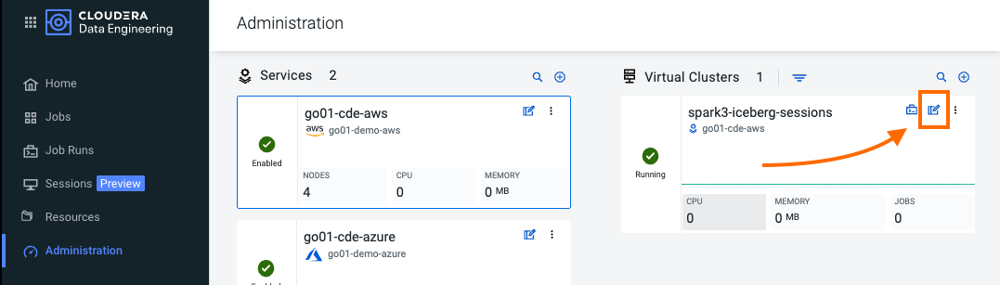
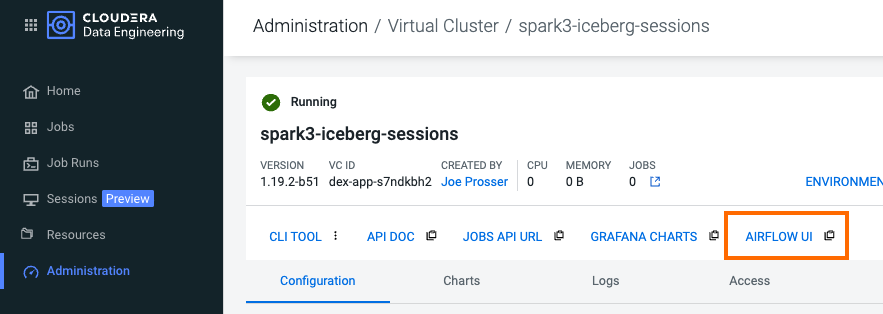
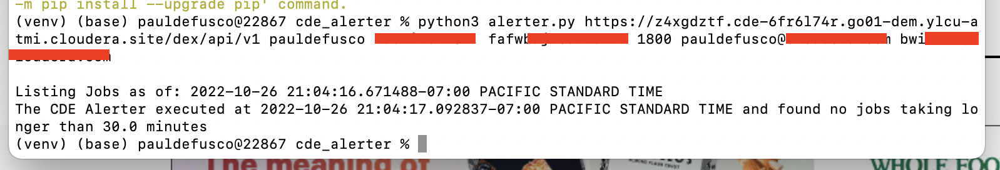

# Parte 5: Lab Extra

## Obbiettivo

Finora hai esplorato gli aspetti fondamentali di Spark, Airflow e Iceberg in CDE. I seguenti lab ti offrono l'opportunità di esplorare CDE in maggior dettaglio.

Ogni labo bonus può essere eseguito indipendentemente dagli altri. In altre parole, puoi eseguirne tutti o solo alcuni di essi, in qualsiasi ordine preferisci.

### Bonus Lab 1: Approfondimento Orchestrazione Airflow in CDE

La parte 2 del HOL ti ha introdotto a un DAG di base in Airflow in CDE. Tuttavia, le capacità di Airflow includono una vasta varietà di operatori, la possibilità di memorizzare valori di contesto temporanei, la connessione a sistemi di terze parti e in generale la capacità di implementare casi di orchestrazione più avanzati.

Utilizzando "bonus-01_Airflow_Operators.py", creerai un nuovo Job CDE Airflow con altri operatori popolari come il SimpleHttpOperator per inviare/ricevere richieste API.

Prima devi configurare una Connessione all'endpoint API cui farai riferimento nel codice del DAG. Torna alla scheda Amministrazione CDE, apri i "Dettagli del Cluster Virtuale" e quindi fai clic sull'icona "Airflow" per accedere all'interfaccia Airflow.





Apri le Connessioni Airflow nel menu a discesa Amministrazione come mostrato di seguito.


Le Connessioni Airflow ti consentono di predefinire configurazioni di connessione in modo che possano essere utilizzate in un DAG per vari scopi. Nel nostro caso, creeremo una nuova connessione per accedere all'API "Random Joke" e in particolare all'endpoint "Programming".


Compila i seguenti campi come mostrato di seguito e salva.

```
Connection Id: random_joke_connection
Connection Type: HTTP
Host: https://official-joke-api.appspot.com/
```


Ora apri "bonus-01_Airflow_Operators.py" e familiarizza con il codice. Alcuni degli aspetti più rilevanti di questo DAG includono:

* Esamina la riga 170. L'esecuzione del task non segue più una sequenza lineare. Lo Step 3 viene eseguito solo quando sia lo Step 1 che lo Step 2 sono stati completati con successo.

```
step1 >> step2 >> step3 >> step4 >> step5 >> [step6a, step6b] >> step6c >> step7 >> step8
```

* Alle righe 80-83, l'operatore DummyOperator viene utilizzato come segnaposto e punto di partenza per l'esecuzione dei task.

```
start = DummyOperator(
    task_id="start",
    dag=operators_dag
)
```

* Alle righe 147-156, l'operatore SimpleHttpOperator viene utilizzato per inviare una richiesta a un endpoint API. Questo fornisce un punto di integrazione opzionale tra CDE Airflow e sistemi di terze parti o altri servizi Airflow in quanto le richieste e le risposte possono essere elaborate dal DAG.

* Alla riga 150, il valore dell'ID di connessione è lo stesso utilizzato nella Connessione Airflow appena creata.

* Alla riga 150, il valore dell'endpoint determina l'endpoint API a cui verranno indirizzate le tue richieste. Questo viene aggiunto all'URL di base impostato nella Connessione Airflow. Alla riga 151, la risposta viene catturata e analizzata dal metodo "handle_response" specificato tra le righe 139-145.

* Alla riga 155, l'opzione "do_xcom_push" è utilizzata per scrivere la risposta come variabile di contesto del DAG. Ora la risposta è temporaneamente memorizzata per la durata del Job di Airflow e può essere riutilizzata da altri operatori.

<pre>
step7 = SimpleHttpOperator(
    task_id="random_joke_api",
    method="GET",
    <b>http_conn_id="random_joke_connection"</b>,
    <b>endpoint="/jokes/programming/random"</b>,
    headers={"Content-Type":"application/json"},
    <b>response_check=lambda response: handle_response(response)</b>,
    dag=operators_dag,
    <b>do_xcom_push=True</b>
)
</pre>

* Alle righe 161-165, l'operatore Python esegue il metodo "_print_random_joke" dichiarato alle righe 117-118 e restituisce la risposta della chiamata API.

```
def _print_random_joke(**context):
    return context['ti'].xcom_pull(task_ids='random_joke_api')

step8 = PythonOperator(
    task_id="print_random_joke",
    python_callable=_print_random_joke,
    dag=operators_dag
)
```

Come nell'esempio nella parte 3, *crea (senza eseguire)* tre Job CDE Spark usando "05_C_pyspark_LEFT.py", "05_D_pyspark_RIGHT.py" e "05_E_pyspark_JOIN.py".

Quindi, apri "bonus-01_Airflow_Operators.py" nel tuo editor e aggiorna il tuo nome utente alla riga 51. Assicurati che i nomi dei job alle righe 55-59 riflettano i nomi dei tre Job CDE Spark come li hai inseriti nell'interfaccia CDE Job.

Infine, carica nuovamente lo script nella tua risorsa File CDE. Crea un nuovo Job CDE di tipo Airflow e seleziona lo script dalla tua risorsa CDE.

>**Note**
>L'operatore SimpleHttpOperator può essere utilizzato per interagire con sistemi di terze parti e scambiare dati da e verso l'esecuzione di un Job CDE Airflow. Ad esempio, potresti attivare l'esecuzione di job al di fuori di CDP o eseguire la logica del DAG CDE Airflow in base agli input provenienti dai sistemi di terze parti.

>**Note**  
>Puoi utilizzare CDE Airflow per orchestrare query SQL in CDW, il servizio Cloudera Data Warehouse Data, con l'operatore CDWOperator supportato da Cloudera. Se vuoi saperne di più, vai al [Bonus Lab 1: Using CDE Airflow with CDW](https://github.com/pdefusco/CDE_Tour_ACE_HOL/blob/main/step_by_step_guides/english.md#bonus-lab-1-using-cde-airflow-with-cdw).

>**Note**  
>Inoltre, sono disponibili in CDE altri operatori tra cui Python, HTTP e Bash. Se desideri saperne di più su Airflow in CDE, consulta [Using CDE Airflow](https://github.com/pdefusco/Using_CDE_Airflow).


### Bonus Lab 2: Utilizzo di CDE Airflow con CDW

Puoi utilizzare il CDWRunOperator per eseguire query CDW da un DAG CDE Airflow. Questo operatore è stato creato ed è completamente supportato da Cloudera.

##### Passaggi per la Configurazione di CDW

Prima di poter utilizzare l'operatore in un DAG, è necessario stabilire una connessione tra CDE Airflow e CDW. Per completare questi passaggi, è necessario avere accesso a un data warehouse virtuale CDW.

Attualmente, CDE supporta operazioni CDW per carichi di job ETL nei data warehouse virtuali Apache Hive. Per determinare l'hostname CDW da utilizzare per la connessione:

Accedi alla pagina Panoramica del Data Warehouse Cloudera facendo clic sulla tessera Data Warehouse nella console di gestione della piattaforma Cloudera Data Platform (CDP).


Nella colonna "Virtual Warehouses", trova il data warehouse a cui desideri connetterti.


Clicca sul menu a tre punti per il data warehouse selezionato, quindi clicca su "Copia URL JDBC".


Incolla l'URL in un editor di testo e prendi note dell'hostname. Ad esempio, partendo dall'URL seguente, l'hostname sarebbe:

```
Original URL: jdbc:hive2://hs2-aws-2-hive.env-k5ip0r.dw.ylcu-atmi.cloudera.site/default;transportMode=http;httpPath=cliservice;ssl=true;retries=3;

Hostname: hs2-aws-2-hive.env-k5ip0r.dw.ylcu-atmi.cloudera.site
```

##### Passaggi di Configurazione CDE

Accedi alla pagina di panoramica di Cloudera Data Engineering cliccando sulla sezione Data Engineering nella console di gestione di Cloudera Data Platform (CDP).

Nella colonna "CDE Services", seleziona il servizio che contiene il virtual cluster che stai utilizzando e quindi, nella colonna "Virtual Clusters", fai clic su "Cluster Details" per il virtual cluster. Fai clic su "AIRFLOW UI".


Dall'interfaccia utente di Airflow, fai clic sul collegamento "Connection" dalla scheda "Admin".


Fai clic sul segno più per aggiungere un nuovo record e poi compila i campi:

* Conn Id: Crea un identificativo di connessione univoco, come ad esempio "cdw_connection".
* Conn Type: Seleziona Hive Client Wrapper.
* Host: Inserisci l'hostname dall'URL di connessione JDBC. Non inserire l'intero URL JDBC.
* Schema: default
* Login: Inserisci il tuo nome utente e password del carico di job.

Fai clic su "Save".


##### Modifica del File DAG di Python

Ora sei pronto per utilizzare il CDWOperator nel tuo DAG di Airflow. Apri lo script "bonus-01_Airflow_CDW.py" e familiarizza con il codice.

La classe Operator viene importata alla riga 47.

```
from cloudera.cdp.airflow.operators.cdw_operator import CDWOperator
```

Un'istanza della classe CDWOperator viene creata alle righe 78-86.

```
cdw_query = """
show databases;
"""

dw_step3 = CDWOperator(
    task_id='dataset-etl-cdw',
    dag=example_dag,
    cli_conn_id='cdw_connection',
    hql=cdw_query,
    schema='default',
    use_proxy_user=False,
    query_isolation=True
)
```

note che la sintassi SQL eseguita nella CDW Virtual Warehouse è dichiarata come una variabile separata e quindi passata all'istanza dell'Operatore come argomento. La Connessione viene anche passata come argomento alla riga

Infine, note che le dipendenze delle attività includono sia le attività spark che dw:

```
spark_step >> dw_step
```

Successivamente, crea un nuovo Job CDE Airflow chiamato "CDW Dag". Carica il nuovo file DAG nella stessa risorsa CDE o in una nuova risorsa durante il processo di creazione.


Vai alla pagina delle esecuzioni dei job CDE e apri l'interfaccia utente Airflow dell'esecuzione. Quindi apri la vista ad albero e verifica che il job sia stato eseguito correttamente.


### Bonus Lab 3: Approfondimento Utilizzo della CDE CLI per Ottimizzare i Casi d'Uso di Produzione della CDE 

La maggior parte dei casi d'uso di produzione della CDE si basa sull'API e sulla CLI della CDE. Con esse, puoi interagire facilmente con la CDE da un IDE locale e creare integrazioni con sistemi esterni di terze parti. Ad esempio, puoi implementare flussi di job multi-CDE cluster con GitLab CI o Python.

In questa parte del workshop acquisirai familiarità con la CLI della CDE eseguendo nuovamente gli stessi job e interagendo con il servizio in remoto.

Puoi utilizzare la CLI o l'API della CDE per eseguire job Spark e Airflow in remoto anziché tramite l'interfaccia utente della CDE come mostrato fino a questo punto. In generale, si consiglia l'uso della CLI della CDE rispetto all'interfaccia utente quando si eseguono submit di Spark da un computer locale. L'API è invece consigliata quando si integrano Job Spark o Job Airflow della CDE (o entrambi) con sistemi di orchestrazione di terze parti. Ad esempio, puoi utilizzare GitLab CI per creare Pipeline CDE su più Cluster Virtuali. Per un esempio dettagliato, consulta  [GitLab2CDE](https://github.com/pdefusco/Gitlab2CDE).

Presumiamo che tu abbia già installato la CLI seguendo le istruzioni nella Parte 1. Se non lo hai ancora fatto, ti preghiamo di installare la CLI della CDE adesso.

Innanzitutto, crea un ambiente virtuale Python e installa i requisiti.

#### Uso della CLI di CDE

###### Esecuzione Job Spark:

Questo comando eseguirà lo script come un semplice Spark Submit. Questo è leggermente diverso dalla creazione di un Job CDE di tipo Spark in quanto la definizione del Job non diventerà riutilizzabile.

>**⚠ Warning**  
> I comandi CLI qui di seguito sono pensati per essere copiati/incollati nel tuo terminale così come sono e eseguiti dalla directory "cde_tour_ace_hol". Tuttavia, potresti dover aggiornare il percorso dello script in ciascun comando se li esegui da una cartella diversa.

```
cde spark submit --conf "spark.pyspark.python=python3" cde_cli_jobs/01_pyspark-sql.py
```

###### Verifica dello Stato del Job::

Questo comando ti permetterà di ottenere informazioni relative al job Spark sopra. Assicurati di sostituire il flag "id" con l'ID fornito quando hai eseguito lo script precedente, ad esempio 199.

```
cde run describe --id 199
```

###### Esamina l'Output:

Questo comando mostra i log per il job sopra. Assicurati di sostituire il flag "id" con l'ID fornito quando hai eseguito lo script precedente.

```
cde run logs --type "driver/stdout" --id 199
```

###### Creazione di una Resource:

Questo comando crea una Resource di tipo File:

```
cde resource create --name "my_CDE_Resource"
```

###### Carica file(i) sulla Resource:

Il comando seguente carica lo script "01_pyspark-sql.py" nella Risorsa CDE.

```
cde resource upload --local-path "cde_cli_jobs/01_pyspark-sql.py" --name "my_CDE_Resource"
```

###### Convalidazione Resource:

Il comando seguente ottiene informazioni relative alla Resource.

```
cde resource describe --name "my_CDE_Resource"
```

###### Pianificazione di un Job Spark con il File Caricato sulla Resource

Il comando seguente crea un Job Spark CDE utilizzando il file caricato sulla Risorsa.

```
cde job create --name "PySparkJob_from_CLI" --type spark --conf "spark.pyspark.python=python3" --application-file "/app/mount/01_pyspark-sql.py" --cron-expression "0 */1 * * *" --schedule-enabled "true" --schedule-start "2022-11-28" --schedule-end "2023-08-18" --mount-1-resource "my_CDE_Resource"
```

###### Convalidazione Job:

Il comando seguente ottiene informazioni sui Job CDE il cui nome contiene la stringa "PySparkJob".

```
cde job list --filter 'name[like]%PySparkJob%'
```

###### Come Apprendere a Usare la CLI di CDE

La CLI della CDE offre molti altri comandi. Per familiarizzartici, puoi utilizzare il comando "help" e imparare man mano. Ecco alcuni esempi:

```
cde --help
cde job --help
cde run --help
cde resource --help
```

Per saperne di più sulla CLI della CDE, visita la pagina [Using the Cloudera Data Engineering command line interface](https://docs.cloudera.com/data-engineering/cloud/cli-access/topics/cde-cli.html) nella documentazione.


### Bonus Lab 4: Utilizzo di Python con la API di CDE

CDE fornisce una robusta API per l'integrazione con le tue piattaforme esistenti di integrazione continua e distribuzione continua. In questo esempio utilizzeremo Python per creare e distribuire Spark Jobs nella CDE dal tuo computer locale. Lo stesso codice può essere eseguito su altre piattaforme e strumenti di terze parti.

##### Introduzione alla API di CDE

Il servizio Cloudera Data Engineering ha un'API documentata in Swagger. Puoi visualizzare la documentazione dell'API e provare singole chiamate API accedendo al link API DOC in qualsiasi virtual cluster:

Nella console web Data Engineering, seleziona un ambiente.
Fai clic sull'icona Dettagli del cluster in uno qualsiasi dei virtual cluster elencati. Fai clic sul link su "API DOC".

##### Workflow Base con la API

Ottieni il Token della CDE e imposta la variabile d'Ambiente:

```
export CDE_TOKEN=$(curl -u <workload_user> $(echo '<grafana_charts>' | cut -d'/' -f1-3 | awk '{print $1"/gateway/authtkn/knoxtoken/api/v1/token"}') | jq -r '.access_token')
```

Creare una Resource CDE:

```
curl -H "Authorization: Bearer $ACCESS_TOKEN" -X POST \
  "$JOBS_API_URL/resources" -H "Content-Type: application/json" \
  -d "{ \"name\": \"cml2cde_api_resource\"}"
```

Convalidare la presenza della Resource:

```
curl -H "Authorization: Bearer $ACCESS_TOKEN" -X GET "$JOBS_API_URL/resources/cml2cde_api_resource"
```

Caricare lo script del Job Spark:

```
curl -H "Authorization: Bearer $ACCESS_TOKEN" -X PUT \
  "$JOBS_API_URL/resources/cml2cde_api_resource/Data_Extraction_Sub_150k.py" \
  -F "file=@/home/cdsw/cml2cde_tutorial_code/Data_Extraction_Sub_150k.py"
```

Creare un Job Spark in CDE:

```
curl -H "Authorization: Bearer $ACCESS_TOKEN" -X POST "$JOBS_API_URL/jobs" \
          -H "accept: application/json" \
          -H "Content-Type: application/json" \
          -d "{ \"name\": \"cml2cde_api_job\", \"type\": \"spark\", \"retentionPolicy\": \"keep_indefinitely\", \"mounts
```

Eseguire Job Spark:

```
curl -H "Authorization: Bearer $ACCESS_TOKEN" -X POST "$JOBS_API_URL/jobs/cml2cde_api_job/run"
```

##### Utilizzo di Python

Puoi utilizzare la libreria Python "Requests" per incapsulare i metodi sopra descritti. Ad esempio, puoi creare una funzione per scaricare il Token della CDE tramite:

```
import requests

def set_cde_token():
    rep = os.environ["JOBS_API_URL"].split("/")[2].split(".")[0]
    os.environ["GET_TOKEN_URL"] = os.environ["JOBS_API_URL"].replace(rep, "service").replace("dex/api/v1", "gateway/authtkn/knoxtoken/api/v1/token")
    token_json = !curl -u $WORKLOAD_USER:$WORKLOAD_PASSWORD $GET_TOKEN_URL
    os.environ["ACCESS_TOKEN"] = json.loads(token_json[5])["access_token"]
    return json.loads(token_json[5])["access_token"]
```

Una volta impostato correttamente il JOBS_API_URL, puoi eseguire il seguente codice per scaricare il Token della CDE:

```
JOBS_API_URL = "https://ewefwfw.cde-6fhtj4hthr.my-cluster.ylcu-atmi.cloudera.site/dex/api/v1"

tok = set_cde_token()
```

Sebbene ciò possa funzionare in un ambiente interattivo, consigliamo l'uso delle Sessioni CDE in quanto ti consentono di utilizzare direttamente gli shell PySpark e Spark Scala.

In generale, la API è un'ottima scelta per la creazione di applicazioni. Ad esempio, potresti utilizzare Python per inviare una richiesta all'API della CDE al fine di monitorare le Risorse CDE:

```
url = os.environ["JOBS_API_URL"] + "/resources"
myobj = {"name": "cml2cde_python"}
headers = {"Authorization": f'Bearer {tok}',
          "Content-Type": "application/json"}

x = requests.get(url, headers=headers)
x.json()["resources"][-3:-1]
```

Come esempio, abbiamo creato [CDE Alerter](https://github.com/pdefusco/CDE_Alerter) e il modulo cde_python. CDE Alerter è un'applicazione Python per monitorare continuamente lo stato dei lavori CDE in più Virtual Clusters CDE. Ti consente di segnalare i lavori CDE che durano più di un determinato numero di secondi. Utilizza cde_python, un wrapper Python personalizzato per l'API della CDE, per inviare periodicamente richieste al Virtual Cluster della CDE. L'idea generale è che puoi utilizzare Python per implementare un insieme di regole aziendali in caso di eventi particolari in un Cluster CDE.

Per eseguire questa App nel tuo computer locale, sono necessarie poche o nessuna modifica al codice. Avrai bisogno di Python 3.6 o versioni successive, di un account Gmail con autenticazione a due fattori e di una password per l'app. Di seguito sono forniti i passaggi per configurare correttamente un account Gmail. Non consigliamo di utilizzare il tuo account Gmail esistente, se ne hai uno, ma di crearne uno nuovo come indicato di seguito.

## Istruzione per il Dispiegamento della App

#### Passo 0: Configurazione del Progetto

Clona questo repository GitHub nella tua macchina locale o nella VM in cui eseguirai lo script.

```
mkdir ~/Documents/CDE_Alerter
cd ~/Documents/CDE_Alerter
git clone https://github.com/pdefusco/CDE_Alerter.git
```

In alternativa, se non hai GitHub, crea una cartella sul tuo computer locale, vai a [questo URL](https://github.com/pdefusco/CDE_Alerter.git) e scarica i file.


#### Passo 1: Crea un ambiente virtuale Python e installa i requisiti

Sebbene un ambiente virtuale Python sia opzionale è altamente consigliato usarlo per isolare l'installazione dei moduli necessari per la app. Per crearlo e installare i requisiti, esegui i seguenti comandi:

```
#Create
python3 -m venv venv

#Activate
source venv/bin/activate

#Install single package
pip install pandas #Optionally use pip3 install

#Install requirements
pip install -r requirements.txt #Optionally use pip3 install
```


#### Passo 2: Modifica Clusters.txt e testa la connessione a CDE

Il file clusters.txt contiene un elenco di JOBS_API_URL e indirizzi email, che riflettono il/i cluster che desideri monitorare e gli indirizzi email da notificare.

Aggiungi il tuo JOBS_API_URL e l'indirizzo email a clusters.txt e rimuovi eventuali altre voci. L'app funziona con una o più voci di cluster. Poi, assicurati che la tua macchina o VM possa raggiungere il CDE Virtual Cluster eseguendo il seguente comando nel terminale:

```
python3 connection_tester.py jobs_api_url cdpusername cdppwd
```

L'output nel terminale dovrebbe confermare che è stata creata con successo una risorsa di test.


#### Step 3: Esegui lo script

Prima di poter eseguire lo script avrai bisogno di:

* Il JOBS_API_URL del Virtual Cluster CDE che intendi monitorare.
* La password APP Gmail (non solo la password di accesso all'account). Se hai bisogno di aiuto per impostarla per la prima volta:
  1. Consigliato: [Crea un nuovo account Gmail](https://support.google.com/mail/answer/56256?hl=en)
  2. [Abilita l'autenticazione a due fattori e crea una password dell'app](https://www.youtube.com/watch?v=hXiPshHn9Pw)
* L'utente e la password CDP con cui ti autenticherai nel Virtual Cluster CDE.

Per eseguire lo script, esegui il seguente comando Python nella directory in cui hai clonato il tuo progetto.

```
python3 alerter.py https://z4xgdztf.cde-6fr6l74r.go01-dem.ylcu-atmi.cloudera.site/dex/api/v1 cdpusername cdppwd mysecregapppwdhere 1800 me@myco.com mycolleague@myco.com
```

La password dell'app Gmail dovrebbe essere inserita come quarto argomento (sostituendo ad esempio "mysecregapppwdhere" sopra).

Lo script rileverà automaticamente se sono trascorsi più di 1800 secondi (30 minuti) tra l'ora di inizio e l'ora di fine di uno dei tuoi lavori CDE.

Se alcuni lavori CDE soddisfano i criteri, lo script invierà automaticamente una notifica agli indirizzi email forniti. Puoi inserire due destinatari dell'email aggiungendoli come gli ultimi due argomenti all'esecuzione dello script.

Come esempio, se riduciamo la finestra temporale da 1800 secondi a 18 secondi, lo script rileverà alcuni lavori e stamperà il seguente output nel terminale.


Se nessun job CDE soddisfa i criteri, non verrà fatto nulla.




#### Passo 4: Schedula lo script come un Job Cron

Lo script può essere eseguito quanto desideri. Ad esempio, potresti pianificare un job Cron per eseguire lo script ogni minuto con il seguente comando:

```
* * * * * /usr/bin/python ~/path/to/proj/cde_alerter/alerter.py
```


## Riepilogo

In questa sezione abbiamo esaminato tre casi d'uso più avanzati di CDE: un DAG CDE Airflow più avanzato, un DAG Airflow che sfrutta l'operatore CDW e una visione più approfondita della CDE CLI.

Puoi utilizzare CDE Airflow con operatori open source per implementare logiche aziendali avanzate nei tuoi DAG. La versione 1.20 di CDE amplierà ulteriormente questa funzionalità offrendo la possibilità di utilizzare un set più ampio di operatori Airflow, plugin e altre funzionalità open source.

Il CDWOperator è stato fornito da Cloudera per consentire agli utenti di orchestrare query CDW da un DAG Airflow. Puoi connetterti a uno o più data warehouse virtuali CDW all'interno dello stesso DAG CDE Airflow.

Infine, la CDE CLI è l'opzione ideale per coloro che utilizzano CDE su larga scala. Mentre l'interfaccia utente di CDE Jobs è uno strumento utile per l'osservabilità, non consigliamo di costruire i tuoi Spark Jobs con l'interfaccia utente troppo frequentemente. La CLI offre più opzioni, compresa la possibilità di inviare Jobs CDE a più di un Virtual Cluster CDE dalla stessa finestra del terminale. In generale, puoi utilizzare la CLI per costruire più Jobs CDE più velocemente una volta che ti sarai familiarizzato con essa.

Grazie per aver completato le Bonus Labs! Prima di proseguire, visita la pagina [Conclusioni e prossimi passi](https://github.com/pdefusco/CDE119_ACE_WORKSHOP/blob/main/step_by_step_guides/english/part06_next_steps.md#part-6-conclusions-and-next-steps) per un breve riepilogo e per scoprire i progetti e gli articoli consigliati. Questi possono essere particolarmente utili se stai già utilizzando o prevedi di utilizzare CDE in futuro.
